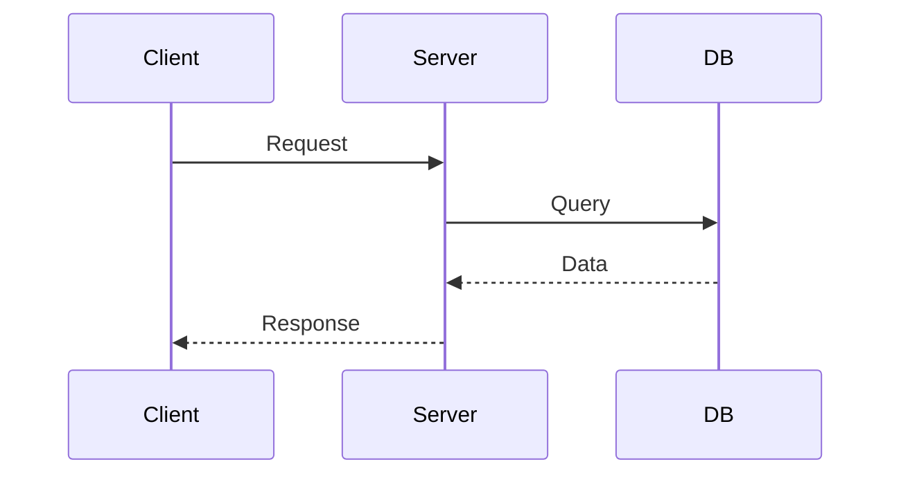

# Document Templates

Templates are defined in `src/App.tsx:69-74` under `INITIAL_TEMPLATES`. They are accessible from the Templates view and the document editor's template panel.

## Template Categories

| Category | Description |
|----------|-------------|
| `epidemiology` | Field epidemiology reports with SIR modeling |
| `mermaid` | System architecture and sequence diagrams |
| `math` | Mathematical formulas and statistical references |
| `research` | Academic paper structure |
| `clinical` | Clinical case reports |
| `project` | Project documentation |
| `mcp` | Model Context Protocol configurations |
| `custom` | User-defined templates |

## Built-In Templates

### WHO Epidemiology Report
```markdown
# WHO FIELD REPORT

## Overview
## Incident Matrix
## SIR Model
## Action Items
```

### System Architecture Diagram
```markdown

```

### Mathematical Reference
```markdown
## Normal Distribution
$$f(x) = \frac{1}{\sigma\sqrt{2\pi}}e^{-\frac{(x-\mu)^2}{2\sigma^2}}$$

## Standard Error
$$SE = \frac{\sigma}{\sqrt{n}}$$
```

### Research Paper Draft
```markdown
# Research Paper

## Abstract
## 1. Introduction
## 2. Methodology
## 3. Results
## 4. Discussion
## 5. Conclusion
## References
```

## Creating Templates

Templates can be added through the Settings panel or by creating documents from existing ones. The document editor (`src/components/WorkspaceDocumentEditor.tsx`) supports:

- **Markdown** with KaTeX math and Mermaid diagrams
- **Version history** with auto-save every 30 seconds
- **Export** to `.md` and `.html` formats
- **Table of contents** auto-generated from headings

## Template Data Model

```typescript
interface DocumentTemplate {
  id: string;                // Unique identifier
  name: string;              // Display name
  description: string;       // Short description
  category: TemplateCategory;// Category enum
  content: string;           // Markdown template content
  icon?: string;             // Optional icon
}
```
