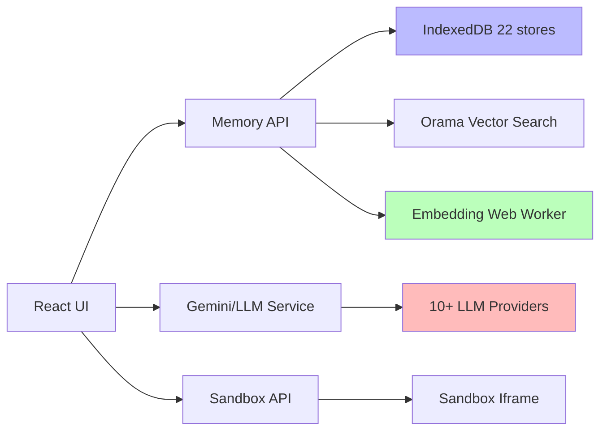

# API Documentation

Open Knowledge Studio's functionality is exposed through four primary API surfaces. All APIs run in-browser — there is no backend server.

## API Reference Documents

| # | Document | Description |
|---|----------|-------------|
| 001 | [Memory API Reference](./001-memory-api.md) | 6-tier memory system — session, episodic, semantic, procedural, working, long-term, plus cross-tier operations and embedding computation |
| 002 | [IndexedDB Schema Reference](./002-indexeddb.md) | Complete schema for all 22 object stores, CRUD operations, schema versioning, and data migration |
| 003 | [Gemini/LLM Service API](./003-gemini-service.md) | Multi-provider LLM router supporting 10+ providers, unified request/response, A2A debate, and orchestrated workflows |
| 004 | [Sandbox API Reference](./004-sandbox-api.md) | Secure code execution via iframe sandbox — `executeCode`, `cleanupSandbox`, security model |

## Architecture Overview

## See Also

- [Architecture Decision Records](../architecture/000-index.md)
- [Security Documentation](../security/000-index.md)

---

_Open Knowledge Studio v2.0 — Zero-dependency, browser-native, 12-agent A2A platform for offline-first research, writing, and data analysis. Built by [Mohammad Ariful Islam](https://github.com/zsdotcom) ([codeandbrain](https://github.com/codeandbrain)) at the [ZarishSphere Foundation](https://zarishsphere.com). Licensed under MIT. Source code: [github.com/zsdotcom/zs-oks](https://github.com/zsdotcom/zs-oks)._
