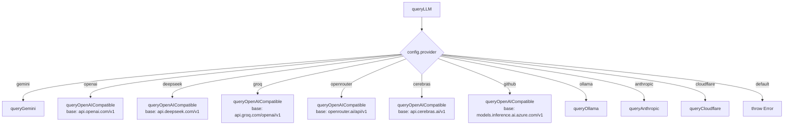

# Gemini/LLM Service API

Source: `src/services/geminiService.ts` (488 lines)

The LLM Service is a multi-provider router that abstracts 10+ AI providers behind a unified interface. All calls use plain `fetch()` — no vendor SDKs.

---

## Supported Providers

| Provider | Backend URL | Auth Method | Config Identifier |
|----------|------------|-------------|-------------------|
| **Gemini** | `generativelanguage.googleapis.com/v1beta` | Query param `?key=` | `gemini` |
| **OpenAI** | `api.openai.com/v1` | Bearer token | `openai` |
| **Anthropic** | `api.anthropic.com/v1` | `x-api-key` header | `anthropic` |
| **DeepSeek** | `api.deepseek.com/v1` | Bearer token | `deepseek` |
| **Groq** | `api.groq.com/openai/v1` | Bearer token | `groq` |
| **Ollama** | `localhost:11434` (configurable) | None | `ollama` |
| **OpenRouter** | `openrouter.ai/api/v1` | Bearer token | `openrouter` |
| **Cerebras** | `api.cerebras.ai/v1` | Bearer token | `cerebras` |
| **GitHub** | `models.inference.ai.azure.com/v1` | Bearer token | `github` |
| **Cloudflare** | `api.cloudflare.com/client/v4` | Bearer token | `cloudflare` |

---

## Core Functions

### `queryLLM(messages, config, contextDocs?, systemPrompt?)`

```typescript
async function queryLLM(
  messages: ChatMessage[],
  config: ProviderConfig,
  contextDocs?: string,
  systemPrompt?: string
): Promise<string>
```

| Parameter | Type | Required | Description |
|-----------|------|----------|-------------|
| `messages` | `ChatMessage[]` | Yes | Chat history with `{ id, text, sender, timestamp }` |
| `config` | `ProviderConfig` | Yes | `{ provider, apiKey, selectedModel, temperature, enableThinking, ... }` |
| `contextDocs` | `string \| undefined` | No | Context documents prepended to system prompt |
| `systemPrompt` | `string \| undefined` | No | Overrides default system prompt |

**Returns:** The LLM response text.

**Error scenarios:**
- Missing API key → throws `"[Provider] API key required."`
- Network error → throws `"[Provider] API error (status): body"`
- Unsupported provider → throws `"Unsupported provider: ..."`
- Empty response → returns `"No response generated."`

**Example:**
```typescript
import { queryLLM } from '@/services/geminiService';

const response = await queryLLM(
  [{ id: '1', text: 'What is R0 for measles?', sender: MessageSender.USER, timestamp: new Date() }],
  { provider: 'gemini', apiKey: '...', selectedModel: 'gemini-3.5-flash', temperature: 0.7 }
);
```

### `getInitialSuggestions(config)`

```typescript
async function getInitialSuggestions(config: ProviderConfig): Promise<string[]>
```

Generates 5 research questions via the configured provider. Returns empty array on failure.

---

## A2A Multi-Agent Debate

### `runA2ADebate(topic, agents, config, contextDocs?, onAgentResponse?)`

```typescript
async function runA2ADebate(
  topic: string,
  agents: (Partial<A2AAgent> & { name: string; systemPrompt: string; color: string; avatar: string })[],
  config: ProviderConfig,
  contextDocs?: string,
  onAgentResponse?: (agentName: string, response: string, latency: number) => void
): Promise<string[]>
```

| Parameter | Type | Description |
|-----------|------|-------------|
| `topic` | `string` | The debate topic/question |
| `agents` | `Array` | Array of agent definitions with name, systemPrompt, color, avatar |
| `config` | `ProviderConfig` | Base provider config (per-agent overrides supported) |
| `contextDocs` | `string \| undefined` | Shared context for all agents |
| `onAgentResponse` | `callback \| undefined` | Called after each agent responds |

**Returns:** Array of string responses, one per agent, plus a final synthesis response.

**Flow:**
1. Each agent responds sequentially with per-agent provider config
2. On error, agent response is replaced with `"[Error from {name}: {message}]"`
3. A final synthesis pass generates a consensus recommendation
4. All responses are returned as a flat array

### `runOrchestratedWorkflow(topic, agents, config, contextDocs?, onAgentResponse?)`

```typescript
async function runOrchestratedWorkflow(
  topic: string,
  agents: (Partial<A2AAgent> & { id: string; name: string; role: string; systemPrompt: string; color: string; avatar: string })[],
  config: ProviderConfig,
  contextDocs?: string,
  onAgentResponse?: (agentName: string, response: string, latency: number) => void
): Promise<string>
```

**Flow:**
1. Coordinator agent (`id: 'coord'`) decomposes the task into sub-tasks via LLM
2. Each sub-task is executed by the appropriate specialized agent
3. Coordinator synthesizes all results into a final response

### `runSequentialWorkflow(topic, chain, config, contextDocs?, onStepComplete?)`

```typescript
async function runSequentialWorkflow(
  topic: string,
  chain: (Partial<A2AAgent> & { agentId: string; name: string; systemPrompt: string })[],
  config: ProviderConfig,
  contextDocs?: string,
  onStepComplete?: (agentName: string, response: string, latency: number) => void
): Promise<string>
```

**Flow:**
1. Each agent in the chain receives the accumulated context from all previous agents
2. Results are concatenated as `"Previous context:\n{accumulatedContext}\n\nContinue the workflow..."`

---

## Provider Configuration

```typescript
interface ProviderConfig {
  provider: string;       // 'gemini' | 'openai' | 'anthropic' | 'deepseek' | 'groq' | 'ollama' | ...
  apiKey: string;         // API key (from env or Settings)
  selectedModel?: string; // Model name (default varies by provider)
  temperature?: number;   // 0.0 - 1.0 (default 0.7)
  maxTokens?: number;     // Max output tokens (default 4096)
  enableThinking?: boolean;       // Gemini thinking mode
  thinkingLevel?: string;         // 'low' | 'high'
  enableSearchGrounding?: boolean; // Gemini search grounding
  enableMapsGrounding?: boolean;  // Google Maps grounding
  customEndpoint?: string;        // Custom base URL (Ollama, Cloudflare)
}
```

---

## Internal Architecture



OpenAI-compatible providers share `queryOpenAICompatible()` with different base URLs. Providers with unique APIs (Gemini, Anthropic, Ollama, Cloudflare) have dedicated implementations.

## See Also

- [API Key Management](../security/003-api-key-management.md)
- [Memory API Reference](./010-memory-api.md)
- [Sandbox API Reference](./040-sandbox-api.md)
