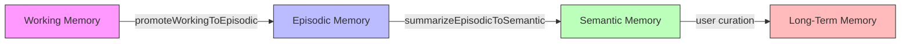

# ADR-002: 6-Tier Memory Architecture

## Status

Accepted

## Context

The A2A (Agent-to-Agent) debate system and knowledge management features require structured memory with different retention policies. A single flat storage mechanism is insufficient because:

- **Session data** (intermediate agent state) must be cleared on refresh
- **Episodic data** (conversation logs) must be auto-purged after 90 days
- **Semantic data** (embeddings + text) needs vector search but no automatic deletion
- **Procedural data** (skill instructions, agent workflows) must never be auto-purged
- **Working data** (in-progress task context) must be flushed per-session
- **Long-term data** (user-curated knowledge) requires manual deletion only

## Decision

Implement a 6-tier memory system, each tier with a distinct storage backend and retention policy:

| Tier | Name | Backend | Retention | Auto-Purge | Exposed Functions |
|------|------|---------|-----------|------------|-------------------|
| 1 | **Session** | `Map<string, any>` in-memory | Browser tab lifetime | On refresh | `storeSession`, `getSession`, `clearSession` |
| 2 | **Episodic** | IndexedDB `episodic` store | 90 days | `purgeEpisodic(beforeDate)` | `storeEpisodic`, `getEpisodic`, `getEpisodicByProject`, `purgeEpisodic` |
| 3 | **Semantic** | IndexedDB `semantic` store + Orama vector index | Indefinite | Manual | `storeSemantic`, `searchSemantic`, `deleteSemantic`, `rebuildSemanticIndex` |
| 4 | **Procedural** | IndexedDB `procedural` store | Never | Never (`purgeAllProcedural` is a no-op) | `storeProcedural`, `getProceduralBySkill` |
| 5 | **Working** | IndexedDB `working` store | Session-scoped | `flushWorking(sessionId)` | `storeWorking`, `getWorking`, `flushWorking` |
| 6 | **Long-Term** | IndexedDB `long_term` store | Manual | Never (`purgeAllLongTerm` is a no-op) | `storeLongTerm`, `getLongTermByCategory` |

Cross-tier operations enable data promotion:

## Consequences

| Positive | Negative |
|----------|----------|
| Each tier has a clear, documented lifecycle | More complex API surface (22 exported functions) |
| Sensitive data (session) never touches disk | Cross-tier promotion can create data duplication |
| Procedural skills survive all user actions | Storage estimation must sum across multiple object stores |
| `performMaintenance()` cron purges episodic memory at 90-day threshold | Working memory flush is manual — stale data can accumulate |

## See Also

- [ADR-005: IndexedDB Schema Design](./005-indexeddb-schema.md)
- [API Documentation: Memory API](../api/001-memory-api.md)
- [API Documentation: IndexedDB Schema](../api/002-indexeddb.md)

---

_Open Knowledge Studio v2.0 — Zero-dependency, browser-native, 12-agent A2A platform for offline-first research, writing, and data analysis. Built by [Mohammad Ariful Islam](https://github.com/zsdotcom) ([codeandbrain](https://github.com/codeandbrain)) at the [ZarishSphere Foundation](https://zarishsphere.com). Licensed under MIT. Source code: [github.com/zsdotcom/zs-oks](https://github.com/zsdotcom/zs-oks)._
