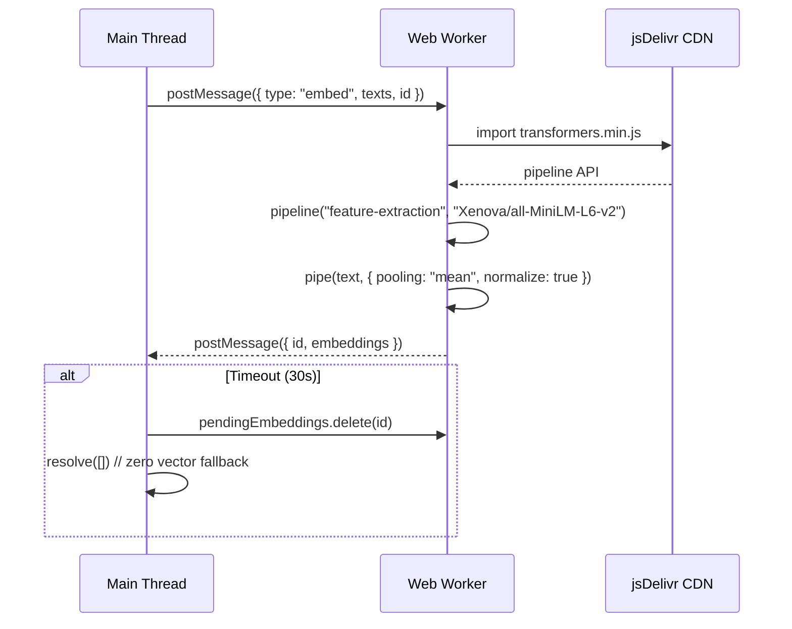

# ADR-003: Vector Embeddings in Web Worker

## Status

Accepted

## Context

Semantic memory (Tier 3) requires vector embeddings to enable cosine-similarity search. The chosen embedding model is `Xenova/all-MiniLM-L6-v2` running via Transformers.js, which produces 384-dimensional vectors. Transformers.js uses WebAssembly (WASM) internally and its first inference can take 2-5 seconds as the model loads and compiles.

If embedding computation runs on the main thread, the UI freezes for the duration — an unacceptable user experience for a chat-focused application.

## Decision

**Run Transformers.js embedding computation in a background Web Worker** (`src/services/embeddingWorker.ts`). The worker:

1. Is lazily instantiated on first `computeEmbedding()` call (`getEmbeddingWorker()`)
2. Dynamically imports Transformers.js from CDN: `https://cdn.jsdelivr.net/npm/@huggingface/transformers@3.4.0`
3. Defaults to WASM execution device: `{ device: 'wasm' }`
4. Supports batched embedding via `computeEmbeddingsParallel(texts[])`
5. Implements a 30-second timeout per batch — falls back to zero vectors if exceeded
6. Communicates results via `postMessage` / `onmessage` with a correlation ID pattern

## Consequences

| Positive | Negative |
|----------|----------|
| UI remains responsive during embedding computation | Additional 2-5 second cold-start latency for first embedding |
| Batched embedding reduces per-text overhead | CDN dependency — embedding unavailable offline |
| 30-second timeout prevents permanent hangs | WASM model cache (~3MB) must be re-downloaded on cache clear |
| Zero-vector fallback enables graceful degradation | Worker adds ~1KB to bundle |
| Parallel computation via `Map` of correlation IDs | Memory: worker loads full Transformers.js (~15MB WASM) |

## See Also

- [ADR-001: Zero NPM Dependency Decision](./001-zero-npm-dependency.md)
- [ADR-002: 6-Tier Memory Architecture](./002-6-tier-memory.md)
- [Memory API: computeEmbedding](../api/001-memory-api.md#computeembedding)
