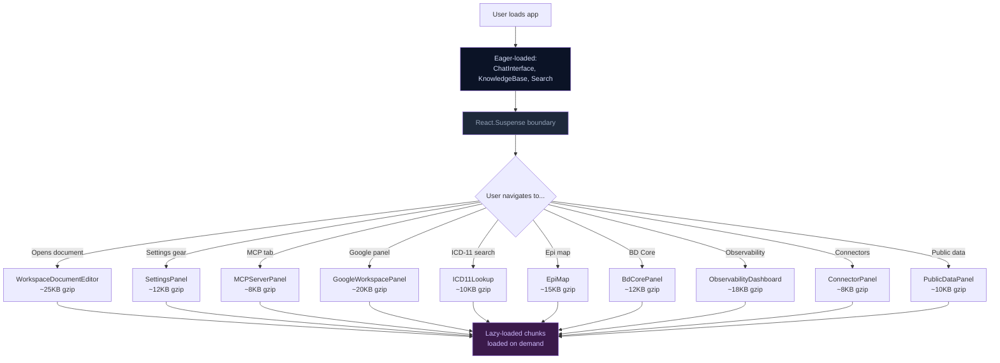

# ADR-004: Code Splitting Strategy

## Lazy Loading Flow



## Status

Accepted

## Context

The initial `main.js` bundle (before code splitting) approached 150KB+ gzip, driven by panels not used on initial view. Not every user navigates to every panel. Loading all panels upfront wastes bandwidth and increases Time-to-Interactive (TTI), especially on mobile connections.

## Decision

**Use `React.lazy()` + dynamic `import()` for 10 panels that are not needed on initial load**, defined in `src/App.tsx:45-49,57-61`:

```typescript
const WorkspaceDocumentEditor = React.lazy(() =>
  import('./components/WorkspaceDocumentEditor')
);
const GoogleWorkspacePanel = React.lazy(() =>
  import('./components/GoogleWorkspacePanel')
);
const SettingsPanel = React.lazy(() =>
  import('./components/SettingsPanel')
);
const MCPServerPanel = React.lazy(() =>
  import('./components/MCPServerPanel')
);
const ObservabilityDashboard = React.lazy(() =>
  import('./components/ObservabilityDashboard')
);
const ICD11Lookup = React.lazy(() =>
  import('./components/ICD11Lookup')
);
const BdCorePanel = React.lazy(() =>
  import('./components/BdCorePanel')
);
const EpiMap = React.lazy(() =>
  import('./components/EpiMap')
);
const ConnectorPanel = React.lazy(() =>
  import('./components/ConnectorPanel')
);
const PublicDataPanel = React.lazy(() =>
  import('./components/PublicDataPanel')
);
```

All lazy components are wrapped inside `<React.Suspense>` with a loading fallback in the rendering tree. Components used on initial view (KnowledgeBaseManager, ChatInterface, ThemeSwitcher, AgentBuilder, SearchPanel, WorkspaceManager, A2AMetricsDashboard and others) remain eagerly loaded.

Lazy-loaded panels with their approximate size contributions:

| Component | Estimated Size | Trigger |
|-----------|---------------|---------|
| WorkspaceDocumentEditor | 25KB gzip | User opens a document |
| GoogleWorkspacePanel | 20KB gzip | User opens GDrive panel |
| SettingsPanel | 12KB gzip | User opens Settings |
| MCPServerPanel | 8KB gzip | User opens MCP config |
| ObservabilityDashboard | 18KB gzip | User opens observability |
| ICD11Lookup | 10KB gzip | User searches ICD-11 codes |
| BdCorePanel | 12KB gzip | User opens BD Core FHIR panel |
| EpiMap | 15KB gzip | User views epidemic map |
| ConnectorPanel | 8KB gzip | User manages connectors |
| PublicDataPanel | 10KB gzip | User browses public data |

## Consequences

| Positive | Negative |
|----------|----------|
| Initial JS bundle reduced by ~130KB gzip | Lazy components show a loading state on first render |
| Faster initial page load (lower TTI) | Slightly more complex import syntax with `.then()` unwrapping |
| Users on mobile download only what they use | Dynamic imports add a few extra network requests |
| Vite automatically code-splits at dynamic `import()` boundaries | Module-level CSS might flash unstyled content |

## See Also

- [ADR-001: Zero NPM Dependency Decision](./001-zero-npm-dependency.md)
- [API Documentation Index](../api/000-index.md)


---

_Open Knowledge Studio v2.0 — Zero-dependency, browser-native, 12-agent A2A platform for offline-first research, writing, and data analysis. Built by [Mohammad Ariful Islam](https://github.com/zsdotcom) ([codeandbrain](https://github.com/codeandbrain)) at the [ZarishSphere Foundation](https://zarishsphere.com). Licensed under MIT. Source code: [github.com/zsdotcom/zs-oks](https://github.com/zsdotcom/zs-oks)._
