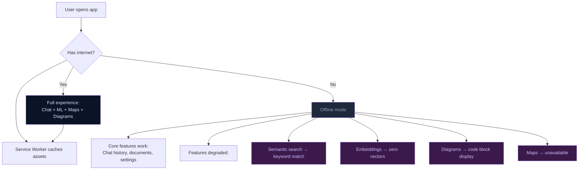

# ADR-006: PWA & Offline Architecture

## Online vs Offline Behavior



## Status

Accepted

## Context

Open Knowledge Studio targets field epidemiology use cases where internet connectivity may be unreliable or absent (remote clinics, outbreak zones). Users need the app to load and function in offline or low-connectivity environments.

CDN-loaded libraries (Transformers.js, Orama, KaTeX, Mermaid, Leaflet) and API calls to AI providers are inherently online-only, but the core UI, IndexedDB-persisted data, and static assets should work offline.

## Decision

**Use a Vite-generated Service Worker to cache all built assets**, with an install prompt for supported browsers.

The Service Worker is configured via `vite-plugin-pwa` (in `vite.config.ts`) and:

1. Caches all Vite-built JS/CSS/HTML assets on first load (precache)
2. Applies a cache-first strategy for static assets
3. Registers the Service Worker on app bootstrap
4. Shows an install prompt (`beforeinstallprompt` event) managed by `usePWAInstall` hook in `src/App.tsx`

The install prompt UI is triggered via the `usePWAInstall` hook:

```typescript
const { isInstallable, install } = usePWAInstall();
```

CDN resources are **not** pre-cached by the Service Worker. They are cached individually by the CDN provider's own edge network. Offline degradation:

| Feature | Offline Behavior |
|---------|-----------------|
| Chat UI, knowledge base, settings | Fully functional (IndexedDB data available) |
| Semantic search | Degrades to keyword matching |
| Embedding computation | Returns zero vectors (Transformers.js unavailable) |
| AI provider calls | Shows "no internet" error in chat |
| Mermaid/KaTeX rendering | Unavailable (CDN scripts not loaded) |
| Leaflet maps | Unavailable |

The PWA is deployable to any static host. The deploy pipeline (`deploy.yml`) sets `BASE_PATH=/open-knowledge-studio/` and copies `index.html` to `404.html` for SPA fallback routing.

## Consequences

| Positive | Negative |
|----------|----------|
| Fully offline-capable for core UI and stored data | CDN-dependent features break without internet (graceful degradation required) |
| Static assets load instantly on repeat visits | Service Worker cache invalidation requires careful version management |
| Install prompt enables "native" app experience on mobile | IndexedDB can be evicted by the browser under storage pressure |
| Vite plugin handles precache manifest generation automatically | PWA only works over HTTPS (or localhost) — dev requires `https://` for SW registration |

## See Also

- [ADR-001: Zero NPM Dependency Decision](./001-zero-npm-dependency.md)
- [Security Documentation: Data Privacy](../security/002-data-privacy.md)
- [API Documentation Index](../api/000-index.md)


---

_Open Knowledge Studio v2.0 — Zero-dependency, browser-native, 12-agent A2A platform for offline-first research, writing, and data analysis. Built by [Mohammad Ariful Islam](https://github.com/zsdotcom) ([codeandbrain](https://github.com/codeandbrain)) at the [ZarishSphere Foundation](https://zarishsphere.com). Licensed under MIT. Source code: [github.com/zsdotcom/zs-oks](https://github.com/zsdotcom/zs-oks)._
