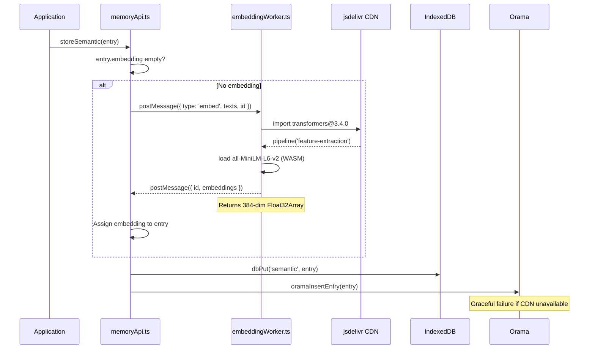

# 050 — Memory Architecture Deep Dive

Complete documentation of the **6-tier memory architecture**, vector embedding pipeline, and search system.

---

## 1. Executive Summary

The 6-tier memory architecture provides structured state management and knowledge persistence entirely in the browser. No server-side database is needed.

**Key files:**

| File | Purpose |
| :--- | :--- |
| `src/db/indexedDB.ts` | Generic IndexedDB CRUD — 22 object stores, v2 schema |
| `src/services/memoryApi.ts` | Domain-specific 6-tier memory API |
| `src/services/embeddingWorker.ts` | Web Worker for Transformers.js vector embeddings |
| `src/services/oramaService.ts` | Orama JS hybrid vector + keyword search |

---

## 2. The 6 Memory Tiers

### Tier 1: Session Memory (In-Memory Map)

| Property | Detail |
| :--- | :--- |
| **Storage** | `Map<string, any>` in JavaScript memory |
| **Location** | `memoryApi.ts` — `const sessionStore = new Map()` |
| **Functions** | `storeSession(key, value)` — `getSession<T>(key)` — `clearSession()` |
| **Persistence** | None — cleared on page refresh |
| **Use cases** | Current conversation context, UI state, temporary flags |

### Tier 2: Episodic Memory (IndexedDB)

| Property | Detail |
| :--- | :--- |
| **Store** | `episodic` in IndexedDB |
| **Schema** | `{ id, projectId, agentId, text, summary?, createdAt }` |
| **Indexes** | `projectId_agentId` (composite), `createdAt` |
| **Purge** | 90-day default via `performMaintenance()` |
| **Functions** | `storeEpisodic()` — `getEpisodic()` — `getEpisodicByProject()` — `purgeEpisodic(beforeDate)` |

Each interaction with an agent is stored as an episodic memory entry, timestamped and scoped to a project+agent pair.

### Tier 3: Semantic Memory (IndexedDB + Orama)

| Property | Detail |
| :--- | :--- |
| **Store** | `semantic` in IndexedDB + Orama in-memory index |
| **Schema** | `{ id, projectId, agentId, topic, text, embedding: number[], createdAt }` |
| **Vector Dimension** | 384 (all-MiniLM-L6-v2 via Transformers.js) |
| **Search** | Orama hybrid (vector + keyword) with keyword fallback |
| **Embedding** | Auto-generated on store via Web Worker |
| **Functions** | `storeSemantic()` — `searchSemantic()` — `deleteSemantic()` — `rebuildSemanticIndex()` |

Semantic memory stores knowledge with vector embeddings for semantic search.

### Tier 4: Procedural Memory (IndexedDB)

| Property | Detail |
| :--- | :--- |
| **Store** | `procedural` in IndexedDB |
| **Schema** | `{ id, projectId, skillId, instructions, triggers[], createdAt }` |
| **Purge** | Never auto-purged |
| **Functions** | `storeProcedural()` — `getProceduralBySkill()` — `purgeAllProcedural()` (no-op) |

Stores instructions for skills and agent procedures.

### Tier 5: Working Memory (IndexedDB)

| Property | Detail |
| :--- | :--- |
| **Store** | `working` in IndexedDB |
| **Schema** | `{ id, projectId, agentId, sessionId, key, value, createdAt }` |
| **Purge** | Flushed on session end via `flushWorking(sessionId)` |
| **Functions** | `storeWorking()` — `getWorking()` — `flushWorking()` |

Holds in-progress context for the current session.

### Tier 6: Long-Term Memory (IndexedDB)

| Property | Detail |
| :--- | :--- |
| **Store** | `long_term` in IndexedDB |
| **Schema** | `{ id, projectId, category, text, references[], createdAt }` |
| **Purge** | Manual only |
| **Functions** | `storeLongTerm()` — `getLongTermByCategory()` — `purgeAllLongTerm()` (no-op) |

Persistent knowledge that survives indefinitely.

---

## 3. Vector Embedding Pipeline



### Embedding Worker Details

**File:** `src/services/embeddingWorker.ts`

- Runs in a **dedicated Web Worker** (separate thread)
- Dynamically imports Transformers.js from CDN:
  `https://cdn.jsdelivr.net/npm/@huggingface/transformers@3.4.0/dist/transformers.min.js`
- Loads the `Xenova/all-MiniLM-L6-v2` model with WASM backend
- Returns **384-dim** vector arrays via `postMessage`
- **30-second timeout** — returns zero vector `[]` on failure
- Supports **batch processing** via `computeEmbeddingsParallel()`

### Model: all-MiniLM-L6-v2

| Property | Value |
| :--- | :--- |
| Architecture | MiniLM (12M parameters) |
| Output dimension | 384 |
| Pooling | Mean pooling |
| Normalization | L2 normalized |
| Backend | WASM (cross-platform, no GPU needed) |
| Load time | ~2-5 seconds (first load, cached thereafter) |

---

## 4. Search Pipeline

```mermaid
flowchart TD
    Q[searchSemantic(query, topK)]
    Q-->O[Try Orama hybrid search]
    O-->OK{CDN available?}
    OK-- Yes -->R1[Return vector + keyword results]
    OK-- No -->F[Fallback: keyword matching]
    F-->FA[dbGetAll semantic entries]
    FA-->FM[Token-based scoring]
    FM-->FS[Sort by match count]
    FS-->FT[Return topK]
```

### Orama Search (Primary)

- Dynamically imports from CDN: `https://cdn.jsdelivr.net/npm/@orama/orama@3.0.0/dist/index.js`
- Creates in-memory index with 384-dim vector schema
- Supports **hybrid mode**: `{ term: query, mode: 'hybrid', limit: topK }`
- Results include both vector similarity and keyword matches

### Keyword Fallback

When Orama CDN is unavailable:
1. Loads all entries from the `semantic` IndexedDB store
2. Splits query into terms (lowercase)
3. Scores each entry by number of matching terms
4. Returns topK results sorted by score

---

## 5. Cross-Tier Operations

### promoteWorkingToEpisodic

```typescript
export async function promoteWorkingToEpisodic(sessionId: string, projectId: string): Promise<void>
```

1. Reads all working memory entries for `sessionId`
2. Creates episodic entries from each working entry
3. Flushes (clears) the working memory session

### summarizeEpisodicToSemantic

```typescript
export async function summarizeEpisodicToSemantic(projectId: string): Promise<void>
```

1. Reads all episodic entries for `projectId` that lack a summary
2. Creates semantic entries from each (truncated to 500 chars)
3. Auto-embedding is triggered during `storeSemantic()`

### performMaintenance

```typescript
export async function performMaintenance(): Promise<{ purged: number }>
```

1. Calculates date 90 days ago
2. Purges all episodic entries older than that date
3. Returns count of purged entries

---

## 6. IndexedDB Schema (v2)

**Database name:** `open-knowledge-studio`
**Version:** 2

### Object Stores (22 total)

| Store | Key | Indexes |
| :--- | :--- | :--- |
| `episodic` | `id` | `projectId_agentId` (composite) |
| `semantic` | `id` | `projectId_agentId` (composite) |
| `procedural` | `id` | — |
| `working` | `id` | — |
| `long_term` | `id` | `projectId_category` (composite) |
| `files` | `id` | `name`, `parentFolderId`, `type` |
| `folders` | `id` | — |
| `providers` | `id` | — |
| `urlGroups` | `id` | — |
| `prompts` | `id` | — |
| `a2aAgents` | `id` | — |
| `metrics` | `id` | `timestamp`, `agentId` |
| `skills` | `id` | — |
| `connectors` | `id` | — |
| `workspaceProjects` | `id` | — |
| `sessions` | `id` | — |
| `sandbox` | `id` | — |
| `versions` | `id` | `documentId`, `createdAt` |
| `kanban` | `id` | — |
| `templates` | `id` | — |
| `tags` | `id` | — |
| `appState` | `id` | — |

### Migration

The `migrateLocalStorage()` function automatically migrates data from localStorage (used in v0.9) to IndexedDB on first load after upgrade.

---

## 7. Cross-Tab Synchronization

Uses the **BroadcastChannel API** (`oks_memory_sync` channel):

```typescript
export function broadcastMemoryUpdate(projectId: string, storeName: string): void
export function subscribeMemoryUpdates(callback): () => void  // Returns unsubscribe function
```

When memory is updated in one tab, all other open tabs receive a notification and can refresh their state.

---

## 8. Storage Management

```typescript
export async function getStorageEstimate(): Promise<{ quota: number; usage: number }>
```

Uses `navigator.storage.estimate()` to report browser storage usage. Most browsers provide a few GB of IndexedDB storage per origin.

---

## See Also

- [Development Guidelines](040-development.md) — State management rules
- [Test Suite Documentation](060-test-suite.md) — Memory test coverage and benchmarks
- [Zero-Dependency Architecture](100-dependency-removal.md) — CDN loading philosophy
- [Setup Guide](010-setup.md) — Environment configuration

---

*Back to [Documentation Home](../index.md)*
