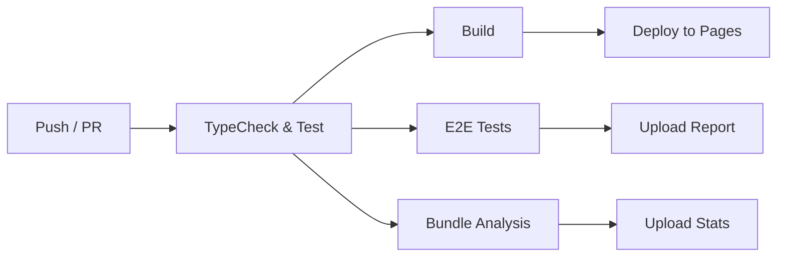

# 080 — CI/CD Pipeline

Complete reference for the GitHub Actions CI/CD pipeline, including type checking, testing, building, E2E tests, bundle analysis, and deployment.

---

## 1. Pipeline Overview



**Two workflow files:**

| File | Trigger | Jobs |
| :--- | :--- | :--- |
| `.github/workflows/ci.yml` | Push to `main`/`develop`, PR to `main` | TypeCheck & Test, E2E Tests, Bundle Analysis |
| `.github/workflows/deploy.yml` | Push to `main` | Deploy to GitHub Pages |

---

## 2. CI Workflow (`ci.yml`)

```yaml
name: CI

on:
  push:
    branches: [main, develop]
  pull_request:
    branches: [main]

jobs:
  typecheck-and-test:
    name: TypeCheck & Test
    runs-on: ubuntu-latest

    steps:
      - uses: actions/checkout@v7

      - name: Setup Node.js
        uses: actions/setup-node@v7
        with:
          node-version-file: .nvmrc
          cache: 'npm'

      - name: Install dependencies
        run: npm ci

      - name: Type check
        run: npm run typecheck

      - name: Run tests
        run: npm test

      - name: Build
        run: npm run build

      - name: Upload build artifacts
        uses: actions/upload-artifact@v4
        with:
          name: dist
          path: dist/
          retention-days: 7

  e2e-tests:
    name: E2E Tests
    runs-on: ubuntu-latest
    needs: typecheck-and-test

    steps:
      - uses: actions/checkout@v7

      - name: Setup Node.js
        uses: actions/setup-node@v7
        with:
          node-version-file: .nvmrc
          cache: 'npm'

      - name: Install dependencies
        run: npm ci

      - name: Install Playwright browsers
        run: npx playwright install chromium

      - name: Run E2E tests
        run: npm run test:e2e
        env:
          CI: true

      - name: Upload Playwright report
        uses: actions/upload-artifact@v4
        if: failure()
        with:
          name: playwright-report
          path: playwright-report/
          retention-days: 7

  bundle-analysis:
    name: Bundle Analysis
    runs-on: ubuntu-latest
    needs: typecheck-and-test

    steps:
      - uses: actions/checkout@v7

      - name: Setup Node.js
        uses: actions/setup-node@v7
        with:
          node-version-file: .nvmrc
          cache: 'npm'

      - name: Install dependencies
        run: npm ci

      - name: Build with analysis
        run: npm run analyze

      - name: Upload bundle stats
        uses: actions/upload-artifact@v4
        with:
          name: bundle-stats
          path: dist/stats.html
          retention-days: 30
```

### CI Job Order

```
1. TypeCheck & Test (always runs)
   ├── tsc -b --noEmit   # TypeScript type checking
   ├── vitest run         # 78 unit + integration tests
   └── vite build         # Production build
2. E2E Tests (runs after TypeCheck & Test, only on PRs)
   └── playwright test    # 7 E2E spec files
3. Bundle Analysis (runs after TypeCheck & Test)
   └── rollup-plugin-visualizer → dist/stats.html
```

---

## 3. Deploy Workflow (`deploy.yml`)

```yaml
name: Deploy to GitHub Pages

on:
  push:
    branches: [main]

permissions:
  contents: read
  pages: write
  id-token: write

concurrency:
  group: "pages"
  cancel-in-progress: false

jobs:
  deploy:
    environment:
      name: github-pages
      url: ${{ steps.deployment.outputs.page_url }}
    runs-on: ubuntu-latest

    steps:
      - uses: actions/checkout@v7

      - name: Setup Node.js
        uses: actions/setup-node@v7
        with:
          node-version-file: .nvmrc
          cache: 'npm'

      - name: Install dependencies
        run: npm ci

      - name: Build
        run: npm run build

      - name: Setup Pages
        uses: actions/configure-pages@v5

      - name: Upload artifact
        uses: actions/upload-pages-artifact@v3
        with:
          path: dist/

      - name: Deploy to GitHub Pages
        id: deployment
        uses: actions/deploy-pages@v4
```

### Deploy Details

- Runs only on push to `main`
- Sets `BASE_PATH=/open-knowledge-studio/` for the Vite `base` config
- Copies `index.html` to `404.html` for SPA client-side routing
- Requires `Settings → Pages → Source: GitHub Actions`

---

## 4. GitHub Secrets Configuration

### Setting Up Secrets

1. Go to **Settings → Secrets and variables → Actions**
2. Click **New repository secret**
3. Add each secret:

| Secret | Required | Description |
| :--- | :---: | :--- |
| `VITE_GEMINI_API_KEY` | No | Google Gemini API key |
| `VITE_GOOGLE_OAUTH_CLIENT_ID` | No | Google OAuth Client ID |
| `VITE_OPENAI_API_KEY` | No | OpenAI API key |

> **CI does not require any secrets.** Tests mock all external services. Secrets are only needed for the deployed application.

### Creating a Gemini API Key for CI

1. Go to [aistudio.google.com/app/apikey](https://aistudio.google.com/app/apikey)
2. Sign in with your Google account
3. Click **Create API Key**
4. Copy the key and add as a GitHub secret

### Creating a Google OAuth Client ID

1. Go to [console.cloud.google.com/apis/credentials](https://console.cloud.google.com/apis/credentials)
2. Click **Create Credentials → OAuth client ID**
3. Select **Web application**
4. Add `http://localhost:3000` and your production URL to **Authorized JavaScript origins**
5. Copy the Client ID and add as a GitHub secret

---

## 5. Local CI Simulation

Run the same checks locally before pushing to avoid CI failures:

```bash
# 1. TypeScript type checking (0 errors expected)
npm run typecheck

# 2. Unit + integration tests (78 tests, all passing)
npm test

# 3. Coverage check (80/75/85/80 thresholds)
npm run test:coverage

# 4. Production build
npm run build

# 5. Bundle analysis
npm run analyze

# 6. E2E tests (requires dev server running)
npm run test:e2e
```

---

## 6. Environment Variables in CI

The `VITE_*` environment variables are exposed to client code at build time. In CI:

- **`.env` file approach:** Create a `.env` file with `echo` in the workflow
- **GitHub Secrets approach:** Set as `env` in the workflow step
- **Better approach:** Don't set them in CI — tests mock all external APIs

For the deploy workflow, `BASE_PATH` is set via `vite.config.ts`:

```typescript
base: process.env.BASE_PATH || '/',
```

The deploy workflow does not explicitly set `BASE_PATH` — it relies on GitHub Pages convention. For custom setups, add:

```yaml
env:
  BASE_PATH: /open-knowledge-studio/
```

---

## 7. Troubleshooting CI

### TypeCheck fails locally but passes in CI

```bash
# Clear TypeScript cache
rm -rf node_modules/.cache/tsbuildinfo
npm run typecheck
```

### E2E tests fail in CI

Ensure Playwright browsers are installed:

```yaml
- name: Install Playwright browsers
  run: npx playwright install chromium
```

### npm ci fails

Ensure `package-lock.json` is committed and up to date:

```bash
npm install  # Updates package-lock.json
git add package-lock.json
git commit -m "chore: update package-lock.json"
```

---

## See Also

- [Development Guidelines](040-development.md) — Git workflow and PR guidelines
- [Deployment Guide](090-deployment.md) — Docker, Vercel, Netlify deployment
- [Test Suite Documentation](060-test-suite.md) — Test architecture and coverage
- [Environment Variables](020-environment.md) — All VITE_* vars reference

---

*Back to [Documentation Home](../index.md)*

---

_Open Knowledge Studio v2.0 — Zero-dependency, browser-native, 12-agent A2A platform for offline-first research, writing, and data analysis. Built by [Mohammad Ariful Islam](https://github.com/zsdotcom) ([codeandbrain](https://github.com/codeandbrain)) at the [ZarishSphere Foundation](https://zarishsphere.com). Licensed under MIT. Source code: [github.com/zsdotcom/zs-oks](https://github.com/zsdotcom/zs-oks)._
