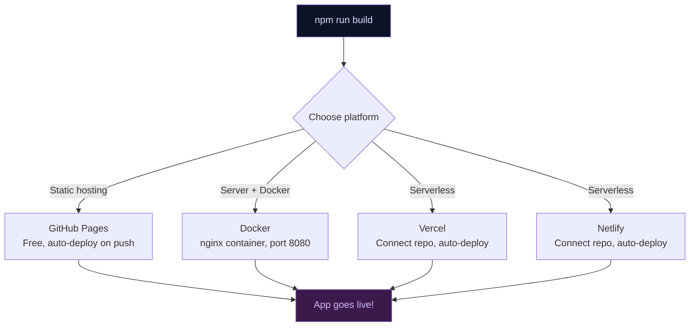

# 009 — Deployment Guide

## Deployment Options



Deploy Open Knowledge Studio using **Docker**, **Vercel**, **Netlify**, or **GitHub Pages**.

---

## 1. Docker Deployment

### Dockerfile

```dockerfile
FROM node:26-alpine AS builder
WORKDIR /app
COPY package*.json ./
RUN npm ci
COPY . .
RUN npm run build

FROM nginx:alpine AS runner
COPY --from=builder /app/dist /usr/share/nginx/html
COPY nginx.conf /etc/nginx/conf.d/default.conf
EXPOSE 80
CMD ["nginx", "-g", "daemon off;"]
```

> Multi-stage build: Stage 1 compiles the app, Stage 2 serves with nginx (only ~5 MB image).

### nginx.conf

```nginx
server {
    listen 80;
    server_name _;
    root /usr/share/nginx/html;
    index index.html;

    location / {
        try_files $uri $uri/ /index.html;
    }

    # Cache static assets aggressively
    location /assets/ {
        expires 1y;
        add_header Cache-Control "public, immutable";
    }
}
```

> The `try_files` directive ensures SPA routing works — all paths fall back to `index.html`.

### Build and Run

```bash
# Build the image
docker build -t open-knowledge-studio .

# Run the container
docker run -p 8080:80 open-knowledge-studio
```

Open **http://localhost:8080** in your browser.

### Docker Compose

```yaml
# docker-compose.yml
services:
  web:
    build: .
    ports:
      - "8080:80"
```

```bash
docker compose up
```

### Environment Variables with Docker

```bash
docker run -p 8080:80 \
  -e VITE_GEMINI_API_KEY=your_key_here \
  -e VITE_GOOGLE_OAUTH_CLIENT_ID=your_client_id_here \
  open-knowledge-studio
```

> **Note:** `VITE_*` variables are baked into the JS bundle at build time (Vite requirement). For runtime configuration, use the Settings Panel UI instead.

---

## 2. Vercel Deployment

### Step-by-Step

1. Go to [vercel.com](https://vercel.com)
2. Click **Sign Up** (or **Log In**) — use your GitHub account
3. Click **Add New... → Project**
4. Import the repository: `zsdotcom/zs-oks`
5. Configure the project:

| Setting | Value |
| :--- | :--- |
| **Framework Preset** | Vite (auto-detected) |
| **Root Directory** | `./` |
| **Build Command** | `npm run build` |
| **Output Directory** | `dist` |
| **Install Command** | `npm ci` |

6. Click **Environment Variables** to add:
   - `VITE_GEMINI_API_KEY`
   - `VITE_GOOGLE_OAUTH_CLIENT_ID`
   - Any other `VITE_*` keys you need

7. Click **Deploy**
8. Wait for deployment — you'll get a URL like `https://open-knowledge-studio.vercel.app`

### vercel.json (Optional)

```json
{
  "buildCommand": "npm run build",
  "outputDirectory": "dist",
  "installCommand": "npm ci",
  "framework": "vite"
}
```

### Custom Domain (Pro)

1. Go to your project dashboard on Vercel
2. Click **Settings → Domains**
3. Enter your domain name
4. Follow the DNS configuration instructions

---

## 3. Netlify Deployment

### Step-by-Step

1. Go to [app.netlify.com](https://app.netlify.com)
2. Click **Sign up** (or **Log in**) — use your GitHub account
3. Click **Add new site → Import an existing project**
4. Click **Deploy with GitHub**
5. Authorize Netlify access to your repositories
6. Search for and select `zsdotcom/zs-oks`
7. Configure:

| Setting | Value |
| :--- | :--- |
| **Branch to deploy** | `main` |
| **Build command** | `npm run build` |
| **Publish directory** | `dist` |

8. Click **Show advanced → Environment variables** to add `VITE_*` keys
9. Click **Deploy site**

### netlify.toml

```toml
[build]
  command = "npm run build"
  publish = "dist"

[[redirects]]
  from = "/*"
  to = "/index.html"
  status = 200
```

> The redirect rule is essential for SPA routing — it ensures all paths serve `index.html`.

### Post-Deployment

- **URL:** `https://<random-name>.netlify.app`
- **Custom domain:** Site settings → Domain management
- **Environment variables:** Site settings → Build & deploy → Environment
- **Deploy hooks:** For auto-deploy from CI

---

## 4. GitHub Pages Deployment

### Automatic (via CI)

The `.github/workflows/deploy.yml` deploys automatically on push to `main`:

1. Go to **Settings → Pages**
2. Under **Source**, select **GitHub Actions**
3. Push to `main` — the deploy workflow runs automatically

### Manual

```bash
# Build with BASE_PATH
BASE_PATH=/open-knowledge-studio/ npm run build

# Copy index.html to 404.html for SPA routing
cp dist/index.html dist/404.html

# Deploy to gh-pages branch
npx gh-pages -d dist
```

---

## 5. Environment Variables Reference

| Variable | Docker | Vercel | Netlify | GitHub Pages |
| :--- | :--- | :--- | :--- | :--- |
| `VITE_GEMINI_API_KEY` | `-e` flag | Env vars UI | Env vars UI | `.env` at build time |
| `VITE_GROQ_API_KEY` | `-e` flag | Env vars UI | Env vars UI | `.env` at build time |
| `VITE_OPENAI_API_KEY` | `-e` flag | Env vars UI | Env vars UI | `.env` at build time |
| `VITE_ANTHROPIC_API_KEY` | `-e` flag | Env vars UI | Env vars UI | `.env` at build time |
| `VITE_DEEPSEEK_API_KEY` | `-e` flag | Env vars UI | Env vars UI | `.env` at build time |
| `VITE_GOOGLE_OAUTH_CLIENT_ID` | `-e` flag | Env vars UI | Env vars UI | `.env` at build time |

> **Important:** All `VITE_*` variables must be set at **build time** (they are baked into the JS bundle). For runtime-only keys, use the **Settings Panel** inside the app.

---

## 6. Deployment Comparison

| Feature | Docker | Vercel | Netlify | GitHub Pages |
| :--- | :--- | :--- | :--- | :--- |
| **Setup complexity** | Medium | Low | Low | Very low |
| **Custom domain** | Yes | Yes (paid plan) | Yes (free) | Yes |
| **HTTPS** | Manual (reverse proxy) | Automatic | Automatic | Automatic |
| **CDN** | Manual | Global CDN | Global CDN | Fastly CDN |
| **Free tier** | N/A | Generous (100 GB bandwidth) | Generous (100 GB bandwidth) | 1 GB storage |
| **Build minutes** | N/A | 6,000/month | 300 minutes/month | 2,000/month |
| **Server-side features** | Full control (nginx) | Serverless Functions | Edge Functions | None |
| **SPA routing** | nginx config | Automatic | Redirect rule | 404.html copy |
| **Best for** | Self-hosted / private / air-gapped | Quick team deploys | Static sites + forms | Open source project pages |
| **Auth support** | None needed | Vercel Edge Config | Netlify Identity | None |

---

## 7. Post-Deployment Checklist

- [ ] App loads without errors
- [ ] SPA routing works (refresh on sub-page doesn't 404)
- [ ] AI provider responds (test chat)
- [ ] Settings panel saves and loads configuration
- [ ] IndexedDB persists across page reloads
- [ ] Environment variables are accessible
- [ ] Content Security Policy doesn't block CDN resources
- [ ] CDN-linked resources load (KaTeX, Mermaid, Leaflet)
- [ ] Mobile viewport is responsive
- [ ] Custom domain configured (if applicable)

---

## See Also

- [Setup & Installation](001-setup.md) — Prerequisites and dev environment
- [CI/CD Pipeline](008-ci-cd.md) — GitHub Actions automation
- [Environment Variables](002-environment.md) — API keys reference
- [Development Guidelines](004-development.md) — Build commands

---

*Back to [Documentation Home](../index.md)*

---

_Open Knowledge Studio v2.0 — Zero-dependency, browser-native, 12-agent A2A platform for offline-first research, writing, and data analysis. Built by [Mohammad Ariful Islam](https://github.com/zsdotcom) ([codeandbrain](https://github.com/codeandbrain)) at the [ZarishSphere Foundation](https://zarishsphere.com). Licensed under MIT. Source code: [github.com/zsdotcom/zs-oks](https://github.com/zsdotcom/zs-oks)._
