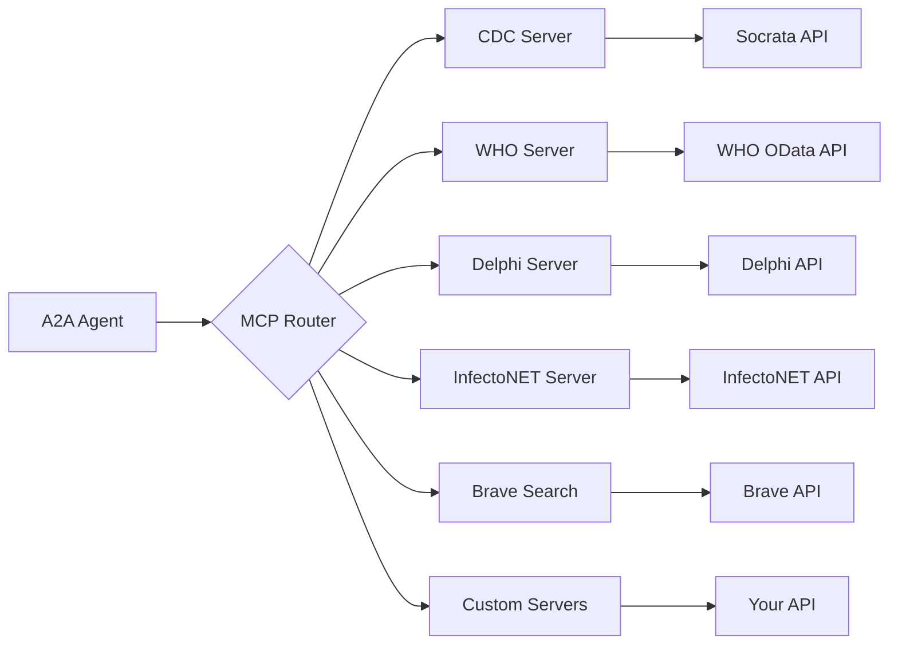

# 110 — MCP Server Configuration Guide

Configure **Model Context Protocol (MCP)** servers to extend agent capabilities with external data sources and tools.

---

## 1. What is MCP?

The **Model Context Protocol (MCP)** is an open standard that allows AI agents to connect to external data sources, APIs, and tools. In Open Knowledge Studio, MCP servers provide agents with real-time access to:

- Disease surveillance data (CDC, WHO)
- Epidemiological forecasts (CMU Delphi)
- Genomic surveillance (InfectoNET)
- Web search (Brave Search)
- Custom APIs (your own data sources)

---

## 2. Built-in MCP Servers

Open Knowledge Studio ships with 5 pre-configured MCP servers:

| Server | Source | Data Provided |
| :--- | :--- | :--- |
| **CDC Disease Surveillance** | Socrata Open Data API | Notifiable disease surveillance, vaccination rates, health statistics |
| **WHO Global Health Observatory** | WHO GHO OData API | Global health indicators, mortality, disease burden, SDG tracker |
| **CMU Delphi Epidata** | Delphi Group API | COVID-19, influenza, dengue epidemiological surveillance |
| **InfectoNET Genomic Surveillance** | InfectoNET API | Viral genomic surveillance for 50+ pathogens, outbreak alerts |
| **Brave Search** | Brave Search API | Web and local search (requires API key) |

---

## 3. MCP Data Types

### MCPTool

Each MCP server exposes tools with the following structure:

```typescript
interface MCPTool {
  name: string;          // Tool identifier
  description: string;   // What the tool does
  parameters: string;    // JSON schema for parameters
  isActive: boolean;     // Enabled/disabled toggle
}
```

### MCPServer

```typescript
interface MCPServer {
  id: string;                         // Unique identifier (e.g., "mcp-cdc")
  name: string;                       // Display name
  description: string;                // Long description
  status: 'connected' | 'disconnected';
  tools: MCPTool[];                   // Available tools
}
```

---

## 4. Step-by-Step Configuration

### Step 1: Open Settings

1. Open the Open Knowledge Studio app in your browser
2. Look at the **left sidebar** — you will see navigation icons
3. Click the **Database icon** labeled **"MCP"** (or navigate to the MCP view)

### Step 2: View Available Servers

The MCP panel shows all configured servers with their connection status:

- A **green Wi-Fi icon** means the server is connected
- A **gray Wi-Fi-off icon** means the server is disconnected
- Each server card shows the number of tools it provides

### Step 3: Add a New Server

1. Click the **"+" (Plus) button** in the top-right of the MCP panel
2. An input form appears:
   - **Server name** — A recognizable name (e.g., "My Custom API")
   - **Description** — What data this server provides (optional)
3. Click **"Add Server"**
4. The new server appears in the list with **disconnected** status

### Step 4: Add Tools to a Server

1. Click on a server card to expand it
2. At the bottom of the expanded card, there is a **"Tool name"** input field
3. Type a tool name (e.g., `search_conditions`, `get_vaccination_rates`)
4. Click **"Add"** (or press Enter)
5. The tool appears with a checkbox — it is enabled by default

### Step 5: Manage Tools

- **Enable/disable a tool:** Click the checkbox next to the tool name
- **Remove a tool:** Click the **trash icon** next to the tool name
- **Remove a server:** Click the **trash icon** on the server card header

### Step 6: Save Configuration

MCP server configurations are automatically saved to IndexedDB. You do not need to manually save.

---

## 5. Available Tools by Server

### CDC Disease Surveillance

| Tool | Description |
| :--- | :--- |
| `search_notifiable_diseases` | Search CDC notifiable disease data |
| `get_vaccination_rates` | Retrieve vaccination coverage statistics |
| `get_health_statistics` | Access general health statistics |

### WHO Global Health Observatory

| Tool | Description |
| :--- | :--- |
| `search_health_indicators` | Search global health indicators |
| `get_mortality_data` | Retrieve mortality statistics by cause |
| `get_disease_burden` | Access disease burden estimates |

### CMU Delphi Epidata

| Tool | Description |
| :--- | :--- |
| `search_surveillance_data` | Search epidemiological surveillance data |
| `get_covid_indicators` | Retrieve COVID-19 specific indicators |
| `get_influenza_data` | Access influenza surveillance data |

### InfectoNET Genomic Surveillance

| Tool | Description |
| :--- | :--- |
| `search_pathogens` | Search pathogen genomic data |
| `get_outbreak_alerts` | Retrieve current outbreak alerts |
| `get_genomic_sequences` | Access genomic sequence data |

### Brave Search

| Tool | Description |
| :--- | :--- |
| `web_search` | General web search |
| `local_search` | Location-based search |

---

## 6. Connection Status

| Status | Meaning |
| :--- | :--- |
| **Connected** (green Wi-Fi) | Server is configured and available |
| **Disconnected** (gray Wi-Fi) | Server is configured but not currently reachable |

The status indicator is a visual cue. MCP servers in Open Knowledge Studio are **template-based** — they describe available tools and data sources rather than maintaining persistent network connections. The actual API calls are made on-demand when agents use the tools.

---

## 7. Brave Search API Key

The Brave Search server requires an API key:

1. Go to [brave.com/search/api](https://brave.com/search/api/)
2. Sign up for a free plan (1,000 queries/month)
3. Copy your API key
4. In Open Knowledge Studio, go to **Settings → AI Providers**
5. Find the **Brave Search** section
6. Paste your API key and click **Save**

---

## 8. Adding Custom MCP Servers

You can add any REST API as an MCP server:

1. In the MCP panel, click **"+"**
2. Enter a **Server name** (e.g., "My Research API")
3. Optionally add a **Description**
4. Click **"Add Server"**
5. Click the server card to expand it
6. Add tools one by one — each tool represents an API endpoint

Example custom tools:

| Tool Name | Description | Parameters (JSON) |
| :--- | :--- | :--- |
| `search_papers` | Search academic papers by keyword | `{"query": "string", "limit": "number"}` |
| `get_paper_detail` | Get paper metadata by ID | `{"id": "string"}` |
| `get_citations` | Get citation data for a paper | `{"doi": "string"}` |

---

## 9. Using MCP Tools with Agents

Once MCP servers are configured, A2A agents automatically discover and use the available tools:

1. Go to the **A2A Agents** configuration tab in Settings
2. Each agent has a **"Tools"** field
3. MCP tools are available for selection
4. Assign relevant tools to each agent based on their role:
   - **Researcher:** CDC, WHO, Brave Search tools
   - **Data Analyst:** Delphi, InfectoNET tools
   - **Reviewer:** All sources for fact-checking

---

## 10. Troubleshooting

### MCP server not showing tools

1. Click the server card to expand it
2. Verify tools are added (not empty)
3. Check that tools have names
4. Try collapsing and re-expanding the card

### Brave Search not working

1. Verify the API key is set in Settings
2. Check the API key hasn't expired
3. Check Brave Search API usage quota
4. Try a different search query

### Server disappears after refresh

1. MCP config is saved to IndexedDB automatically
2. Go to **Settings → Data Management** and check if IndexedDB is working
3. Try clearing browser cache and reconfiguring

### Agent doesn't use MCP tools

1. Verify the agent has the relevant tools assigned
2. Check that the tools are enabled (checkbox checked)
3. Some agents may need explicit instructions to use specific tools
4. Try the **Researcher** or **Data Analyst** agents first

---

## 11. Technical Architecture



MCP servers are managed in `src/App.tsx` with state stored in the `sandbox` IndexedDB store. The MCPServerPanel component (`src/components/MCPServerPanel.tsx`) provides the UI for adding, removing, and configuring servers and tools.

---

## See Also

- [Development Guidelines](040-development.md) — State management and component patterns
- [Code Splitting & Performance](070-code-splitting.md) — MCPServerPanel is lazy-loaded
- [Environment Variables](020-environment.md) — API key configuration
- [Setup Guide](010-setup.md) — Running the application

---

*Back to [Documentation Home](../index.md)*

---

_Open Knowledge Studio v2.0 — Zero-dependency, browser-native, 12-agent A2A platform for offline-first research, writing, and data analysis. Built by [Mohammad Ariful Islam](https://github.com/zsdotcom) ([codeandbrain](https://github.com/codeandbrain)) at the [ZarishSphere Foundation](https://zarishsphere.com). Licensed under MIT. Source code: [github.com/zsdotcom/zs-oks](https://github.com/zsdotcom/zs-oks)._
