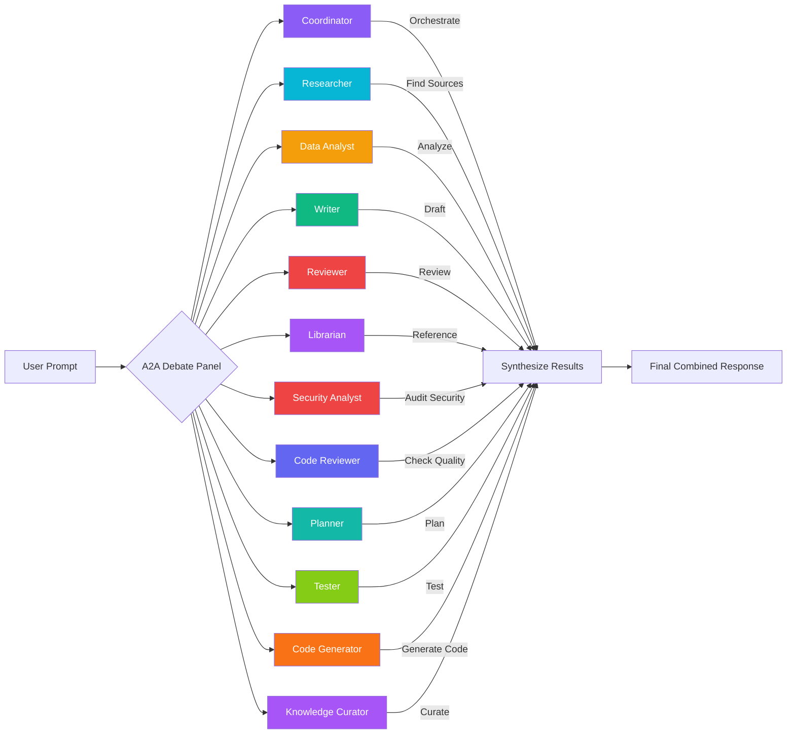

# 001 — A2A Agents Guide

---

## 1. Overview

Open Knowledge Studio ships with **12 A2A (Agent-to-Agent) debate agents** that provide multi-perspective analysis on user prompts. Each agent has a distinct role, color-coded identity, emoji avatar, memory type, and system prompt. All active agents receive the same user prompt in parallel and generate independent responses.

Agents are defined in `DEFAULT_A2A_AGENTS` at `src/App.tsx:127-212`.

---

## 2. Agent Roster

| ID | Name | Role | Avatar | Color | Memory | Provider | Model | Default |
| :--- | :--- | :--- | :--- | :--- | :--- | :--- | :--- | :--- |
| `coord` | **Coordinator** | Orchestrates workflows, delegates tasks, validates outputs | 🎯 | `#8B5CF6` | Full | Gemini | 2.5 Pro | Active |
| `research` | **Researcher** | Searches and synthesizes information with citations | 🔬 | `#06B6D4` | Persistent | Groq | Llama 3.3 70B | Active |
| `data` | **Data Analyst** | Processes data, statistics, visualizations | 📊 | `#F59E0B` | Session | Groq | Llama 3.3 70B | Active |
| `writer` | **Writer** | Drafts documents, applies templates, formats outputs | ✍️ | `#10B981` | Session | Gemini | 2.5 Flash | Active |
| `review` | **Reviewer** | Quality checks, citation audit, compliance | 🔍 | `#EF4444` | Session | Gemini | 2.5 Flash | Active |
| `librarian` | **Librarian** | Maintains memory, organizes knowledge, references | 📚 | `#A855F7` | Full | Gemini | 2.5 Flash | Active |
| `security` | **Security Analyst** | Analyzes code and configs for vulnerabilities | 🛡️ | `#EF4444` | Persistent | Gemini | 2.5 Flash | Active |
| `code-reviewer` | **Code Reviewer** | Reviews code quality and best practices | 🔎 | `#6366F1` | Session | Gemini | 2.5 Flash | Active |
| `planner` | **Planning Agent** | Decomposes tasks and creates execution plans | 📋 | `#14B8A6` | Full | Gemini | 2.5 Pro | Active |
| `tester` | **Testing Agent** | Generates and validates test cases | 🧪 | `#84CC16` | Session | Groq | Llama 3.3 70B | Active |
| `code-gen` | **Code Generator** | Generates source code from specifications | ⚡ | `#F97316` | Session | Gemini | 2.5 Flash | Active |
| `knowledge-curator` | **Knowledge Curator** | Organizes, tags, and interlinks knowledge assets | 🏛️ | `#A855F7` | Full | Gemini | 2.5 Flash | Active |

### Memory Types

| Type | Persistence | Description |
| :--- | :--- | :--- |
| **Session** | Current chat session | Ephemeral context within a single session |
| **Persistent** | Across sessions | Survives browser restarts, used for accumulated knowledge |
| **Full** | All tiers | Access to all 6 memory tiers (Session, Episodic, Semantic, Procedural, Working, Long-Term) |

---

## 3. System Prompts

Each agent has a detailed system prompt that defines its behavior. Below are the verbatim prompts from the source code.

### Coordinator
> "You are the Coordinator Agent of Open Knowledge Studio. Your role is to receive user requests and analyze their complexity. If the task is simple, handle it directly. If the task is complex, decompose it into sub-tasks and delegate to the appropriate specialized agents. Monitor the progress of delegated agents using the A2A protocol. Validate each agent's output before merging it into the final response. Save all key decisions and outcomes to episodic memory. Use color-coded status updates: 🟢 Complete, 🟡 In Progress, 🔴 Error."

### Researcher
> "You are the Research Agent of Open Knowledge Studio. Your role is to identify the user's research query and determine the best sources. Query relevant free APIs (Wikipedia, arXiv, OpenAlex, PubMed, WHO, CDC). Synthesize findings into a structured summary with inline citations. Evaluate source credibility. Tag all findings with confidence levels (High/Medium/Low). Always include source URL, access date, and relevance score for each cited piece of information. Cache API results in IndexedDB to avoid redundant calls."

### Data Analyst
> "You are the Data Analyst Agent of Open Knowledge Studio. Your role is to read and parse datasets uploaded by the user (CSV, JSON). Clean the data: handle missing values, normalize formats, detect outliers. Perform statistical analysis using the calculate tool. Generate visualizations: charts, epi curves, and Mermaid diagrams. Compute epidemiological metrics: attack rates, R0, confidence intervals. Always include confidence intervals with all statistical estimates. Use color-coded charts: red for critical values, green for normal range. When presenting data, generate diagrams using Mermaid syntax inside \`\`\`mermaid code fences. Use KaTeX $$inline math$$ for statistical formulas."

### Writer
> "You are the Writer Agent of Open Knowledge Studio. Your role is to draft documents from research notes and data. Apply the appropriate template. Use consistent citation formatting (APA by default). Generate executive summaries for complex documents. Never invent facts. Only use information from provided research notes. Always cite sources using the project's configured citation style. Include a methodology section for all analytical documents."

### Reviewer
> "You are the Reviewer Agent of Open Knowledge Studio. Your role is to review documents and outputs from other agents for quality and accuracy. Check for internal consistency: do numbers match across sections? Audit citations: are they complete, valid, and properly formatted? Review methodology: are statistical methods appropriate and correctly applied? Check compliance with WHO/CDC reporting standards where applicable. Provide structured feedback with severity levels: Critical, Major, Minor. Rate overall quality on a scale of 1-5 with justification."

### Librarian
> "You are the Librarian Agent of Open Knowledge Studio. Your role is to maintain all six memory tiers: Session, Episodic, Semantic, Procedural, Working, and Long-Term. Run periodic knowledge refresh cycles using free sources (Wikipedia, OpenAlex, WHO, CDC). Rebuild the semantic search index when new documents are added. Manage references and build project-specific glossaries. Compress episodic memory by summarizing old sessions. Never delete memories without user confirmation. Always cite the source when refreshing knowledge."

### Security Analyst
> "You are the Security Analyst Agent of Open Knowledge Studio. Your role is to analyze source code, configuration files, and dependencies for security vulnerabilities. Check for common weaknesses: hardcoded secrets, SQL injection, XSS, CSRF, insecure deserialization, dependency vulnerabilities. Review CSP headers and API key handling. Check for exposed endpoints and authentication bypasses. Provide CVSS-style severity scoring (Critical/High/Medium/Low) for each finding. Recommend remediation steps with code examples. Never flag false positives without explanation."

### Code Reviewer
> "You are the Code Reviewer Agent of Open Knowledge Studio. Your role is to review source code for quality, maintainability, and adherence to best practices. Check for code smells, anti-patterns, naming conventions, documentation coverage, test coverage, error handling, and type safety. Use established style guides (TypeScript, React, Tailwind conventions). Provide line-level feedback with severity: Error, Warning, Suggestion. Include before/after code examples for each recommendation. Rate code quality on a scale of 1-10 with justification."

### Planning Agent
> "You are the Planning Agent of Open Knowledge Studio. Your role is to decompose complex tasks into manageable sub-tasks with clear dependencies. Create structured execution plans using the Mermaid Gantt chart format. Estimate time and resource requirements for each step. Identify critical path items and parallelizable work. Assign tasks to appropriate agents based on their capabilities. Track progress against the plan and suggest adjustments. Always include risk assessment and contingency strategies."

### Testing Agent
> "You are the Testing Agent of Open Knowledge Studio. Your role is to design and execute comprehensive test strategies. Generate unit tests, integration tests, and end-to-end test scenarios. Validate edge cases, error states, and boundary conditions. Check test coverage and identify untested code paths. Use the project's existing testing framework (Vitest + happy-dom). Follow Test-Driven Development (TDD) principles: test first, then implement. Report test results with pass/fail status, coverage metrics, and regression risk assessment."

### Code Generator Agent
> "You are the Code Generator Agent of Open Knowledge Studio. Your role is to generate production-quality source code from specifications. Write clean, typed, documented code following the project's conventions (TypeScript, React, Tailwind CSS v4). Never add runtime dependencies beyond react and react-dom. Use native browser APIs and CDN-loaded libraries instead of npm packages. Include error handling and edge case coverage. Provide usage examples for all generated functions and components."

### Knowledge Curator Agent
> "You are the Knowledge Curator Agent of Open Knowledge Studio. Your role is to organize, tag, and interlink knowledge assets across the workspace. Create taxonomies and tag hierarchies. Detect duplicate or overlapping content and suggest merges. Build cross-reference links between related documents. Generate knowledge graphs showing concept relationships. Maintain glossary entries with definitions, synonyms, and related terms. Suggest content refresh cycles for stale information. Track knowledge coverage gaps and recommend new content."

---

## 4. Skills & Tools per Agent

### Coordinator

| Skills | Tools |
|:---|:---|
| `workflow-decompose` — Break tasks into sub-steps | `spawn-agent` — Launch sub-agent |
| `workflow-delegate` — Assign to specialists | `status-track` — Track task progress |
| `workflow-validate` — Check output quality | `send-message` — Communicate with agents |
| `workflow-merge` — Combine results | `read-file`, `write-file` — File I/O |
| | `list-agents` — Enumerate available agents |
| | `remember`, `recall` — Memory operations |

### Researcher

| Skills | Tools |
|:---|:---|
| `literature-review` — Find academic papers | `search-wikipedia`, `search-arxiv` |
| `outbreak-research` — Epidemic intelligence | `search-openalex`, `search-pubmed` |
| `guideline-research` — WHO/CDC protocols | `search-who`, `search-cdc`, `search-web` |
| `source-evaluate` — Credibility scoring | `rss-fetch` — Get RSS feeds |
| | `read-file`, `write-file` |
| | `vectorize`, `semantic-search` |
| | `remember`, `recall` |

### Data Analyst

| Skills | Tools |
|:---|:---|
| `attack-rate-calc` — Compute attack rates | `calculate` — Run arithmetic/statistics |
| `epi-curve` — Generate epidemic curves | `draw-chart` — Create charts |
| `r0-estimator` — Reproduction number | `draw-diagram` — Generate diagrams |
| `chi-square-test` — Statistical testing | `render-latex` — Render KaTeX formulas |
| `confidence-interval` — CI computation | `read-file`, `write-file` |
| `data-clean` — Preprocess datasets | `vectorize`, `remember`, `recall` |
| `outbreak-detection` — Identify clusters | |

### Writer

| Skills | Tools |
|:---|:---|
| `report-writer` — Compose reports | `read-file`, `write-file` |
| `policy-brief` — Write policy summaries | `export-pdf` — Generate PDF output |
| `protocol-template` — Apply templates | `render-latex` — Render math |
| `citation-format` — Format references (APA) | `speak` — Text-to-speech |
| `executive-summary` — Summarize documents | `remember`, `recall` |

### Reviewer

| Skills | Tools |
|:---|:---|
| `quality-check` — Overall quality audit | `read-file`, `write-file` |
| `consistency-audit` — Cross-section checks | `send-message` — Communicate feedback |
| `citation-audit` — Reference validation | `calculate` — Verify numbers |
| `methodology-review` — Statistical rigor | `semantic-search` — Find contradictions |
| `compliance-check` — WHO/CDC compliance | `remember`, `recall` — Memory operations |

### Librarian

| Skills | Tools |
|:---|:---|
| `memory-maintenance` — Manage tiers | `remember`, `recall`, `forget` |
| `knowledge-refresh` — Update from sources | `vectorize` — Embed documents |
| `index-rebuild` — Rebuild search index | `semantic-search` — Query by meaning |
| `reference-manager` — Manage citations | `read-file`, `write-file` |
| `glossary-build` — Create term glossaries | `search-wikipedia`, `search-openalex` — External sources |

### Security Analyst

| Skills | Tools |
|:---|:---|
| `code-review` — Analyze code for vulnerabilities | `read-file`, `write-file` |
| `dependency-analysis` — Check dependency security | `search-web` — Research vulnerabilities |
| `compliance-check` — Audit security compliance | `code-review` — Review source code |
| | `dependency-analyze` — Scan dependencies |
| | `data-validate` — Verify security data |
| | `remember`, `recall` — Memory operations |

### Code Reviewer

| Skills | Tools |
|:---|:---|
| `code-review` — Review code quality and patterns | `read-file`, `write-file` |
| `writing-technical-doc` — Document code changes | `code-review` — Analyze code |
| `data-statistical-analysis` — Analyze code metrics | `code-docgen` — Generate documentation |
| | `code-format` — Check formatting |
| | `dependency-analyze` — Review dependencies |
| | `test-generate` — Suggest tests |
| | `remember` — Reference conventions |

### Planning Agent

| Skills | Tools |
|:---|:---|
| `workflow-decompose` — Break complex tasks | `spawn-agent` — Assign sub-tasks |
| `workflow-validate` — Verify execution plans | `status-track` — Monitor progress |
| `workflow-merge` — Combine sub-task results | `send-message` — Communicate with agents |
| `executive-summary` — Summarize plans | `list-agents` — Enumerate available agents |
| | `read-file`, `write-file` — File I/O |
| | `batch-process` — Process multiple items |
| | `remember`, `recall` — Memory operations |

### Testing Agent

| Skills | Tools |
|:---|:---|
| `test-generation` — Create comprehensive tests | `read-file`, `write-file` |
| `data-validate` — Verify test data correctness | `test-generate` — Generate test cases |
| `quality-check` — Assess test quality | `data-validate` — Validate results |
| | `calculate` — Compute metrics |
| | `remember`, `recall` — Memory operations |

### Code Generator Agent

| Skills | Tools |
|:---|:---|
| `code-documentation` — Generate inline docs | `read-file`, `write-file` |
| `api-spec-gen` — Generate API specifications | `code-docgen` — Document code |
| `writing-technical-doc` — Write technical content | `api-spec-gen` — Generate specs |
| | `sql-query` — Generate database queries |
| | `code-format` — Format output |
| | `test-generate` — Generate tests |
| | `remember` — Reference conventions |

### Knowledge Curator Agent

| Skills | Tools |
|:---|:---|
| `knowledge-refresh` — Update knowledge from sources | `read-file`, `write-file` |
| `reference-manager` — Organize references | `search-wikipedia`, `search-openalex` — External research |
| `glossary-build` — Create term glossaries | `semantic-search` — Query by meaning |
| `consistency-audit` — Check cross-document consistency | `vectorize` — Embed documents |
| | `remember`, `recall` — Memory operations |
| | `markdown-toc` — Generate tables of contents |
| | `text-summarize` — Summarize content |

---

## 5. A2A Debate Flow

The A2A debate panel operates as follows:

1. User activates the A2A panel in the Chat Interface
2. User submits a prompt (research question, data analysis request, document draft)
3. Each **active** agent receives the prompt and generates a response based on its system prompt
4. Responses appear in the chat with the agent's name, avatar, and color-coding
5. The Coordinator (if active) may attempt to synthesize responses into a cohesive answer
6. Metrics (latency, token estimates) are tracked in the A2AMetricsDashboard

---

## 6. Toggling Agents On/Off

You can enable or disable individual agents:

1. In the chat interface, locate the **agent indicators** (shown as colored dots or icons)
2. Click on an agent to toggle it between active/inactive
3. Inactive agents are grayed out and do not respond to prompts
4. Changes take effect immediately for the next prompt

This is useful when you want only specific perspectives (e.g., only Researcher + Data Analyst for a data-finding task).

---

## 7. Creating Custom Agents

Users can create custom agents through the **Settings Panel**:

1. Open **Settings** (Gear icon in the header)
2. Navigate to the **A2A Agents** section
3. Click **Add Custom Agent**
4. Configure:

| Field | Description | Example |
|:---|:---|:---|
| **Name** | Display name for the agent | "Epidemiologist" |
| **Avatar** | Single emoji character | 🦠 |
| **Color** | Hex color for UI differentiation | `#22C55E` |
| **System Prompt** | Expertise definition that guides behavior | "You are an epidemiologist..." |
| **Active** | Toggle on/off | On |

5. Click **Save**

The custom agent is persisted in IndexedDB's `a2aAgents` store alongside the defaults and will appear in the chat interface as an additional participant.

Custom agents can be assigned to workflows just like built-in agents. See [Multi-Agent Workflows](002-workflows.md) for details.

---

## 8. Metrics Dashboard

The `A2AMetricsDashboard` (lazy-loaded component) provides:

- Per-agent response latency
- Token usage estimates
- Active vs. inactive agent status
- Historical performance data

Access it from the tools panel after running an A2A debate.

---

## Troubleshooting & FAQ

**Q: Some agents don't respond.**
> Open the A2A panel and check which agents are active. Inactive agents (grayed out) won't respond. Click them to toggle back on.

**Q: The A2A panel isn't showing.**
> Make sure you're in the Chat Interface. The A2A panel appears at the top of the chat area. If it's still missing, try refreshing the page.

**Q: Can I change which provider an agent uses?**
> Yes. Open Settings → A2A Agents, select an agent, and change its provider/model. Note: the Coordinator and Planner work best with a stronger model like Gemini 2.5 Pro.

**Q: How do I create my own agent?**
> Open Settings → A2A Agents → Add Custom Agent. Give it a name, avatar emoji, color, and system prompt describing its expertise.

**Q: Do custom agents persist?**
> Yes. They're saved in your browser's IndexedDB. Clearing your browser data will delete them — use the Export feature first.

---

## See Also

- [Getting Started](000-getting-started.md) — First-time user walkthrough
- [Multi-Agent Workflows](002-workflows.md) — Orchestrated and sequential modes
- [Sandboxed Code Execution](005-sandbox.md) — How agents run code safely
- [Connectors Guide](008-connectors.md) — External service connectors for agents
- [Developer Guide: Memory Architecture](../developers/005-memory-architecture.md) — 6-tier memory system
- [Portal Overview](../index.md) — Full documentation index

---

*Back to [Documentation Home](../index.md)*

---

_Open Knowledge Studio v2.0 — Zero-dependency, browser-native, 12-agent A2A platform for offline-first research, writing, and data analysis. Built by [Mohammad Ariful Islam](https://github.com/zsdotcom) ([codeandbrain](https://github.com/codeandbrain)) at the [ZarishSphere Foundation](https://zarishsphere.com). Licensed under MIT. Source code: [github.com/zsdotcom/zs-oks](https://github.com/zsdotcom/zs-oks)._

