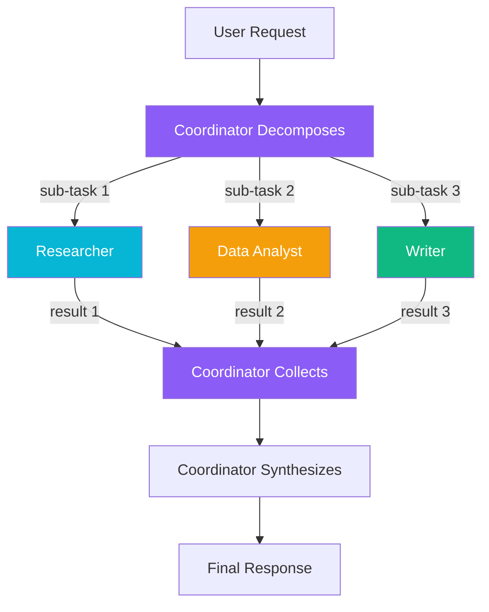
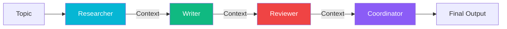

# 020 — Multi-Agent Workflows

---

## 1. Overview

Beyond the basic parallel A2A debate, Open Knowledge Studio offers **two advanced workflow modes** that allow agents to collaborate in structured patterns. These modes are implemented in `src/services/geminiService.ts`.

| Mode | Function | Best For |
| :--- | :--- | :--- |
| **Orchestrated** | Coordinator decomposes the task, assigns sub-tasks to specialists, collects results, synthesizes final answer | Complex multi-step research and analysis |
| **Sequential** | Agents execute in a chain, each receiving prior context | Document drafting pipelines (research → write → review) |

---

## 2. Orchestrated Workflow

The orchestrated workflow uses the Coordinator agent as a project manager.

### Flow Diagram



### Step-by-Step Process

1. **Decompose** — The Coordinator analyzes the user request and produces a JSON array of `{agentId, subTask, rationale}` mapping each sub-task to the best-suited agent
2. **Execute** — Each sub-task is sent to the appropriate agent in parallel (results are independent)
3. **Collect** — The Coordinator receives all agent outputs
4. **Synthesize** — The Coordinator merges results into a cohesive final response with cross-references

### Error Handling

| Scenario | Behavior |
|:---|:---|
| JSON parsing failure of decomposition | Fallback assigns task to first 3 non-Coordinator agents |
| Individual agent error | Output captured as `[Error: message]`, synthesis continues |
| No Coordinator agent available | Raw agent results returned directly |
| Agent timeout | Treated as error, synthesis continues |

### Use Cases

- **Outbreak investigation**: Coordinator has Researcher find case data, Data Analyst compute R₀ and build epidemic curve, Writer draft the sitrep
- **Policy brief**: Researcher gathers guidelines, Data Analyst extracts statistics, Writer formats the brief, Reviewer validates
- **Literature review**: Researcher searches databases, Data Analyst runs meta-analysis metrics, Writer compiles the review

---

## 3. Sequential Workflow

The sequential workflow chains agents together, passing context from one to the next.

### Flow Diagram



### Step-by-Step Process

1. The topic is sent to the first agent in the chain
2. Each subsequent agent receives the **original topic** plus **all prior agent outputs** as context
3. The final result contains every step's output in sequence

### Default Chain

The standard sequential chain is defined in code as:

```typescript
const chain = [
  a2aAgents.find(a => a.id === 'research')!,
  a2aAgents.find(a => a.id === 'writer')!,
  a2aAgents.find(a => a.id === 'review')!,
  a2aAgents.find(a => a.id === 'coord')!,
];
```

### Use Cases

- **Document drafting pipeline**: Researcher gathers facts → Writer creates the document → Reviewer checks quality → Coordinator finalizes
- **Data analysis report**: Data Analyst processes data → Writer describes findings → Reviewer validates methodology → Coordinator summarizes
- **Research note**: Researcher finds sources → Librarian organizes references → Writer formats the note

---

## 4. Using Workflows from Chat

### Orchestrated Workflow

To trigger an orchestrated workflow, include a request pattern in your chat message that implies multi-step work. For example:

> "Create a comprehensive report on dengue fever trends in Southeast Asia. Use the orchestrated workflow."

The Coordinator will automatically detect the complexity and delegate sub-tasks.

### Sequential Workflow

To trigger a sequential workflow:

> "Run a sequential workflow to research AI in epidemiology, write a summary, and review it."

The system routes the topic through the default agent chain.

### Explicit Workflow Selection

In the chat interface, you can explicitly choose the workflow mode from the workflow selector (if available in the UI) or by mentioning the mode in your prompt.

---

## 5. Metrics & Monitoring

Both workflow modes report per-agent performance data:

| Metric | Description |
|:---|:---|
| Latency | Time per agent response |
| Token estimate | Approximate token usage |
| Agent status | Complete, In Progress, or Error |
| Step output | Each agent's contribution |

These are pushed to the `A2AMetricsDashboard` via the `onAgentResponse` callback.

---

## 6. Comparison

| Aspect | Orchestrated | Sequential |
|:---|:---|:---|
| Control flow | Star (Coordinator hub) | Linear chain |
| Parallelism | Agents run in parallel | Agents run sequentially |
| Error isolation | Individual agent errors isolated | Error breaks the chain |
| Context passing | Coordinator manages context | Each step adds to context |
| Best for | Complex multi-faceted tasks | Document/review pipelines |
| Coordinator required | Yes | Optional (chains can exclude it) |

---

## See Also

- [A2A Agents Guide](010-agents.md) — Agent configuration and system prompts
- [Getting Started](000-getting-started.md) — First-time user walkthrough
- [Diagram Generation](030-diagrams.md) — Agents generating visualizations
- [Sandboxed Code Execution](050-sandbox.md) — Safe code execution in workflows
- [Developer Guide: Memory Architecture](../developers/005-memory-architecture.md) — Memory tiers used in workflows
- [Portal Overview](../index.md) — Full documentation index

---

*Back to [Documentation Home](../index.md)*

---

_Open Knowledge Studio v2.0 — Zero-dependency, browser-native, 12-agent A2A platform for offline-first research, writing, and data analysis. Built by [Mohammad Ariful Islam](https://github.com/zsdotcom) ([codeandbrain](https://github.com/codeandbrain)) at the [ZarishSphere Foundation](https://zarishsphere.com). Licensed under MIT. Source code: [github.com/zsdotcom/zs-oks](https://github.com/zsdotcom/zs-oks)._


