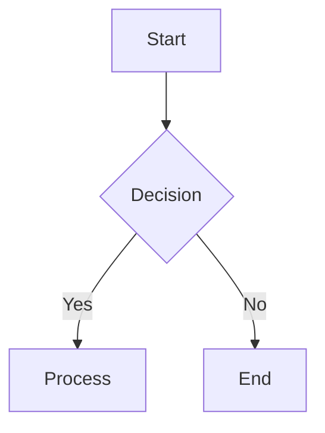
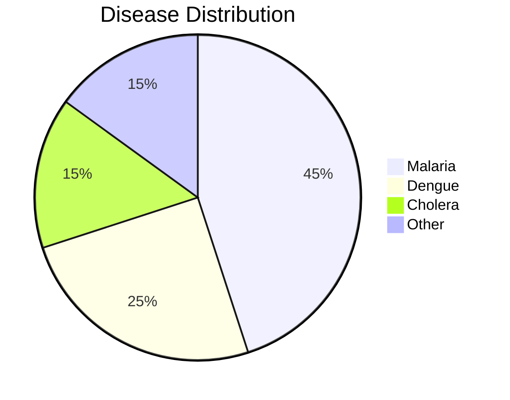
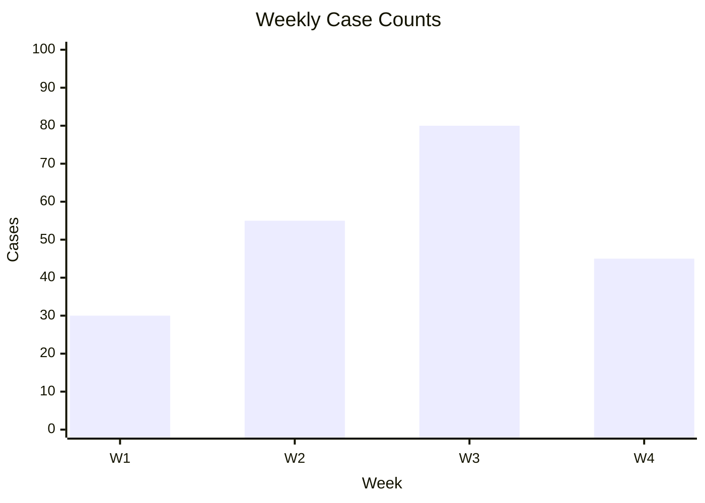
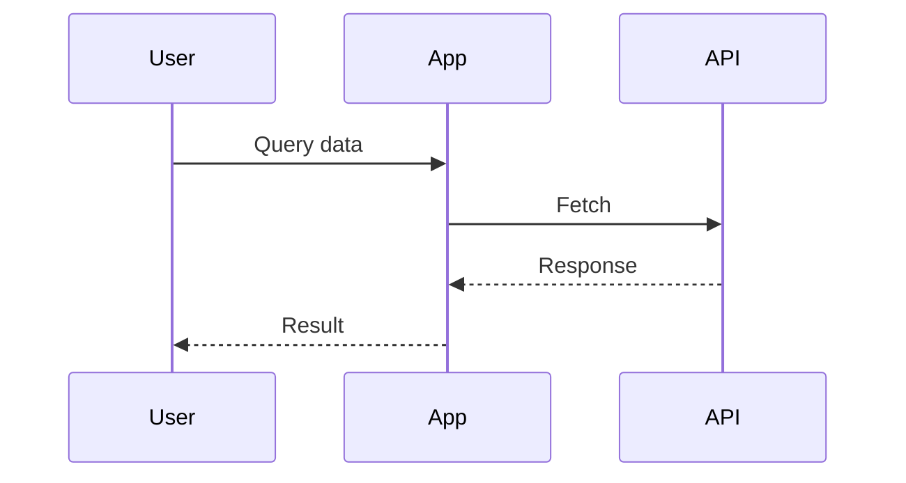
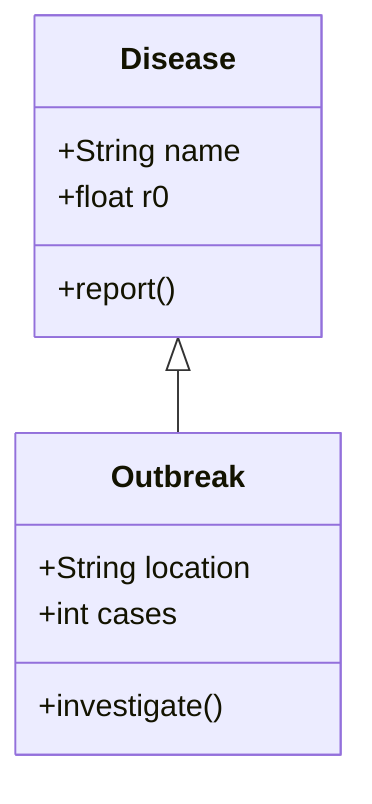
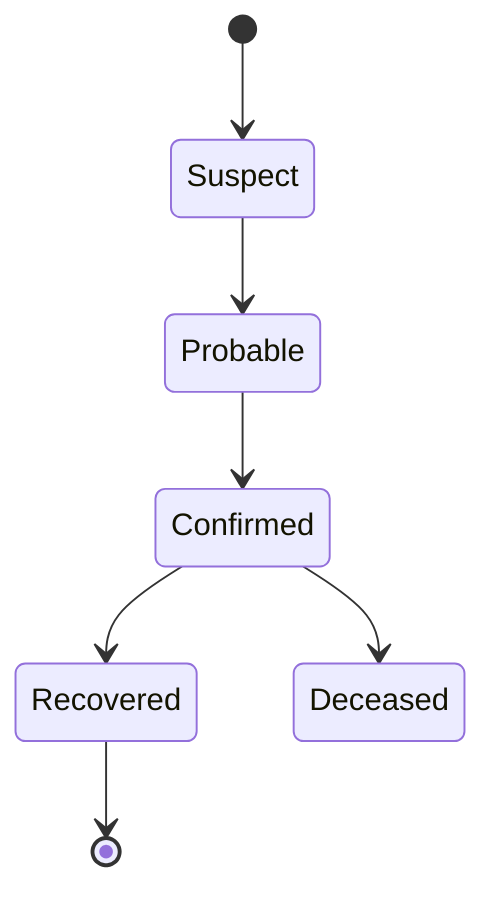
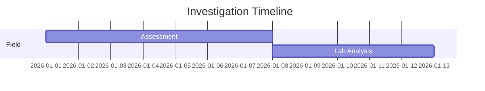
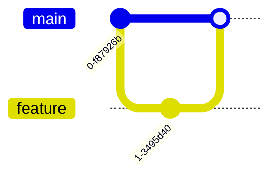
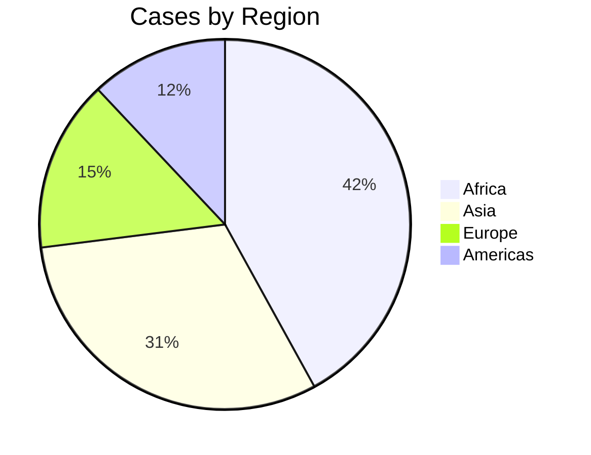

# 030 — Diagram Generation Guide

---

## 1. Overview

Open Knowledge Studio renders agent messages through a markdown parser (`src/utils/markdown.ts`) that supports **Mermaid diagrams** and **KaTeX mathematical formulas** inline. The Data Analyst agent is specifically prompted to use these tools when presenting data.

Diagrams and math are rendered using CDN-loaded libraries (KaTeX 0.18.1, Mermaid 11.16.0) — no npm dependencies are required.

---

## 2. How It Works

1. Agent messages in `ChatInterface.tsx` use `parse(msg.text)` to convert markdown to HTML
2. A `useEffect` hook scans rendered output for `.language-mermaid` code blocks and `.katex-math` / `.katex-inline` elements
3. Mermaid code blocks are converted to SVG diagrams via the Mermaid CDN library
4. KaTeX elements are rendered using the KaTeX CDN library
5. Diagrams and formulas are inserted into the chat message DOM

---

## 3. Data Analyst Prompt

The Data Analyst agent's system prompt includes diagram generation instructions:

> "When presenting data, generate diagrams using Mermaid syntax (flowcharts, bar charts, pie charts, xy charts) inside \`\`\`mermaid code fences. Use KaTeX $$inline math$$ for statistical formulas."

This means you can ask the Data Analyst to create visualizations, and it will generate the appropriate Mermaid code automatically.

---

## 4. Supported Diagram Types

### Flowcharts

Use `graph TD` (top-down) or `graph LR` (left-right) for process flows.



**Usage**: Workflow diagrams, decision trees, process documentation.

### Pie Charts

Use `pie` to show proportion data.



**Usage**: Proportion breakdowns, demographic distributions.

### XY Charts (Bar/Line)

Use `xychart-beta` for quantitative data visualization.



**Usage**: Time series data, case counts, trend analysis.

### Sequence Diagrams

Use `sequenceDiagram` to show interactions between actors.



**Usage**: API workflows, communication protocols, system interactions.

### Class Diagrams

Use `classDiagram` for object structure.



**Usage**: Data modeling, architecture documentation.

### State Diagrams

Use `stateDiagram-v2` for state machines.



**Usage**: Disease progression, workflow states, case status tracking.

### Gantt Charts

Use `gantt` for timeline visualization.



**Usage**: Project timelines, outbreak investigation schedules.

### Git Graphs

Use `gitGraph` for version control visualization.



**Usage**: Version control documentation, branching strategies.

---

## 5. KaTeX Mathematical Formulas

Statistical formulas are rendered using KaTeX. Delimiters:

| Type | Syntax | Example |
|:---|:---|:---|
| Display math | `$$ formula $$` | `$$ R_0 = \frac{\beta}{\gamma} $$` |
| Inline math | `$$ formula $$` (same, within text) | `The $$R_0$$ value was 2.5` |

### Common Epidemiological Formulas

**Attack Rate**
$$Attack\ Rate = \frac{Number\ of\ Cases}{Population\ at\ Risk} \times 100\%$$

**Case Fatality Rate**
$$CFR = \frac{Deaths}{Confirmed\ Cases} \times 100\%$$

**Basic Reproduction Number**
$$R_0 = \frac{\beta}{\gamma}$$

**Confidence Interval**
$$CI = \hat{p} \pm Z_{\alpha/2} \sqrt{\frac{\hat{p}(1-\hat{p})}{n}}$$

**Chi-Square Test**
$$\chi^2 = \sum\frac{(O_i - E_i)^2}{E_i}$$

---

## 6. Including Diagrams in Chat Messages

To include a diagram in a chat message, use a fenced code block with the `mermaid` language identifier:

````markdown
Here is the case distribution:



The $$R_0$$ estimate was 2.3 (95% CI: 1.8–2.8).
````

The Data Analyst agent generates these automatically when asked for visualizations.

---

## 7. Limitations

- **Mermaid rendering** requires a live browser environment — diagrams are not rendered in plain text export
- **PDF Export** includes KaTeX (via CDN script in the export HTML) but Mermaid may not render in PDF if the browser print engine does not execute JavaScript
- **Complex diagrams** with many nodes may render slowly; keep diagrams focused

---

## 8. Troubleshooting

| Issue | Fix |
|:---|:---|
| Diagram shows raw code | Ensure the code fence starts with ` ```mermaid ` |
| KaTeX is not rendering | Check that `$$` delimiters are balanced |
| Diagram is cut off | Reduce node count or use `graph LR` for horizontal layout |
| Slow rendering | Simplify the diagram; split into multiple smaller diagrams |

---

## See Also

- [A2A Agents Guide](010-agents.md) — Data Analyst diagram generation
- [PDF Export Guide](040-pdf-export.md) — Exporting diagrams to PDF
- [Multi-Agent Workflows](020-workflows.md) — Workflows that generate diagrams
- [Developer Guide: Development](../developers/004-development.md) — Markdown parser implementation
- [Portal Overview](../index.md) — Full documentation index

---

*Back to [Documentation Home](../index.md)*
