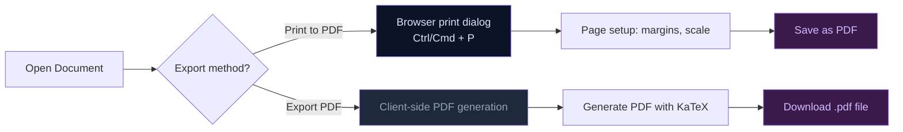

# 004 — PDF Export Guide

---

## Export Flow



## 1. Overview

The `WorkspaceDocumentEditor` provides **two export methods** for saving documents as PDF or print-ready HTML. Both are accessible from the editor toolbar.

Export logic is implemented in `src/components/WorkspaceDocumentEditor.tsx` via the `exportToPDF()` function.

---

## 2. Export Methods

### Print to PDF

Opens a new browser window with a styled HTML version of the document and triggers the browser's native print dialog (`window.print()`). From there, the user selects "Save as PDF" as the destination.

**Best for**: Quick exports, when you want browser-native print controls (page range, orientation).

### Export PDF

Downloads an HTML file with embedded KaTeX support, optimized for print rendering. The file includes both KaTeX CSS and JavaScript from CDN, plus an inline script that auto-renders math elements on page load.

**Best for**: Sharing documents with others who need to view them in a browser with proper KaTeX rendering.

---

## 3. Step-by-Step: Export a Document

1. **Open** the document in the Workspace Document Editor
2. **Edit** content as needed (the editor is markdown-based)
3. **Click** the **Print to PDF** or **Export PDF** button in the toolbar
4. **For Print to PDF**: The print dialog opens — choose "Save as PDF" as the destination, adjust settings, click Save
5. **For Export PDF**: An HTML file downloads automatically — open it in a browser and print from there

---

## 4. Print Styles

The export HTML includes dedicated print styles:

| Property | Value |
|:---|:---|
| Font family | Georgia / Times New Roman (serif) |
| Base font size | 12pt |
| Heading hierarchy | Proper h1–h6 scaling |
| Page margins | `@page { margin: 2cm; }` |
| Table breaks | `page-break-inside: avoid` |
| Code block breaks | `page-break-inside: avoid` |
| Mermaid diagram breaks | `page-break-inside: avoid` |
| Footer | "Generated by Open Knowledge Studio" (auto-generated) |

---

## 5. KaTeX Support in Export

The exported HTML includes:

- KaTeX CSS from CDN (`https://cdn.jsdelivr.net/npm/katex@0.18.1/dist/katex.min.css`)
- KaTeX JS from CDN (`https://cdn.jsdelivr.net/npm/katex@0.18.1/dist/katex.min.js`)
- Auto-render extension (`https://cdn.jsdelivr.net/npm/katex@0.18.1/dist/contrib/auto-render.min.js`)
- Inline initialization script that calls `renderMathInElement()` on page load

This means mathematical formulas rendered with KaTeX in the document will render correctly when the HTML file is opened in a browser.

### Mermaid Note

Mermaid diagrams are **not automatically rendered** in the exported HTML because Mermaid requires runtime JavaScript (browser rendering). The diagram source code (the Mermaid code block) will be visible as plain text in the export. For best results with Mermaid diagrams:

- Use **Print to PDF** while the document is open in the app (Mermaid is already rendered there)
- Or take a screenshot of the rendered diagram

---

## 6. Function Reference

```typescript
function exportToPDF(
  fileName: string,    // Document name for title and filename
  html: string,        // Pre-rendered markdown HTML from parse()
  isDownload: boolean  // false = print dialog, true = download .html
): void
```

| Parameter | Type | Description |
| :--- | :--- | :--- |
| `fileName` | `string` | Used for the window title and download filename |
| `html` | `string` | The parsed markdown HTML (output of `parse()`) |
| `isDownload` | `boolean` | `false` = open browser print dialog; `true` = download `.html` file |

---

## 7. Tips

- **Always preview** your document in the editor before exporting
- **KaTeX formulas** will render correctly in both export modes (when the HTML is opened in a browser for download mode)
- **For Mermaid diagrams**, use Print to PDF while the document is open in the app for the best result
- **Large documents** may take longer to render in the print dialog — be patient
- **Page breaks** can be controlled by structuring your markdown with appropriate headings

---

## Troubleshooting & FAQ

**Q: PDF export fails silently.**
> Check your browser's download permissions. Some browsers block multiple automatic downloads. Also check that your document doesn't contain external images that fail to load.

**Q: The PDF is blank.**
> The document might not have any content selected for export. Use the selection controls to choose which sections to include. If the document is empty, write some content first.

**Q: Formatting looks different in the PDF vs the screen.**
> PDF export converts HTML to PDF format. Complex layouts (tables, diagrams, math) may render differently. Use the Print Preview feature first to check.

**Q: Can I export very large documents (100+ pages)?**
> Yes, but it may take several seconds. The app processes the document in chunks. Watch the progress bar — if it stalls, try exporting in sections.

---

## See Also

- [Diagram Generation](003-diagrams.md) — KaTeX and Mermaid in documents
- [A2A Agents Guide](001-agents.md) — Writer agent document generation
- [Getting Started](000-getting-started.md) — Creating and editing documents
- [Developer Guide: Development](../developers/004-development.md) — Document editor implementation
- [Portal Overview](../index.md) — Full documentation index

---

*Back to [Documentation Home](../index.md)*

---

_Open Knowledge Studio v2.0 — Zero-dependency, browser-native, 12-agent A2A platform for offline-first research, writing, and data analysis. Built by [Mohammad Ariful Islam](https://github.com/zsdotcom) ([codeandbrain](https://github.com/codeandbrain)) at the [ZarishSphere Foundation](https://zarishsphere.com). Licensed under MIT. Source code: [github.com/zsdotcom/zs-oks](https://github.com/zsdotcom/zs-oks)._


