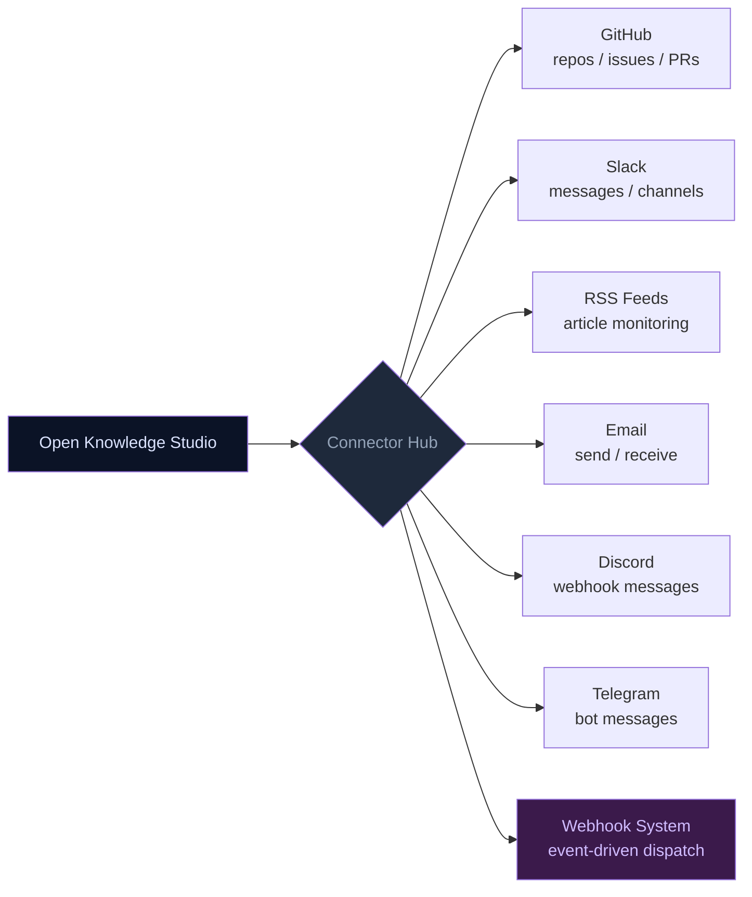

# 008 — Connectors Guide

---

## Connector Architecture

## 1. Overview

Connectors allow Open Knowledge Studio to integrate with external services — fetching data, sending notifications, and interacting with third-party platforms. Connectors are configured through the **ConnectorPanel** and stored in IndexedDB.

Implemented in `src/components/ConnectorPanel.tsx` and `src/services/connectorService.ts`.

---

## 2. Available Connector Types

| Type | Icon | Purpose |
|:---|:---|:---|
| **GitHub** | 🐙 | Access repositories, issues, and repo metadata |
| **Slack** | 💬 | Send messages and alerts via webhooks |
| **RSS** | 📡 | Subscribe to news feeds and content updates |
| **Email** | 📧 | Send email notifications |
| **Webhook** | 🔗 | Generic webhook for any HTTP endpoint |

---

## 3. Accessing Connectors

1. Open **Settings** (Gear icon in the header)
2. Navigate to the **Connectors** tab
3. You will see a list of existing connectors and an **Add Connector** button

---

## 4. Connector Setup Guides

### GitHub Connector

**Purpose**: Fetch issues, repository info, and code metadata.

1. **Generate a Personal Access Token** on GitHub:
   - Go to GitHub → Settings → Developer settings → Personal access tokens → Fine-grained tokens
   - Grant `repo` scope for private repos or `public_repo` for public repos
   - Copy the token (starts with `github_pat_` or `ghp_`)
2. **In Open Knowledge Studio**:
   - Click **Add Connector** → select **GitHub**
   - Enter a name (e.g., "My GitHub")
   - Paste your **GitHub Token**
   - Enter a **Default Repository** (format: `owner/repo`)
   - Click **Save**
3. **Test the connection** — The connector will call `testGitHubConnection()` which verifies the token against `https://api.github.com/user`
4. If successful, the connector status changes to **Connected**

**Technical detail**: Uses the [GitHub REST API](https://docs.github.com/en/rest) with Bearer token authentication. See `connectorService.ts:30-55` for implementation.

### Slack Connector

**Purpose**: Send messages to Slack channels.

1. **Create a Slack Webhook**:
   - Go to your Slack workspace → Settings & administration → Manage apps
   - Search for "Incoming Webhooks" and add it
   - Select a channel and click **Add New Webhook**
   - Copy the webhook URL (starts with `https://hooks.slack.com/services/`)
2. **In Open Knowledge Studio**:
   - Click **Add Connector** → select **Slack**
   - Enter a name (e.g., "Team Slack")
   - Paste the **Webhook URL**
   - Click **Save**
3. **Test** — The connector sends a test message: "Open Knowledge Studio connection test"

### RSS Connector

**Purpose**: Subscribe to content feeds for research.

1. **Find an RSS feed URL** (e.g., `https://www.who.int/rss-feeds/news.xml`)
2. **In Open Knowledge Studio**:
   - Click **Add Connector** → select **RSS**
   - Enter a name (e.g., "WHO News")
   - Paste the **Feed URL**
   - Click **Save**

The Researcher agent can use RSS connectors via the `rss-fetch` tool to scan feeds for relevant content.

### Email Connector

**Purpose**: Send email alerts and notifications.

1. **In Open Knowledge Studio**:
   - Click **Add Connector** → select **Email**
   - Enter a name (e.g., "My Email")
   - Enter the **Default Recipient** email address
   - Configure SMTP settings (requires additional server-side setup)
   - Click **Save**

### Webhook Connector

**Purpose**: Generic HTTP webhook for any third-party endpoint.

1. **Get a webhook URL** from the target service (e.g., Discord, Teams, custom API)
2. **In Open Knowledge Studio**:
   - Click **Add Connector** → select **Webhook**
   - Enter a name (e.g., "Discord Alerts")
   - Paste the **Webhook URL**
   - Optionally add a **Secret** for HMAC signing
   - Click **Save**

---

## 5. How Connectors Are Used by Agents

Once configured, agents can use connectors in their workflows:

| Agent | Connector Usage |
|:---|:---|
| **Researcher** | Fetches RSS feeds for latest research; queries GitHub for code/data repositories |
| **Data Analyst** | Imports data from GitHub repos |
| **Writer** | Sends completed documents via email or Slack |
| **Coordinator** | Dispatches notifications through webhooks on task completion |

---

## 6. Managing Connectors

| Action | How |
|:---|:---|
| **Enable/Disable** | Toggle the switch on a connector card |
| **Edit** | Click the edit/pencil icon to modify fields |
| **Remove** | Click the delete/trash icon to permanently remove |
| **Test** | Click the test button (if available) to verify connectivity |

Removed connectors are deleted from IndexedDB via `removeConnector()`.

---

## 7. Troubleshooting

| Issue | Likely Cause | Fix |
|:---|:---|:---|
| GitHub connection fails | Token expired or lacks permissions | Regenerate token with proper scopes |
| Slack test fails | Webhook URL is wrong or app uninstalled | Check URL and reinstall the Slack app |
| RSS not fetching | Feed URL is invalid or feed changed | Verify URL in a browser first |
| Connector shows "Disconnected" | Never tested or credentials changed | Click test or re-enter credentials |

---

## Troubleshooting & FAQ

**Q: The connector says "Connection Failed".**
> Check your API key or authentication credentials in Settings. Many connectors require a valid key. Also verify the service is reachable from your network.

**Q: A connector is installed but not showing up.**
> Some connectors need to be activated individually. Go to Settings → Connectors and toggle the connector to active. It should appear in the tools panel immediately.

**Q: Data from the connector looks incomplete.**
> Some APIs have rate limits or return paginated results. The connector fetches a default page size (usually 100). Use the "Load More" button if available.

**Q: Can I create my own connector?**
> Custom connectors aren't supported through the UI yet. You can extend the source code — see the Developer Guide for the connector interface.

---

## See Also

- [Webhooks Guide](009-webhooks.md) — Event-driven webhook system
- [Public Data APIs Guide](010-public-data.md) — Free data source queries
- [A2A Agents Guide](001-agents.md) — How agents use connectors
- [Getting Started](000-getting-started.md) — Configuring settings
- [Portal Overview](../index.md) — Full documentation index

---

*Back to [Documentation Home](../index.md)*

---

_Open Knowledge Studio v2.0 — Zero-dependency, browser-native, 12-agent A2A platform for offline-first research, writing, and data analysis. Built by [Mohammad Ariful Islam](https://github.com/zsdotcom) ([codeandbrain](https://github.com/codeandbrain)) at the [ZarishSphere Foundation](https://zarishsphere.com). Licensed under MIT. Source code: [github.com/zsdotcom/zs-oks](https://github.com/zsdotcom/zs-oks)._

