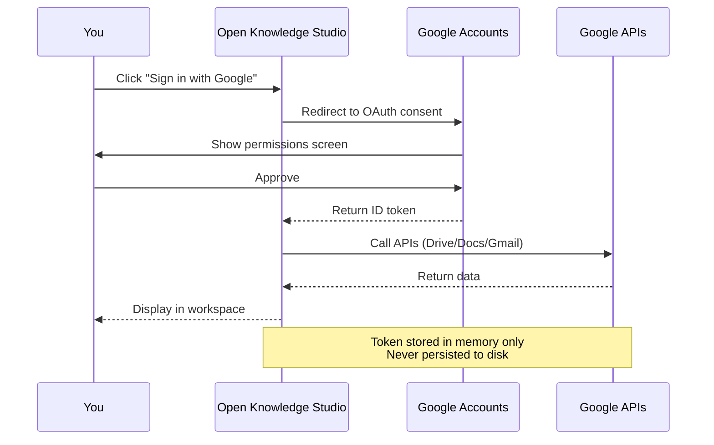

# 011 — Google OAuth Setup Guide

## OAuth Flow



Open Knowledge Studio uses Google OAuth 2.0 to connect to Google Workspace (Drive, Docs, Sheets, Gmail, Tasks). This is a client-side flow using Google Identity Services (GIS) — you only need a **Client ID**, no secret.

## Quick Setup (3 minutes)

### 1. Go to Google Cloud Console

Open [Google Cloud Console > APIs & Services > Credentials](https://console.cloud.google.com/apis/credentials).

### 2. Create or Select a Project

| Step | Action |
|------|--------|
| Click project dropdown at top of page | Select or create a new project |
| Name it (e.g., "Open Knowledge Studio") | |

### 3. Configure OAuth Consent Screen

| Step | Action |
|------|--------|
| Click **OAuth consent screen** in left sidebar | |
| Select **External** user type (anyone with a Google account) | |
| Fill in: App name, User support email, Developer contact email | |
| Click **Save and Continue** through Scopes, Test Users | |

### 4. Create OAuth Client ID

| Step | Action |
|------|--------|
| Click **Credentials** → **Create Credentials** → **OAuth client ID** | |
| Application type: **Web application** | |
| Name: "Open Knowledge Studio" | |
| **Authorized JavaScript origins**: | |
| `https://codeandbrain.github.io` | (for published site) |
| `http://localhost:3000` | (for local development) |
| Add `https://your-custom-domain.com` if self-hosting | |
| Click **Create** | |

### 5. Copy Your Client ID

A dialog shows your **Client ID** (ends in `.apps.googleusercontent.com`). Copy it.

### 6. Add to Open Knowledge Studio

**Option A: Settings Panel (Runtime — works everywhere)**

1. Open Open Knowledge Studio
2. Click **Settings** (gear icon)
3. In the **General** tab, find **Google OAuth Client ID**
4. Paste your Client ID
5. Click "Sign in with Google"

**Option B: Environment Variable (Build-time — for local dev)**

Create a `.env` file in the project root:

```
VITE_GOOGLE_OAUTH_CLIENT_ID=your-client-id-here.apps.googleusercontent.com
```

## Troubleshooting

| Problem | Solution |
|---------|----------|
| `redirect_uri_mismatch` | Ensure your deployed URL is in **Authorized JavaScript origins** |
| `client_id is not recognized` | Verify the Client ID is copied exactly (no extra spaces) |
| Login popup closes immediately | Disable popup blockers for this site |
| "Access blocked: Authorization Error" | Check OAuth consent screen is published (not in Testing mode) |
| Google Drive features not working | Ensure scopes include `drive.appdata`, `drive.file` |

## Scopes Used

| Scope | Purpose |
|-------|---------|
| `openid email profile` | Basic sign-in info |
| `drive.appdata` | Cloud backup (app-specific folder) |
| `drive.file` | Create/open user-selected files |
| `drive.readonly` | List Drive files |
| `spreadsheets` | Create/edit Google Sheets |
| `documents` | Create Google Docs |
| `presentations` | Create Google Slides |
| `gmail.send` | Send reports via Gmail |
| `gmail.readonly` | Read Gmail messages |
| `tasks` | Create Google Tasks |

---

_Open Knowledge Studio v2.0 — Zero-dependency, browser-native, 12-agent A2A platform for offline-first research, writing, and data analysis. Built by [Mohammad Ariful Islam](https://github.com/zsdotcom) ([codeandbrain](https://github.com/codeandbrain)) at the [ZarishSphere Foundation](https://zarishsphere.com). Licensed under MIT. Source code: [github.com/zsdotcom/zs-oks](https://github.com/zsdotcom/zs-oks)._


