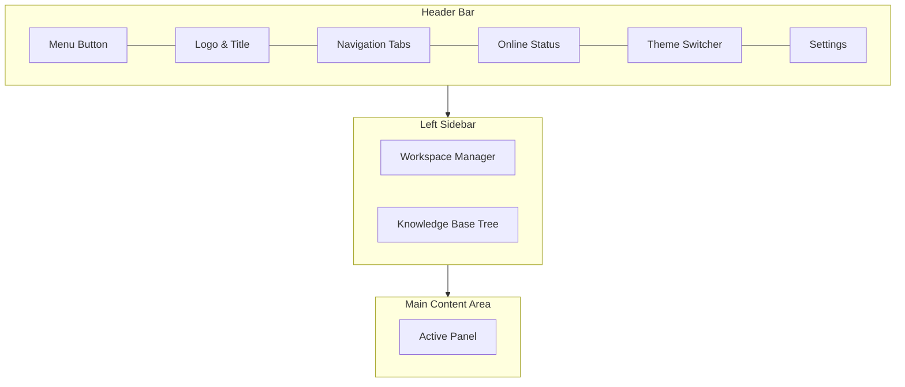

# 001 — First Steps: Interface Tour

Welcome to Open Knowledge Studio! This guide will walk you through the interface so you know where everything is.

## The Layout

## Step-by-Step

- [ ] **1. Open the app** — You should see the header bar at the top, a sidebar on the left, and the main chat area.

- [ ] **2. Explore navigation tabs** — Click each tab in the header to see different views:
  - **Chat** — Talk to AI
  - **Editor** — Write documents
  - **Search** — Find files
  - **Dashboard** — Monitor activity
  - **Kanban** — Task management
  - **Templates** — Pre-built documents
  - **MCP** — Server configuration
  - **Skills** — Automation rules
  - **Tools** — Built-in utilities
  - **Data** — Public data sources
  - **NL Query** — Natural language queries
  - **Knowledge** — Knowledge sources
  - **Docs** — This documentation

- [ ] **3. Toggle the sidebar** — Click the **menu icon** (three lines) in the top-left to show/hide the workspace sidebar.

- [ ] **4. Check your connection** — Look at the top-right for the **Online/Offline** indicator. The app works offline too.

- [ ] **5. Try the theme switcher** — Click the **theme icon** in the header to toggle between dark mode and other themes (Ocean, Midnight, Solarized, WeWeb, Light).

- [ ] **6. Open Settings** — Click the **gear icon** in the top-right to open the Settings panel. This is where you'll configure providers, agents, and more.

## Keyboard Shortcuts

| Shortcut | Action |
|----------|--------|
| `Ctrl+K` (or `Cmd+K`) | Open search overlay |
| `Ctrl+/` (or `Cmd+/`) | Show shortcuts help |
| `Escape` | Close overlays |

## Key Areas

### Header Bar
- **Left**: Menu toggle, logo, navigation tabs
- **Right**: Online status, PWA install, Google Workspace, email compose, ICD-11 lookup, BD Core FHIR, Epi Map, theme switcher, settings, auth

### Workspace Sidebar (left)
- **Projects**: Switch between workspaces
- **Knowledge Base**: Browse files and folders

### Main Content Area
- Shows the active panel (Chat, Editor, etc.)

---

**Next step:** [002 — Connect an AI Provider](./002-connect-provider.md)

---

_Open Knowledge Studio v2.0 — Zero-dependency, browser-native, 12-agent A2A platform for offline-first research, writing, and data analysis. Built by [Mohammad Ariful Islam](https://github.com/zsdotcom) ([codeandbrain](https://github.com/codeandbrain)) at the [ZarishSphere Foundation](https://zarishsphere.com). Licensed under MIT. Source code: [github.com/zsdotcom/zs-oks](https://github.com/zsdotcom/zs-oks)._
