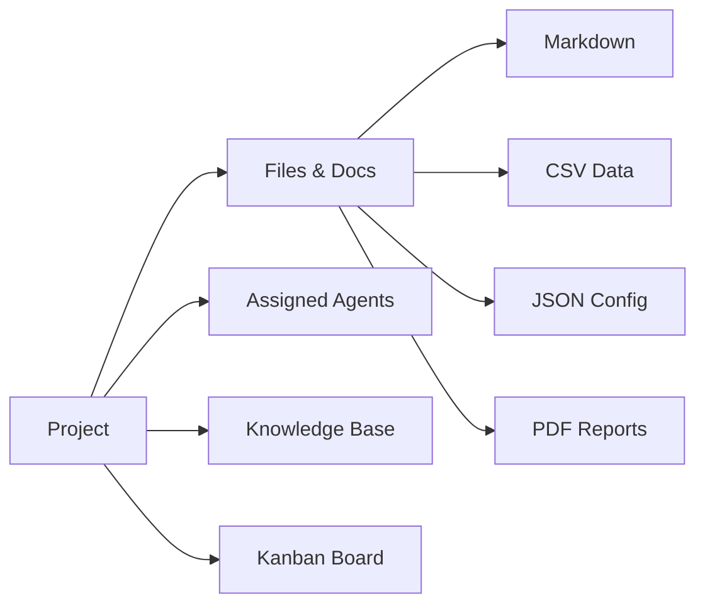

# 003 — Create Your First Project

Projects help you organize your work. Each project has its own files, agents, and settings.

## Step-by-Step

- [ ] **1. Open the Workspace sidebar** — Click the **menu icon** (three lines) in the top-left header if the sidebar is hidden.

- [ ] **2. Find the Projects section** — At the top of the sidebar, you'll see **"Workspace Projects"** with a **+** button.

- [ ] **3. Create a new project**:
  - Click the **+** button
  - Enter a project name (e.g., "Outbreak Investigation 2026")
  - Press Enter or click **Create**

- [ ] **4. See your project** — The project appears in the sidebar with default folders:
  - **Development Guidelines**
  - **Market Intelligence**
  - **Health & Epidemiology**
  - **Templates**

- [ ] **5. Rename or delete** — Right-click or use the project menu to rename or delete a project.

- [ ] **6. Switch projects** — Click any project name to switch. Each project maintains its own files and workspace state.

## Project Structure

## Tips

- Create separate projects for different research topics
- Use descriptive names that reflect the project goal
- Assign relevant agents to each project for context-aware AI assistance
- Each project has an isolated Kanban board for task tracking

---

**Next step:** [004 — Build Your Knowledge Base](./004-knowledge-base.md)
