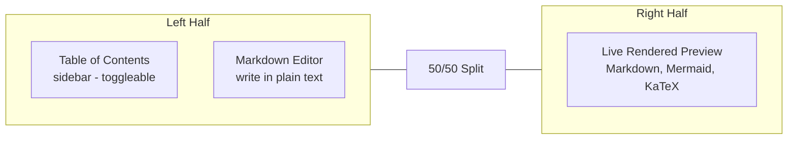

# 008 — Creating Documents

The document editor is a split-pane tool for writing Markdown with live preview, version history, and export options.

## Step-by-Step

- [ ] **1. Open a file** — In the Knowledge Base sidebar, click any file. The view switches to the **Editor** tab.

- [ ] **2. Understand the editor layout**:

- [ ] **3. Write in Markdown** — Type Markdown syntax in the left textarea:
  - `# Heading 1`
  - `**bold**` and `*italic*`
  - `- bullet list`
  - `1. numbered list`
  - `[link text](url)`
  - ``

- [ ] **4. See the preview** — The right pane renders your Markdown live with:
  - Styled headings, lists, tables
  - Syntax-highlighted code blocks
  - KaTeX mathematical formulas (`$$...$$`)
  - Mermaid diagrams (\`\`\`mermaid)

- [ ] **5. Use the Table of Contents** — Click the **Layout icon** to toggle a TOC sidebar inside the editor pane. Click any heading to jump to that section.

- [ ] **6. Use templates** — Click **+** (Templates) to insert a pre-built template into your document.

- [ ] **7. Save versions** — Click the **eye icon** to save a named version of your document.

- [ ] **8. Compare versions** — Open **Version History** (clock icon) and click **Diff** to see changes between versions.

- [ ] **9. Export options**:
  - **Download as .md** — Raw Markdown file
  - **Download as .html** — Rendered HTML file
  - **Print to PDF** — Opens browser print dialog
  - **Download PDF** — Downloads as searchable PDF

## Toolbar Reference

| Button | Icon | Action |
|--------|------|--------|
| Layout | ⊞ | Toggle Table of Contents |
| + | + | Insert template |
| Clock | 🕐 | Show version history |
| Eye | 👁 | Save version |
| Copy | 📋 | Copy document to clipboard |
| Download MD | ⬇ | Export as .md |
| Download HTML | ⬇ | Export as .html |
| Print | 🖨 | Open print dialog |
| PDF | ⬇ | Export as PDF |

## Tips

- Content auto-saves after 2 seconds of inactivity
- Mermaid diagrams need the `mermaid` language tag on code blocks
- Use `$$` for display math and `$` for inline math with KaTeX
- The editor supports all standard Markdown including tables, blockquotes, and task lists

---

**Next step:** [009 — Templates](./009-templates.md)
