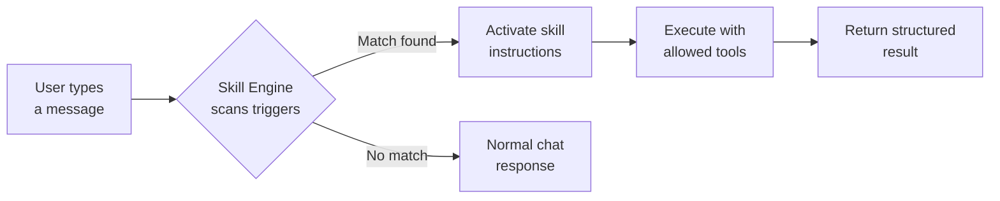

# 010 — Skills & Automation

Skills are automated workflows triggered by keywords in your chat messages. When the AI detects a trigger, it activates the relevant skill to handle the task.

## How Skills Work

## Available Skills (34 total)

### Epidemiology (Original)
| Skill | Triggers | Tools |
|-------|----------|-------|
| Outbreak Analysis | outbreak, attack rate, epi curve | calculate, draw-chart, search-who |
| Attack Rate Calculator | attack rate, case count, incidence | calculate |
| Epi Curve Generator | epi curve, case onset, outbreak curve | calculate, draw-chart |
| R0 Estimator | R0, reproduction number, transmissibility | calculate, draw-chart |
| Outbreak Detection | anomaly, surveillance, alert | calculate, search-cdc, draw-chart |
| ICD-11 Coding | icd, diagnosis code, fhir | search, semantic-search |

### Code & Development (New)
| Skill | Triggers | Tools |
|-------|----------|-------|
| Code Review | code review, audit code, code quality | code-review, dependency-analyze, code-format |
| Test Generation | generate tests, unit tests, test coverage | test-generate, calculate |
| Dependency Analysis | dependency, circular dependency, imports | dependency-analyze |
| Code Documentation | jsdoc, document code, generate docs | code-docgen, api-spec-gen |
| API Spec Generation | openapi, swagger, api specification | api-spec-gen |
| SQL Query Builder | sql query, database query, generate sql | sql-query |

### Knowledge Management (New)
| Skill | Triggers | Tools |
|-------|----------|-------|
| Knowledge Graph Builder | knowledge graph, concept map, relationship map | entity-extract, draw-diagram |
| Content Summarizer | briefing, content summary, research brief | text-summarize, topic-model |
| Knowledge Audit | audit knowledge, knowledge gap, content audit | semantic-search, recall |
| Research Synthesis | synthesize, meta-analysis, combine research | search-pubmed, search-arxiv, text-summarize |

## Step-by-Step

- [ ] **1. Go to Skills** — Click the **Skills** tab in the header to see all registered skills.

- [ ] **2. Browse skills** — Each skill card shows:
  - Name and description
  - Priority level (High/Medium/Low)
  - Category
  - Instructions and allowed tools
  - Trigger keywords

- [ ] **3. Use a skill automatically** — Just type a message containing a trigger word. For example:
  - "I need an **outbreak analysis** for measles in Zambia" → Activates Outbreak Analysis
  - "Please **review this code** for security issues" → Activates Code Review
  - "**Synthesize** these research findings" → Activates Research Synthesis

- [ ] **4. Create a custom skill** — In **Settings → Skills**, you can create skills with:
  - Custom instructions (step-by-step)
  - Specific allowed tools
  - Trigger keywords
  - Priority level

## Skill Priority

| Priority | Behavior |
|----------|----------|
| High | Activated immediately upon trigger match |
| Medium | Activated if no higher-priority skill matches |
| Low | Activated only when explicitly requested |

## Tips

- Use specific, unique trigger words for your custom skills
- Skills chain together — a Data Fetching skill can feed into an Outbreak Analysis
- Review skill output and give feedback to improve results
- Combine skills with agents for powerful automated workflows

---

**Next step:** [011 — Connectors](./011-connectors.md)

---

_Open Knowledge Studio v2.0 — Zero-dependency, browser-native, 12-agent A2A platform for offline-first research, writing, and data analysis. Built by [Mohammad Ariful Islam](https://github.com/zsdotcom) ([codeandbrain](https://github.com/codeandbrain)) at the [ZarishSphere Foundation](https://zarishsphere.com). Licensed under MIT. Source code: [github.com/zsdotcom/zs-oks](https://github.com/zsdotcom/zs-oks)._
