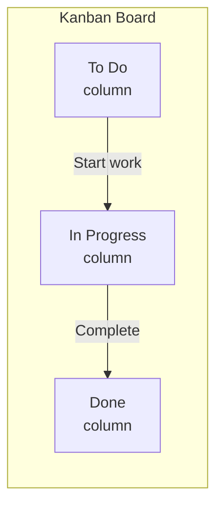

# 012 — Kanban Boards

Kanban boards help you track tasks and manage project workflows visually. Each project gets its own board where you can create, organize, and track tasks.

## Board Structure

## Step-by-Step

- [ ] **1. Go to Kanban** — Click the **Kanban** tab in the header navigation.

- [ ] **2. See the default board** — There's a default board called "Project Tasks" with three columns:
  - **To Do** (blue)
  - **In Progress** (yellow)
  - **Done** (green)

- [ ] **3. Create a new board** — Click **+ New Board** and enter a name (e.g., "Outbreak Response Tasks").

- [ ] **4. Add a task card** — Click **+ Add Card** on any column. Fill in:
  - **Title** — Short task name
  - **Description** — Details and notes
  - **Priority** — Low, Medium, High, or Critical
  - **Due date** — Optional deadline
  - **Tags** — Labels for categorization

- [ ] **5. Move cards** — Drag and drop cards between columns to update their status.

- [ ] **6. Edit a card** — Click a card to edit its details.

- [ ] **7. Manage boards** — Use the dropdown at the top to switch between boards. Delete boards from the board list.

## Priority Levels

| Priority | Color | Meaning |
|----------|-------|---------|
| **Critical** | 🔴 Red | Must be done immediately |
| **High** | 🟠 Orange | Important, do soon |
| **Medium** | 🔵 Blue | Standard priority |
| **Low** | ⚪ Gray | When time permits |

## Tips

- Create separate boards for different work streams
- Use tags to categorize cards by type (bug, feature, research, etc.)
- Set due dates to track deadlines
- Move cards through the full workflow to track progress
- Review your board daily and update card statuses

---

**Next step:** [013 — Export & Share](./013-export-share.md)
