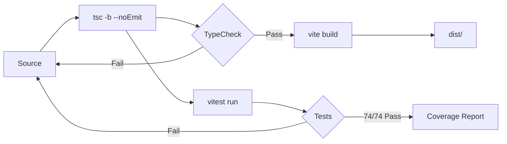

# 003 — Project Blueprint

## 1. Technology Stack

| Layer | Technology | Version | Role |
| :--- | :--- | :--- | :--- |
| **Framework** | React + React DOM | 19.2.7 | UI rendering |
| **Build** | Vite (with Rolldown) | 8.1.5 | Dev server, bundling, HMR |
| **Language** | TypeScript | 7.0.2 | Type safety |
| **Vite Plugin** | @vitejs/plugin-react | 6.0.4 | React Fast Refresh |
| **CSS** | Tailwind CSS + @tailwindcss/vite | 4.x | Utility-first styling |
| **Test Runner** | Vitest | 4.1.10 | Unit, integration, benchmark tests |
| **Coverage** | @vitest/coverage-v8 | 4.1.9 | V8-based coverage reporting |
| **E2E** | Playwright | — | End-to-end browser tests |

### Runtime Dependencies

```
npm list --production
├── react@19.2.7
└── react-dom@19.2.7
```

**Zero other runtime npm dependencies.** All other libraries (Transformers.js, Orama JS, KaTeX, Mermaid, Leaflet) are loaded dynamically from CDN.

## 2. Architecture Principles

| Principle | Description |
| :--- | :--- |
| **SPA Architecture** | Single-page app with no backend. All state in React + IndexedDB. |
| **Zero Backend** | No servers, no databases, no deployment infrastructure beyond static hosting. |
| **Local-First** | IndexedDB is the source of truth. App functions fully offline. |
| **CDN Dynamic Loading** | Heavy libraries loaded at runtime from CDN, not bundled. Graceful degradation on failure. |
| **Web Worker ML** | Transformers.js runs in a background thread to keep UI responsive. |
| **Code Splitting** | Heavy panels lazy-loaded via `React.lazy()`. Initial bundle under 300 KB. |
| **PWA** | Service Worker caches all assets. App installable on device. |
| **Multi-Provider AI** | Unified API over Gemini, OpenAI, Anthropic, DeepSeek, Groq, Ollama. |

## 3. Success Metrics

| Metric | Target | Measurement |
| :--- | :--- | :--- |
| **Vector Embedding Generation** | <100ms per text | Vitest benchmark |
| **Semantic Search** | <50ms hybrid query | Vitest benchmark |
| **Test Coverage** | >80% statements, >75% branches, >85% functions, >80% lines | Vitest V8 report |
| **Build Size** | <100 KB gzip | Vite build analysis |
| **Initial Load** | <300 KB total JS | Vite build output |
| **TypeScript Errors** | 0 (`tsc -b --noEmit` clean) | CI check |
| **Runtime Dependencies** | 2 (react, react-dom) | `npm ls --production` |
| **Test Count** | 74+ | Vitest run |
| **IndexedDB Stores** | 22 | Schema definition |

## 4. Build & Test Pipeline



### CI Order (`.github/workflows/ci.yml`)

1. **TypeCheck** — `tsc -b --noEmit`
2. **Test** — `vitest run` (74 tests)
3. **Build** — `vite build` (outputs to `dist/`)
4. **E2E** — Playwright (PRs only)
5. **Bundle Analysis** — `ANALYZE=true vite build` (produces `dist/stats.html`)

### Deploy (`.github/workflows/deploy.yml`)

- Trigger: push to `main`
- Build: `npm run build` with `BASE_PATH=/open-knowledge-studio/`
- Deploy: GitHub Pages with `404.html` copied from `index.html` for SPA routing

## 5. Performance Targets

| Scenario | Target | Implementation |
| :--- | :--- | :--- |
| Initial page load | <2s (fast 3G) | Code splitting, CDN, minimal JS entry |
| Semantic search | <50ms | Orama hybrid index, keyword fallback |
| Embedding generation | <100ms per text | Web Worker, WASM backend |
| Chat response (first token) | <500ms | Streaming configurable via provider |
| Document save (IndexedDB) | <50ms | Async, non-blocking |
| A2A debate (6 agents) | <10s total | Parallel agent execution |

## 6. Roadmap

| Phase | Features | Status |
| :--- | :--- | :--- |
| **v1.0** | Core chat, basic memory, single AI provider | ✅ Archived |
| **v2.0** | 6-agent A2A, vector embeddings, semantic search, 22-store IndexedDB, zero-dependency architecture, PWA, ICD-11, Epi Map, diagrams, PDF export, sandbox, skills, connectors, code splitting | ✅ Current |
| **v2.1** | Full-text i18n, collaborative real-time editing | 🔜 Planned |
| **v2.2** | Plugin marketplace, advanced data visualization dashboard, export/import wizards | 🔮 Future |

## 7. Licensing & Governance

| Aspect | Detail |
| :--- | :--- |
| **License** | MIT |
| **Repository** | `github.com/codeandbrain/open-knowledge-studio` |
| **Contribution** | PRs via GitHub. Must pass CI (typecheck, test, build). Conventional Commits. |
| **Deployments** | Automatic GitHub Pages on `main` push. Manual Docker/Vercel/Netlify optional. |

---

## See Also

- [000 — Project Overview](000-overview.md) — High-level introduction
- [002 — Technical Specification](002-specification.md) — Detailed feature specifications
- [004 — Architecture](004-architecture.md) — System architecture and data model
- [Index](index.md) — Full documentation index
- [Developer Guide: Setup](../developers/050-setup.md) — Getting started
- [Developer Guide: CI/CD](../developers/098-cicd-pipeline.md) — Pipeline configuration

---

*Last updated: July 27, 2026*
