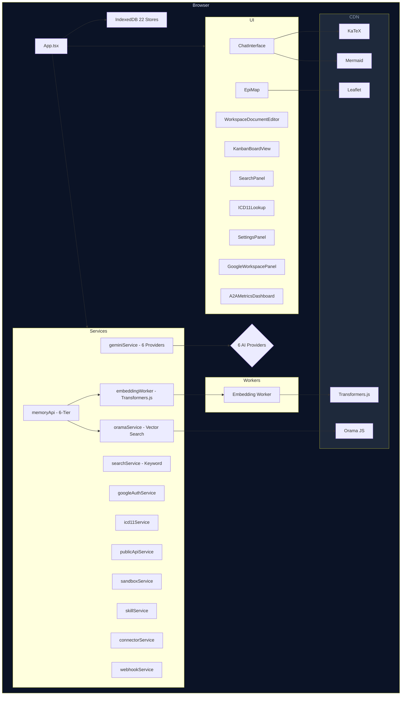

# 004 — System Architecture

## 1. High-Level Architecture



## 2. Component Architecture

```
src/
├── index.tsx                           # ReactDOM.createRoot entry
├── index.css                           # Tailwind directives, CSS variables, theme
├── App.tsx                             # Shell: agents, state, routing, layout
├── types.ts                            # All shared TypeScript interfaces
│
├── components/                         # 25 UI components
│   ├── ChatInterface.tsx               # AI chat with A2A integration
│   ├── WorkspaceDocumentEditor.tsx     # Split-pane markdown editor (lazy)
│   ├── KnowledgeBaseManager.tsx         # Tree file/folder browser
│   ├── A2AMetricsDashboard.tsx         # Agent metrics charts (lazy)
│   ├── SettingsPanel.tsx               # All settings (lazy)
│   ├── GoogleWorkspacePanel.tsx        # Drive/Docs/Sheets (lazy)
│   ├── MCPServerPanel.tsx              # MCP configuration (lazy)
│   ├── ConnectorPanel.tsx              # GitHub/Slack/RSS/Email connectors
│   ├── WebhookManager.tsx              # Webhook CRUD
│   ├── AgentBuilder.tsx                # Custom agent creation
│   ├── PublicDataPanel.tsx             # Public health data browser
│   ├── DocumentationViewer.tsx         # In-app docs
│   ├── ICD11Lookup.tsx                 # Medical code browser
│   ├── EpiMap.tsx                      # Leaflet epidemiological map
│   ├── KanbanBoardView.tsx             # Drag-drop task board
│   ├── SearchPanel.tsx                 # Full-text search
│   ├── ChatSessionSidebar.tsx          # Session list
│   ├── WorkspaceManager.tsx            # Project CRUD
│   ├── GmailCompose.tsx                # Gmail compose
│   ├── ThemeSwitcher.tsx               # Dark/light toggle
│   ├── ErrorBoundary.tsx               # Crash recovery
│   ├── DocumentEditor.tsx              # Re-export alias
│   ├── MetricsDashboard.tsx            # Re-export alias
│   ├── charts/SimpleCharts.tsx         # SVG chart components
│   └── icons/lucide-shim.tsx           # 36 inline SVG icons
│
├── services/                           # 12 application services
│   ├── geminiService.ts                # 6-provider LLM router
│   ├── memoryApi.ts                    # 6-tier memory API
│   ├── embeddingWorker.ts              # Web Worker entry
│   ├── oramaService.ts                 # Orama CDN wrapper
│   ├── searchService.ts                # Token-based fuzzy search
│   ├── googleAuthService.ts            # Google OAuth flow
│   ├── icd11Service.ts                 # ICD-11 lookup + FHIR
│   ├── publicApiService.ts             # CDC/WHO/weather APIs
│   ├── sandboxService.ts               # iframe sandbox
│   ├── skillService.ts                 # Skill registry
│   ├── connectorService.ts             # External connectors
│   └── webhookService.ts               # Webhook dispatch
│
├── db/
│   └── indexedDB.ts                    # 22 object stores, generic CRUD
│
├── hooks/
│   ├── useChat.ts                      # Chat session CRUD
│   ├── useFiles.ts                     # File/folder/version CRUD
│   └── usePWAInstall.ts                # PWA install prompt
│
├── utils/
│   ├── markdown.ts                     # Custom CommonMark parser
│   └── highlight.ts                    # Custom regex highlighter
│
└── test/                               # 74 tests across 6 files
    ├── setup.ts                        # Mocks: indexeddb, Worker, BroadcastChannel, crypto
    ├── memory.unit.test.ts             # 25 unit tests
    ├── memory.integration.test.ts      # 10 integration tests
    ├── memory.benchmark.ts             # 5 benchmarks
    ├── gemini.test.ts                  # 8 LLM router tests
    ├── sandbox.test.ts                 # 9 sandbox tests
    └── icd11.test.ts                   # 22 ICD-11 tests
```

## 3. Data Flow Architecture

### 3.1 User Interaction Flow

```
User Action
  → React Component (event handler)
  → Service function (if needed)
  → IndexedDB read/write
  → State update (useState)
  → Re-render
```

### 3.2 A2A Debate Flow

```
User submits prompt
  → ChatInterface calls geminiService.streamResponse() for each active agent
  → Each agent gets its systemPrompt + user message
  → LLM streams response tokens back
  → Responses rendered with agent color/avatar in chat
  → Metrics pushed to A2AMetricsDashboard
  → Episodic memory: conversation saved to IndexedDB
```

### 3.3 Vector Embedding Flow

```
storeSemantic(entry)
  → entry.embedding is empty?
    → YES: computeEmbedding(text)
      → Web Worker postMessage(text)
      → Worker imports Transformers.js from CDN
      → pipeline('feature-extraction', 'all-MiniLM-L6-v2')
      → Returns 384-dim Float32Array
      → Worker postMessage(embedding)
    → NO: skip
  → dbPut('semantic', { ...entry, embedding })
  → oramaInsert(entry)  [if Orama CDN available]
```

### 3.4 Semantic Search Flow

```
searchSemantic(query, topK=10)
  → Try oramaSearchEntries(query, topK)
    → Orama hybrid search (vector cosine similarity + keyword BM25)
    → Returns ranked entries
  → If Orama unavailable:
    → dbGetAll('semantic')
    → Tokenize query → count keyword matches per entry
    → Sort by match count descending
    → Return topK
```

## 4. State Management

| State Type | Mechanism | Examples |
| :--- | :--- | :--- |
| **UI State** | `useState`, `useReducer` | Active view, modal open/close, form inputs |
| **Session State** | In-memory Map (session memory tier) | Current conversation context |
| **Persistent State** | IndexedDB direct access | Files, folders, settings, agents, metrics |
| **Cross-Tab Sync** | `BroadcastChannel('oks_memory_sync')` | Memory changes reflected across tabs |
| **Theme** | CSS variables + IndexedDB `appState` | Dark/light mode, accent color |
| **PWA Install** | `beforeinstallprompt` event + localStorage | Install prompt state |

## 5. Security Architecture

| Concern | Implementation |
| :--- | :--- |
| **API Key Storage** | IndexedDB `providers` store. Never exposed to network. |
| **Code Execution** | iframe with `sandbox="allow-scripts"`. No `allow-same-origin`. eval() in isolated scope. 5s timeout. |
| **Cross-Tab** | BroadcastChannel restricted to same origin. |
| **OAuth** | Google OAuth 2.0 implicit flow. Token stored in memory only. |
| **Content Security** | CDN scripts loaded via dynamic `<script>` tags. No inline eval in main thread. |
| **Data Privacy** | All data stays in browser IndexedDB. No telemetry, no analytics. |

---

## See Also

- [000 — Project Overview](000-overview.md) — High-level introduction
- [002 — Technical Specification](002-specification.md) — Detailed component/service specs
- [003 — Blueprint](003-blueprint.md) — Tech stack and success metrics
- [005 — Design](005-design.md) — UI/UX design system
- [Index](index.md) — Full documentation index
- [Memory Architecture](developers/005-memory-architecture.md) — 6-tier memory deep dive
- [Dependency Removal](developers/010-dependency-removal.md) — Zero-dependency architecture

---

*Last updated: July 27, 2026*

---

_Open Knowledge Studio v2.0 — Zero-dependency, browser-native, 12-agent A2A platform for offline-first research, writing, and data analysis. Built by [Mohammad Ariful Islam](https://github.com/zsdotcom) ([codeandbrain](https://github.com/codeandbrain)) at the [ZarishSphere Foundation](https://zarishsphere.com). Licensed under MIT. Source code: [github.com/zsdotcom/zs-oks](https://github.com/zsdotcom/zs-oks)._
