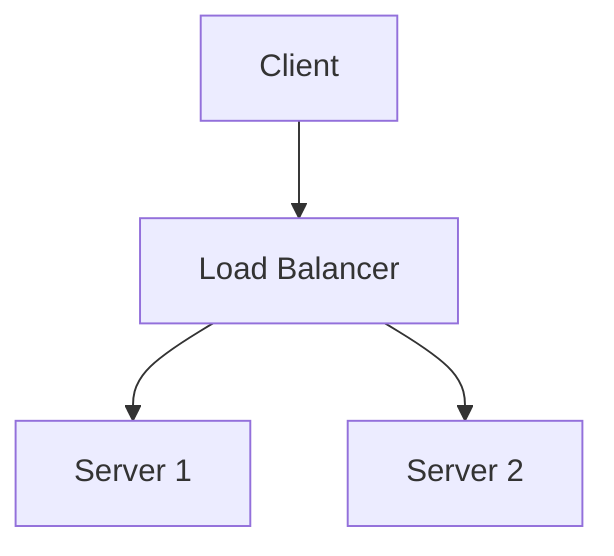

# zarishsphere-writing-rules.md
## ZarishSphere Universal Serialization Standard (ZUSS)
### Documentation, Naming, and Formatting Rules — V2.1

**Document type:** Normative Standard — V2.1
**Date:** July 30, 2026
**Author:** Mohammad Ariful Islam / ZarishSphere Foundation
**License:** CC BY 4.0
**Status:** V2.1 — Authoritative. Supersedes V2 (July 30, 2026). All ZarishSphere documents, repos, and workflows must comply.

**What changed in V2.1:**
- Section 14: Mandatory Research Before Writing — NON-NEGOTIABLE rule
- Comprehensive Information Source Registry with 10 categories, 100+ authoritative sources
- Every ZarishSphere document must cite verified, current sources from the registry
- New validation rules Z18-Z25 for research compliance
- Version 2.0.0 → 2.1.0 (substantive addition to normative scope)

---

## Table of Contents

1. [Purpose](#1-purpose)
2. [Core Naming Mechanics](#2-core-naming-mechanics)
3. [Tooling-Reserved Filenames](#3-tooling-reserved-filenames)
4. [Repository Naming (zs-\* Catalog)](#4-repository-naming-zs--catalog)
5. [Entity Identifiers and ID Registry](#5-entity-identifiers-and-id-registry)
6. [Document Classes and Structure Rules](#6-document-classes-and-structure-rules)
7. [Writing Style Rules](#7-writing-style-rules)
8. [Technical Documentation Subtypes](#8-technical-documentation-subtypes)
9. [Version Policy](#9-version-policy)
10. [License Block (Mandatory Footer)](#10-license-block-mandatory-footer)
11. [Cross-Reference Standard](#11-cross-reference-standard)
12. [Validation and Enforcement](#12-validation-and-enforcement)
13. [External Standards Alignment](#13-external-standards-alignment)
14. [Mandatory Research Before Writing](#14-mandatory-research-before-writing)
    14.1 [The Non-Negotiable Rule](#141-the-non-negotiable-rule)
    14.2 [Why This Rule Exists](#142-why-this-rule-exists)
    14.3 [Information Source Registry](#143-information-source-registry)
    14.4 [When to Check Which Sources](#144-when-to-check-which-sources)
    14.5 [Exceptions](#145-exceptions)
    14.6 [Validation](#146-validation)

---

## 1. Purpose

ZUSS is the single, consistent rule set governing how every file, folder, repository, workflow, identifier, and document is named, structured, and written within the ZarishSphere ecosystem. Consistency at this level makes the ecosystem machine-explorable and human-navigable simultaneously.

Every repository matching the `zs-*` catalog format must align its taxonomy with ZUSS. No exceptions — except the tooling-reserved filenames explicitly listed in Section 3, which exist because external tools (GitHub, MkDocs, Copilot) require them.

ZUSS V2 is aligned with the **Google Open Knowledge Format (OKF) v0.2** for structured metadata, the **Diátaxis** content framework (Tutorials, How-to guides, Explanation, Reference), and ecosystem standards for **diagram-as-code**, **prompt-as-code**, **policy-as-code**, and **skills-as-documents**. Where external standards exist (OpenAPI, Arazzo, MCP), ZUSS references them by link rather than re-specifying them.

---

## 2. Core Naming Mechanics

### 2.1 Universal Syntax Rules

| Rule | Requirement |
|---|---|
| Case | Lowercase only. No uppercase anywhere in file or folder names, except tooling-reserved filenames (Section 3). |
| Separator | Hyphen (`-`) only. No underscores, no spaces, no camelCase, no PascalCase. |
| Index prefix | All content files and folders begin with a 3-digit zero-padded sequence number: `001`, `002`, `099`. |
| Extension | Always explicit, exactly one: `.md`, `.yml`, `.json`, `.go`, `.yaml`. Never omit. Never double (`.md.md` is invalid). |
| Pattern | `nnn-descriptive-name.ext` |

**Valid examples:**
```
001-zarishsphere-constitution.md
002-zarishsphere-foundation-profile.md
003-zarishsphere-founder-profile.md
004-zarishsphere-writing-rules.md
005-zarishsphere-ecosystem-architecture.md
006-zarishsphere-glossary.md
099-zarishsphere-appendix-references.md
```

**Invalid examples:**
```
Profile Context.md              ← spaces + uppercase
profileContext.md               ← camelCase
001_profile_context.md          ← underscores
profile-context                 ← missing extension
001-overview.md.md              ← doubled extension
ZarishSphere_Ecosystem.md.md.md ← PascalCase, underscores, tripled extension
```

### 2.2 Folder Naming

Same rules as files, but without numbers and extensions:

```
zs-core/
zs-health/
zs-geography/
zs-index/
```

### 2.3 Workflow File Naming

CI/CD and automation workflow files SHOULD follow this three-segment format for new workflows:

```
[id]--[trigger]--[process].yml
```

| Segment | Rules | Example |
|---|---|---|
| `[id]` | 3-digit zero-padded integer | `101` |
| `[trigger]` | What fires the workflow (kebab-case) | `on-push`, `on-schedule`, `on-release` |
| `[process]` | What the workflow does (kebab-case) | `validate-markdown`, `build-artifacts`, `publish-pages` |
| Separator | Double hyphen `--` between each segment | — |

**Valid examples:**
```
101--on-push--validate-markdown.yml
102--on-schedule--sync-iso-data.yml
201--on-release--publish-pages.yml
301--on-pull-request--lint-yaml.yml
```

**Existing files** under `.github/workflows/` are exempt from this naming convention (covered by the `.github/**` exemption in Section 3). The following workflows currently exist in this repository and use their GitHub-generated or purpose-descriptive names:

| File | Purpose |
|---|---|
| `auto-assign.yml` | Auto-assign PR reviewers and labels |
| `ci.yml` | Type check, test, build, E2E, bundle analysis |
| `codeql-analysis.yml` | CodeQL security analysis (weekly) |
| `deploy-app.yml` | Build, Vercel deploy, Docker Hub push |
| `deploy-docs.yml` | Validate and deploy docs to GitHub Pages |
| `stale.yml` | Mark stale issues/PRs for cleanup |

New workflow files SHOULD follow the `[id]--[trigger]--[process].yml` convention. If renaming an existing file, update all references (external callers, badges, branch protection rules) in the same PR.

### 2.4 Asset Naming (Images, Diagrams, Non-Code Files)

Assets follow the same lowercase-hyphen rule, with a type prefix:

```
[type]-[nnn]-[descriptive-name].[ext]

Types: img (raster images), svg (vector/diagrams), pdf (documents), data (CSV/JSON seed files)
```

**Valid examples:**
```
img-001-fhir-engine-architecture.png
svg-002-g2a-pipeline-flow.svg
data-001-domain-taxonomy-seed.csv
```

---

## 3. Tooling-Reserved Filenames

The following filenames are **exempt** from Section 2.1 because external tooling requires their exact case and spelling to function. This is the one deliberate, permanent exception to ZUSS naming — not a violation.

| Filename | Reason for exemption |
|---|---|
| `README.md` | GitHub renders this automatically on repo landing pages |
| `LICENSE` / `LICENSE.md` | GitHub license detection requires this exact name |
| `CONTRIBUTING.md` | GitHub links this automatically in PR/issue templates |
| `CODE_OF_CONDUCT.md` | GitHub community health file convention |
| `SECURITY.md` | GitHub security tab convention |
| `CHANGELOG.md` | Standard tooling convention (Keep a Changelog, semantic-release) |
| `AGENTS.md` | Cross-tool AI agent bootstrap convention (OpenCode, Cursor, Windsurf, etc.) |
| `CLAUDE.md` | Claude Code native agent context file (global → project → subdirectory hierarchy) |
| `TODO.md` | Root-level roadmap file, referenced by name in AGENTS.md |
| `llms.txt` | AI-crawler documentation index (markdown links for LLM context ingestion) |
| `mkdocs.yml` | MkDocs requires this exact filename |
| `.github/workflows/` | GitHub Actions workflow files — see Section 2.3 for inventory |
| `.github/ISSUE_TEMPLATE/` | GitHub issue template directory (reserved path) |
| `.github/PULL_REQUEST_TEMPLATE/` | GitHub PR template directory (reserved path) |
| `.github/dependabot.yml` | Dependabot configuration — GitHub-required filename |
| `.github/CODEOWNERS` | Code owners — GitHub-required filename |
| `.github/auto-assign.yml` | Auto-assign action configuration (referenced by `kentaro-m/auto-assign-action`) |
| `.github/labeler.yml` | Labeler action configuration (referenced by `actions/labeler`) |
| `index.md` | Directory index page for multiple platforms (GitHub Pages, docs sites) |
| `SKILL.md` | Agent skill definition file with YAML frontmatter schema (OpenCode, Cursor) |

No other filename may deviate from Section 2.1. If a new tool requires a reserved name, add it to this table via a PR — do not create silent exceptions elsewhere.

**Hierarchy note (CLAUDE.md):** When `CLAUDE.md` exists at repo root alongside `AGENTS.md`, the repo-root `AGENTS.md` takes precedence for project-level agent instruction, mirroring the general → specific convention used by the ecosystem.

---

## 4. Repository Naming (zs-\* Catalog)

All ZarishSphere repositories follow the `zs-` prefix convention:

| Category | Pattern | Example |
|---|---|---|
| Core platform | `zs-core` | `zs-core` |
| Domain modules | `zs-[domain]` | `zs-health`, `zs-logistics` |
| FHIR engine | `zs-fhir-[component]` | `zs-fhir-server`, `zs-fhir-g2a` |
| Infrastructure | `zs-infra-[component]` | `zs-infra-cloudflare`, `zs-infra-k3s` |
| Content (data) | `zs-content-[type]` | `zs-content-forms`, `zs-content-protocols` |
| Documentation | `zs-docs` | `zs-docs` |
| ZarishIndex | `zs-index` | `zs-index` |
| ZarishStandards | `zs-standards` | `zs-standards` |
| Skills & agents | `zs-skills` | `zs-skills` |

**Docker image naming:**

```
zarishsphere/[service-name]:[v1.0.0]
```

Example: `zarishsphere/zs-fhir-server:v1.0.0`

Never use a `latest` tag in any production or pinned config.

---

## 5. Entity Identifiers and ID Registry

All system entities use identifier patterns from a fixed namespace. Every namespace's prefix must be unique across the whole registry — check this table before adding a new one.

| Entity | Prefix | Pattern | Example | Owning system |
|---|---|---|---|---|
| FHIR Profile | `zs-` | `https://zarishsphere.com/fhir/StructureDefinition/zs-[resource]` | `zs-patient` | Platform |
| Form ID | `zs-form-` | `zs-form-[domain]-[name]-v1` | `zs-form-ncd-intake-v1` | Platform |
| Service URL | — | `https://[service].zarishsphere.com/[path]` | `https://api.zarishsphere.com/fhir/R5/` | Infrastructure |
| ADR | `ADR-` | `ADR-[NNN]-[title-kebab-case]` | `ADR-001-go-as-primary-language` | Governance |
| ZarishIndex Resources ID | `ZI-` | `ZI-[DOMAIN_CODE]-[NNNNN]` | `ZI-HEALTH-00001` | ZarishIndex (legacy internal ref) |
| ZarishIndex master ID | `[DOMAIN_CODE]-` | `[DOMAIN_CODE]-[ISSUER_CODE]-[SHORT_ID]-[YEAR]` | `HL-ISO-15189-2022` | ZarishIndex (canonical, per 003-zs-index-metadata-schema.md) |
| Skill definition | `SKILL-` | `SKILL-[domain]-[name]` | `SKILL-health-data-analyzer` | zs-skills |
| Diagram document | `DGM-` | `DGM-[domain]-[nnn]` | `DGM-ARCH-001-system-overview` | zs-docs |
| Prompt template | `PRM-` | `PRM-[domain]-[name]` | `PRM-ANALYST-fhir-query` | zs-skills |
| Policy rule | `POL-` | `POL-[domain]-[nnn]` | `POL-SEC-001-data-access` | zs-standards |

**Collision rule:** No two owning systems may claim the same prefix. `ZI-` and the domain-code scheme (`HL-`, `HR-`, etc.) both belong to ZarishIndex and do not collide with each other or with `ZS-`/`zs-`/`ADR-`/`zs-form-`. Any new ID scheme must be added to this table with an explicit prefix check before use.

---

## 6. Document Classes and Structure Rules

ZUSS recognizes two document classes. Every document declares which class it is via its opening block. Do not mix the two schemas in one file.

### 6.1 Class A — Narrative Documents

Governance, architecture, ADRs, SOPs, direction papers — anything meant to be read top-to-bottom by a human first, an agent second. Use the **markdown header block**:

```markdown
# [nnn]-[document-name].md
## [Human-Readable Title]
### [Subtitle or Scope]

**Document type:** [Reference / Specification / Direction / Proposal / ADR / SOP / Report]
**Date:** [Full date — July 30, 2026]
**Author:** Mohammad Ariful Islam / ZarishSphere Foundation
**License:** [Apache 2.0 (code) · CC BY 4.0 (documentation) OR as applicable]
**Status:** V1 — [One-line status description]
```

### 6.2 Class B — Structured Entry Documents

Standards-index entries, catalog rows, skill definitions, prompt templates, policy rules — anything meant to be parsed by a pipeline first and read by a human second. Use **YAML frontmatter**.

Class B frontmatter is aligned with **Google OKF v0.2** (Open Knowledge Format). The only OKF-required field is `type`; all other fields are ZUSS required or recommended.

```yaml
---
id: "ZS-NNN-XXX"
type: "okf-document"          # REQUIRED — OKF v0.2. One of: okf-document, okf-resource, okf-skill, okf-prompt, okf-policy, okf-diagram
title: "Document title"
domain: "domain-slug"
doc-type: "specification"
entity-type: "specification"
description: >-
  One to three sentence machine-readable summary.
version: "1.0.0"
status: "stable"              # OKF-compatible: draft / reviewed / stable / deprecated
tags: ["tag-one", "tag-two"]
isolation_tier: "global"
audience: ["contributors", "ai-agents"]
last_updated: "2026-07-30"

# OKF v0.2 provenance (recommended)
sources:                      # Where this knowledge came from
  - type: "standard"
    uri: "https://example.com/spec"
    label: "External Specification v2.1"
generated:                    # Machine-generated content flag
  tool: "zs-index-pipeline"
  date: "2026-07-30"
verified:                     # Human verification status
  by: "curator-name"
  date: "2026-07-30"
stale_after: "2027-07-30"     # OKF freshness — date after which content should be re-checked
---
```

**OKF alignment notes:**
- `type` is the only OKF-required field. ZUSS extends OKF by requiring additional fields (`id`, `domain`, `doc-type`, `entity-type`, `version`, `isolation_tier`, `audience`).
- `status` values (`draft`/`reviewed`/`stable`/`deprecated`) match OKF lifecycle convention.
- `sources` maps to OKF provenance; `generated`/`verified` map to OKF trust model; `stale_after` maps to OKF freshness.
- OKF supports cross-referencing via standard markdown links — ZUSS Section 11 provides the explicit format.

**Note on the `version` field:** this is the document's own schema/content revision number, independent of Section 9's platform release policy. A Class B document can say `version: "2.0.0"` while the platform itself is still V1 — these are two different counters. Class A documents do not carry a `version` field; they carry `Status: V2` in the header block instead.

Both classes share Sections 7 (Writing Style), 10 (License footer), and 11 (Cross-referencing).

### 6.3 Table of Contents

Required for all Class A documents with more than 5 sections:

```markdown
## Table of Contents

1. [Section Title](#1-section-title)
2. [Section Title](#2-section-title)
```

### 6.4 Section Numbering

- Top-level sections: `## 1. Title`, `## 2. Title`
- Subsections: `### 1.1 Subtitle`, `### 1.2 Subtitle`
- Sub-subsections: `#### 1.1.1 Detail` (use sparingly)
- Never skip a level

### 6.5 Tables

Use tables whenever a list has 3 or more items and each item carries 2 or more attributes worth comparing. If the content is a single flat list with no attributes to compare, use a list instead of a table.

```markdown
| Column A | Column B | Column C |
|---|---|---|
| Value | Value | Value |
```

### 6.6 Code Blocks

All code, commands, configuration, and identifiers use fenced code blocks with a language specifier. Never show a command inline without a code block if it needs to be executed.

````
```bash
sudo apt update
```

```yaml
version: "3.8"
services:
```

```go
func main() {
```
````

### 6.7 Diagrams as Code

All architectural diagrams, flowcharts, sequence diagrams, and visual documentation must be authored in a **diagram-as-code** tool. Raster images (PNG/JPG) are forbidden for anything that can be expressed in text.

**Default: Mermaid** (version 11+). Mermaid is GitHub-native, supports 15+ diagram types, and requires no external renderer.



**Alternatives (explicitly opt-in, declared in frontmatter):**

| Tool | When to use | File extension | Frontmatter declaration |
|---|---|---|---|
| **Mermaid** | Default — all new diagrams | inline in `.md` or `.mmd` | (default, no declaration needed) |
| **PlantUML** | UML-specific diagrams (class, component, deployment) | `.puml` | `diagram-tool: plantuml` |
| **D2** | Large, complex layouts needing TALA layout engine | `.d2` | `diagram-tool: d2` |

**Rules:**
- Every diagram must have a caption and a unique anchor reference:
  ```markdown
  [diagram: ARCH-001-system-overview]
  *Figure 1: System architecture showing client, load balancer, and server tiers*
  ```
- Diagrams over 100 lines must be extracted to a separate file under `assets/diagrams/` and referenced via `!include` or `!import`.
- Generated diagram images (PNG/SVG output) follow Section 2.4 asset naming and must note the source diagram file in a comment.

### 6.8 Prompts as Code

Documents that contain AI system prompts must follow the **prompt-as-code** pattern: structured, versioned, and machine-parseable. This applies to AGENTS.md, SKILL.md, system prompts embedded in applications, and any instruction block passed to an LLM.

**Structure:**

```markdown
## Role
You are a [role definition — one sentence].

## Context
[Background information the agent needs to operate effectively.]

## Instructions
1. [Rule one — imperative, actionable]
2. [Rule two]
3. [Rule three]

## Constraints
- [Boundary the agent must not cross]
- [Resource limit, scope restriction, etc.]

## Output Format
[Required structure for agent responses — JSON schema, markdown template, etc.]

## Tools (optional)
- [Tool name]: [what it does, when to use]
```

**Rules:**
- Role definition must be the first block.
- Instructions must be numbered, actionable items, not paragraphs.
- Each constraint must be independently verifiable.
- Version number in frontmatter or header block.
- Prompt fragments (partial instructions meant to be composed) use `type: "okf-prompt"` in frontmatter.

### 6.9 Skills as Documents

Agent skill definitions (SKILL.md files and skill-library entries) follow the **skills-as-documents** pattern — structured markdown with YAML frontmatter that encodes domain expertise for AI agents to execute.

**File:** `SKILL.md` (tooling-reserved, Section 3) — placed at skill root.

**Frontmatter schema:**

```yaml
---
name: "skill-name"
description: "One-line purpose of this skill"
type: "okf-skill"
version: "1.0.0"
author: "ZarishSphere Foundation"
triggers:                   # What keywords or patterns activate this skill
  - "deploy model"
  - "find capacity"
tools:                      # Tools the skill may invoke
  - name: "tool-name"
    description: "When to use this tool"
    server: "mcp-server-name"
model: "recommended-model"  # Optional: preferred model for this skill
---
```

**Body structure:**

```markdown
# Skill: [Name]

## Description
[Human-readable explanation — what this skill does, when to invoke it.]

## Workflow
1. [Step one]
2. [Step two]
3. [Step three]

## Rules
- [Domain-specific rule]
- [Constraint or boundary]

## Examples
[Optional: worked examples showing input → output]
```

### 6.10 Policy as Code

Documents that express enforceable rules use the **policy-as-code** pattern. Policies are expressed in a machine-readable policy language (Cedar, Rego/OPA, CEL), stored in ZUSS-compliant files, and enforced by a policy engine in CI/CD or at runtime.

**When to use:** Access control rules, data validation rules, compliance checks, workflow approval gates.

**Pattern:**
- Policy logic is authored in the policy language file (`.cedar`, `.rego`, `.cel` — ZUSS-named).
- A companion `.md` file (Class A or B) explains the policy in plain language.

```
101-policy-data-access.cedar    # Machine-enforceable policy
101-policy-data-access.md       # Human-readable explanation (Class A)
```

**Required sections in the companion `.md`:**
1. Purpose — what this policy enforces
2. Scope — which resources/actions it covers
3. Rule summary — plain-English version of each rule
4. Exceptions — documented exemptions and their approval
5. Testing — how to verify the policy behaves correctly

---

## 7. Writing Style Rules

### 7.1 Tone

| Rule | What it means |
|---|---|
| Semi-formal to direct | No corporate fluff. No apologies. No padding. |
| Knowledgeable, not condescending | Assume the reader is competent in their domain. |
| Specific, not vague | Every claim must be actionable or verifiable. |

### 7.2 Banned and Discouraged Language

**Banned outright** (never appears in any ZarishSphere document): "genuinely," "honestly," "straightforward."

**Discouraged marketing language** (flag on review, rewrite unless quoting a source): "seamless / seamlessly," "cutting-edge," "powerful," "robust," "revolutionary," "game-changing," "best-in-class," "world-class," "state-of-the-art." These words describe a feeling, not a fact. Replace with the specific, verifiable claim instead — e.g., not "a powerful FHIR engine" but "a FHIR R5 engine that runs in under 150MB of RAM on a Raspberry Pi 5."

### 7.3 Plain Language First

Technical concepts always get a plain-language framing before the technical detail.

Pattern:
```
[What it is in one plain sentence.]
[Technical detail follows.]
```

Example:
> **Infrastructure as a Service (IaaS)** — You rent the raw foundation; you still build what goes on top.
> *Technical:* On-demand provisioning of virtual machines, storage, and networking. The customer manages OS, runtime, middleware, and applications.

Apply this pattern to all ZarishSphere service descriptions and deployment plane documentation.

### 7.4 Service Model Language (XaaS Mapping)

ZarishSphere uses the XaaS mental model to communicate its deployment options:

| ZarishSphere Tier | XaaS Equivalent | What the deployer owns |
|---|---|---|
| Plane 0 — Serverless | \*aaS code strategies | Everything |
| Plane 1 — Air-Gapped | On-Premises | Everything |
| Plane 2 — Raspberry Pi | IaaS + self-managed | OS + apps + data |
| Plane 3 — District Server | PaaS-like | Apps + data |
| Plane 4 — National Cloud | SaaS + config | Config + data |
| Plane 5 — Global SaaS | Full SaaS | Data only |

### 7.5 Heading Rules

- Use `##` for primary sections, `###` for subsections in the document body.
- Never use `#` for anything other than the document title line.
- Body headings (`##`/`###` within numbered sections) should not exceed 8 words. This limit does not apply to the three-line title block (title / human-readable title / subtitle), which may run longer to carry a full project tagline.
- All body headings: sentence case (first word capitalised, rest lowercase unless proper nouns).

### 7.6 Lists

- Use bullet lists (`-`) only for unordered items with no natural sequence.
- Use numbered lists (`1.`, `2.`) for procedures, steps, or prioritised items.
- Maximum 7 items in a bullet list before converting to a table.
- No single-item lists. If there is only one item, it is prose.

### 7.7 Prompt Writing Style

Documents that contain AI system instructions (Section 6.8) follow additional rules:

- **Role first:** The very first sentence must define who the agent is and what it does.
- **Imperative mood:** "Extract the patient ID" not "you should extract the patient ID."
- **Negative constraints:** State what the agent must NOT do as explicit prohibitions, not soft suggestions.
- **Output format first:** If the agent must produce structured output, specify the format before the task instructions.
- **No ambiguous quantifiers:** "Always," "usually," "when appropriate" — replace with specific conditions.

---

## 8. Technical Documentation Subtypes

### 8.1 ADR (Architecture Decision Record)

File: `nnn-adr-[short-title].md` — Class A.

Required sections:
1. Decision
2. Context
3. Alternatives Considered
4. Reason for Decision
5. Consequences
6. Status (Accepted / Superseded / Proposed)

### 8.2 SOP (Standard Operating Procedure)

File: `nnn-sop-[process-name].md` — Class A.

Required sections:
1. Purpose
2. Scope
3. Roles Responsible
4. Preconditions
5. Step-by-Step Procedure (numbered, GUI-first)
6. Expected Outcome
7. Escalation Path

### 8.3 PRD (Product Requirements Document)

File: `nnn-prd-[feature-name].md` — Class A.

Required sections:
1. Problem Statement
2. Goals & Non-Goals
3. User Stories
4. Functional Requirements
5. Non-Functional Requirements
6. Standards Compliance
7. Acceptance Criteria

### 8.4 Standards-Index Entry

File: `[zarish_id].md` or catalog row — Class B. See `003-zs-index-metadata-schema.md` for the full 22-field schema. This is the one document subtype that uses YAML frontmatter as its primary and only metadata layer — no separate header block.

### 8.5 README.md

Every repository must have a `README.md` (tooling-reserved, Section 3) with:
1. One-line description
2. Status badge
3. Quick start (GUI-first, 5 steps maximum)
4. Architecture overview link
5. License block

### 8.6 OpenAPI Specification

File: `nnn-openapi-[service-name].yaml` or `nnn-openapi-[service-name].json` — Class B.

Conforms to OpenAPI 3.1 (JSON Schema 2020-12). Must include:
- `info.title`, `info.version`, `info.description`
- At least one path with operations
- Components section for reusable schemas

For API workflow descriptions spanning multiple endpoints, use **Arazzo 1.1**:
File: `nnn-arazzo-[workflow-name].yaml` — Class B.
References the OpenAPI spec for the APIs it orchestrates.

### 8.7 MCP Server Documentation

File: `nnn-mcp-[server-name].md` — Class A.

Documents a Model Context Protocol server. Required sections:
1. Purpose — what this MCP server provides
2. Resources — list of available resource URIs
3. Tools — tool names, input schemas, descriptions
4. Prompts — available prompt templates (if any)
5. Authentication — how clients connect (API key, OAuth, etc.)
6. Example usage — client-side invocation examples

### 8.8 SKILL Definition (Agent Skill)

File: `SKILL.md` (tooling-reserved) — Class B body follows Section 6.9.

Alternatively: `nnn-skill-[name].md` for skill-library entries — Class B.

### 8.9 Prompt Document

File: `nnn-prompt-[name].md` — Class B.

YAML frontmatter includes `type: "okf-prompt"` and the `prm-` ID prefix (Section 5). Body follows Section 6.8 structure.

### 8.10 Policy Definition

File: `nnn-policy-[name].md` (human companion) + `nnn-policy-[name].rego` or `.cedar` or `.cel` (machine-enforceable) — see Section 6.10.

---

## 9. Version Policy

**V1 until launch.** No *platform release* version numbers are incremented during development. The platform itself is V1 from first document to launch. This is separate from the Class B `version` frontmatter field (Section 6.2), which tracks individual document/schema revisions and may legitimately read `1.0.0`, `2.0.0`, etc. even pre-launch.

| Stage | Platform Version Label | Document Schema Version |
|---|---|---|
| All development | V1 | Increments per document, e.g. `1.0.0` → `2.0.0` |
| First production launch | v1.0.0 | Unaffected — continues its own track |
| Post-launch patches | v1.0.1, v1.0.2… | Unaffected |
| Feature releases | v1.1.0, v1.2.0… | Unaffected |

---

## 10. License Block (Mandatory Footer)

Every Class A document must end with:

```
---

*ZarishSphere Foundation · V2 · [Date]*
*License: Apache 2.0 (code) · CC BY 4.0 (documentation)*
*GitHub: https://github.com/zsdotcom*
```

Class B documents carry equivalent information in frontmatter (`last_updated`, license implied by repository-level LICENSE file) and do not require the prose footer, though it is not forbidden.

---

## 11. Cross-Reference Standard

### 11.1 Internal Cross-References

When referencing another ZarishSphere document, use the format:

```markdown
→ **[document-name].md** — [one-line description of what it contains]
```

Example:
```markdown
→ **004-harvesting-policy.md** — Strategic direction for the ZarishIndex autonomous research project
→ **001-zarishsphere-platform-overview.md** — Platform architecture, roadmap, and deployment model
```

When referencing a document in a different repository, include the repository name:

```markdown
→ **zs-index/docs/001-zs-index-project-charter.md** — (cross-project: see `zarishsphere/zs-index` repo) — ZarishIndex mission, scope, and vision
```

### 11.2 External Standard References

When referencing an external specification, use the format:

```markdown
→ **[Standard Name vX.Y]** — [URL] — [one-line relevance to ZarishSphere]
```

Examples:
```markdown
→ **OKF v0.2** — https://github.com/GoogleCloudPlatform/knowledge-catalog/blob/main/okf/SPEC.md — Open Knowledge Format: structured metadata for knowledge entries
→ **OpenAPI 3.1** — https://spec.openapis.org/oas/v3.1.0 — REST API description standard
→ **Arazzo 1.1** — https://spec.openapis.org/arazzo/v1.1.0 — API workflow orchestration descriptions
→ **MCP 2025-11-25** — https://modelcontextprotocol.io — Model Context Protocol: AI-tool integration
→ **Diátaxis** — https://diataxis.fr — Content taxonomy framework (Tutorials, How-to, Explanation, Reference)
```

---

## 12. Validation and Enforcement

ZUSS is enforced the same way ZarishIndex enforces its own schema (`003-metadata-schema.md`, Section 8) — rules only count if something checks them.

### 12.1 Automated checks (`scripts/validate-zuss.py`, run in CI on every PR)

| Rule ID | Check |
|---|---|
| Z01 | Filename matches `^[0-9]{3}-[a-z0-9-]+\.[a-z]+$`, OR is listed in the Section 3 exemption table |
| Z02 | No filename contains a doubled extension (`.md.md`, `.yml.yml`, etc.) |
| Z03 | No uppercase characters in filename, except exempted names |
| Z04 | No underscore or space in filename |
| Z05 | Every Class A document opens with the full header block (Section 6.1) |
| Z06 | Every Class B document opens with valid YAML frontmatter containing all required fields |
| Z07 | No document mixes header-block and frontmatter schemas |
| Z08 | Every document ends with the correct footer for its class (Section 10) |
| Z09 | No banned word (Section 7.2, "banned outright" list) appears anywhere in the document |
| Z10 | Every new ID prefix is checked against the Section 5 registry before merge |
| Z11 | Every workflow file matches the `[id]--[trigger]--[process].yml` pattern (Section 2.3) |
| Z12 | Docker image references are never tagged `latest` |
| Z13 | Class B frontmatter includes `type` field matching OKF v0.2 values (Section 6.2) |
| Z14 | Every Mermaid diagram has a caption and anchor reference (Section 6.7) |
| Z15 | Every skill document (SKILL.md) includes `name`, `description`, `type: "okf-skill"` in frontmatter |
| Z16 | Every prompt document includes `type: "okf-prompt"` and follows Section 6.8 structure |
| Z17 | Policy files (.rego/.cedar/.cel) have a companion .md explanation file (Section 6.10) |

Validation failures block merge. Discouraged-language hits (Section 7.2, second list) are logged as warnings, not blockers — a human call, not a machine one.

### 12.2 Human review

| Content type | Review required |
|---|---|
| New ID namespace | Curator approval against Section 5 registry |
| New tooling-reserved filename exemption | Curator approval, added to Section 3 |
| Class A/B classification for a new document type | Curator approval before first use |
| New diagram tool alternative (non-Mermaid) | Curator approval, added to Section 6.7 |

---

## 13. External Standards Alignment

ZUSS is not a replacement for existing ecosystem standards. Where an authoritative external standard exists, ZUSS defers to it by reference.

| Domain | External Standard | ZUSS Integration |
|---|---|---|
| Structured metadata | Google OKF v0.2 | Class B frontmatter aligns with OKF fields; `type` is required |
| REST API documentation | OpenAPI 3.1 | OpenAPI YAML/JSON files use ZUSS naming; referenced from .md docs |
| API workflows | Arazzo 1.1 | Workflow specs use ZUSS naming; companion .md docs explain the flow |
| AI-tool integration | MCP (2025-11-25) | MCP server docs follow Section 8.7; tools are documented per MCP schema |
| Content framework | Diátaxis | Content organized as Tutorial / How-to / Explanation / Reference |
| Diagram as code | Mermaid (default), PlantUML, D2 | Captured in Section 6.7 with explicit rules |
| Agent context | AGENTS.md, CLAUDE.md, SKILL.md, llms.txt | Section 3 reserved names; Section 9 skill pattern |
| Policy enforcement | Cedar / Rego (OPA) / CEL | Section 6.10 pattern for policy documents |
| Machine-readable doc index | llms.txt | llms.txt at repo root indexes all ZUSS documents for AI crawlers |

---

## 14. Mandatory Research Before Writing

### 14.1 The Non-Negotiable Rule

> **All ZarishSphere document authors MUST verify every factual claim about technology versions, software availability, release status, security posture, project health, and ecosystem facts against at least one authoritative source from the Information Source Registry (Section 14.3) before writing. Documents that cite outdated, incorrect, or unverified information will be rejected at review. This rule is NOT optional — it is a binding normative requirement of ZUSS.**

Rationale: ZarishSphere documentation serves as the canonical reference for a fast-moving ecosystem. A single stale version number, broken link, or incorrect availability claim can cascade into failed builds, security gaps, and wasted hours across every project that depends on it.

### 14.2 Why This Rule Exists

The ZarishSphere ecosystem references dozens of external technologies (frameworks, databases, AI providers, package registries, API specifications). These technologies release updates on independent schedules. ZarishSphere documents that describe, depend on, or integrate with external technologies MUST reflect current reality at the time of writing.

A ZarishSphere document is considered **stale** if:
- It references a library version that is two or more minor releases behind the latest stable
- It references an end-of-life (EOL) version without a migration note
- It links to a deprecated API endpoint without flagging its deprecation
- It describes a tool or service that has been acquired, renamed, or shut down
- It cites a security practice that has been superseded by a newer standard

### 14.3 Information Source Registry

Every ZarishSphere author MUST consult the relevant sources below based on the document type being written. Sources are grouped by category for rapid lookup.

---

#### Category A: Technology Version & Release Tracking

| Source | URL | Covers | Authority |
|---|---|---|---|
| endoflife.date | https://endoflife.date | EOL dates for 380+ software products | Community-curated, widely referenced |
| versionlog.com | https://versionlog.com | Version history + EOL calendar for 90+ technologies | Curated release tracking |
| eol.wiki | https://eol.wiki | EOL dates for 514+ software products | Community wiki |
| eosl.date | https://eosl.date | End-of-support dates for 463+ products | Cross-referenced database |
| GitHub Releases | https://github.com/{org}/{repo}/releases | Official release notes for any GitHub project | Authoritative per project |
| GitHub Changelog | https://github.blog/changelog | GitHub platform changes | Official |
| releasealert.dev | https://releasealert.dev | Release notifications across registries | Automated aggregator |
| releases.sh | https://releases.sh | Aggregated release notes | Multi-source currator |
| releasebot.io | https://releasebot.io | Release notes aggregator | Automated |
| releasebytes.com | https://releasebytes.com | Release note summaries | Curated |
| Wapm | https://wapm.io | WebAssembly package versions | Registry authority |
| Node.js Releases | https://nodejs.org/en/about/releases | Node.js version lines + LTS schedule | Official |
| Python Releases | https://www.python.org/downloads | CPython release history | Official |
| Go Release History | https://go.dev/doc/devel/release | Go language version history | Official |
| Rust Release Blog | https://blog.rust-lang.org | Rust release announcements | Official |

---

#### Category B: Package Registries (Canonical Version Authorities)

| Source | URL | Covers | Usage |
|---|---|---|---|
| npmjs.com | https://www.npmjs.com | JavaScript/TypeScript packages | Check latest version, deprecation notices |
| PyPI.org | https://pypi.org | Python packages | Check latest version, Python version support |
| crates.io | https://crates.io | Rust packages | Check latest version, semver compliance |
| rubygems.org | https://rubygems.org | Ruby gems | Check latest version, dependencies |
| Maven Central | https://central.sonatype.com | Java/JVM artifacts | Check latest version, group/artifact coordinates |
| packagist.org | https://packagist.org | PHP packages | Check latest version, installs |
| nuget.org | https://www.nuget.org | .NET packages | Check latest version, framework targets |
| Docker Hub | https://hub.docker.com | Container images | Check tags, base image freshness |
| GitHub Container Registry | https://github.com/orgs/{org}/packages | GHCR images | Check org-specific container versions |
| Anaconda | https://anaconda.org | Data science packages | Check conda package versions |
| homebrew.sh | https://formulae.brew.sh | macOS/homebrew formulae | Check latest brew versions |

---

#### Category C: AI Agent & Skill Marketplaces / Directories

| Source | URL | Description | Authority |
|---|---|---|---|
| Official MCP Registry | https://registry.modelcontextprotocol.io | Canonical registry of MCP servers | Anthropic-official, authoritative |
| GitHub — modelcontextprotocol/servers | https://github.com/modelcontextprotocol/servers | 89K+ stars, reference MCP server implementations | Reference repository |
| PulseMCP | https://pulsemcp.com | 11,840+ hand-reviewed MCP servers | Curated quality gate |
| Smithery | https://smithery.ai | 7,000+ servers, hosted deployment option | Competitive provider |
| Glama | https://glama.ai | 21,000+ MCP servers | Large aggregator |
| MCP.so | https://mcp.so | 19,700+ community-submitted servers | Community registry |
| MCP.directory | https://mcp.directory | 3,000+ curated MCP servers | Clean directory |
| MCP Server Finder | https://mcpserverfinder.com | Search tool for MCP servers | Aggregator search |
| Awesome MCP Tools | https://awesome-mcp.tools | 2,000+ indexed MCP tools | Community-curated list |
| MCP Market | https://mcpmarket.com | Trending MCP server leaderboard | Discovery |
| TokenMix MCP List | https://tokenmix.com/mcp | 70+ production-tested MCP servers | Production focus |
| Automation Switch MCP Index | https://automationswitch.com/mcp | Meta-index aggregating 18+ directories | Meta-directory |
| AIAgentsDirectory Skills | https://aiagentsdirectory.com/skills | 3,002+ agent skills marketplace | Curated marketplace |
| Agensi | https://agensi.io | Curated, security-scanned agent skills | Quality-scanned |
| skills.sh | https://skills.sh | Vercel-style npm package manager for skills | Platform |
| AgentSkills.codes | https://agentskills.codes | 19,296+ installable agent skills | Largest catalog |
| AgenticSkills | https://agenticskills.io | 181+ skills, 200+ MCP servers | Curated |
| SkillRegistry | https://skillregistry.io | Open registry for agent skills | Community open registry |
| OpenAgentSkill | https://openagentskill.com | Registry API for agent skills | Open API |
| ClawHub | https://clawhub.ai | OpenClaw official skills registry | Official |
| SkillsMP | https://skillsmp.com | 800,000+ skills catalog | Largest known catalog |
| LobeHub | https://lobehub.com | Visual marketplace for AI agents/skills | Visual discovery |
| ClaudeSkills.info | https://claudeskills.info | Free directory of Claude skills | Free directory |
| ExplainX Skills | https://explainx.ai/skills | Curated skills leaderboard | Curated ranking |
| Addy Osmani — agent-skills | https://github.com/addyosmani/agent-skills | Curated collection of agent skill examples | Expert-curated |
| Anthropic — anthropics/skills | https://github.com/anthropics/skills | Official Anthropic skill repository | Anthropic-official |
| OpenCode Community | https://opencode.ai | OpenCode skill registry | Ecosystem |

---

#### Category D: Open Source Project Discovery

| Source | URL | Description | Best For |
|---|---|---|---|
| GitHub Trending | https://github.com/trending | Daily/weekly trending repositories | Discovering rising projects |
| GitHub Explore | https://github.com/explore | Topic-based curated collections | Finding projects by topic |
| OpenSourceProjects.cc | https://opensourceprojects.cc | Ranked by GitHub stars | Popularity comparison |
| OSSphere | https://ossphere.dev | Open source project universe explorer | Visual exploration |
| LibHunt | https://libhunt.com | Topic-based library discovery | Library alternatives |
| OpenAlternative | https://openalternative.co | Open source alternatives to proprietary tools | Replacement discovery |
| AlternativeTo | https://alternativeto.net | Software alternatives with community reviews | Alternative comparison |
| OSDaily | https://osdaily.com | Daily open source project highlights | Discovery |
| SourceForge | https://sourceforge.net | Long-established hosting platform | Mature projects |
| GitLab Explore | https://gitlab.com/explore | GitLab-hosted projects | GitLab ecosystem |

---

#### Category E: Technology Stack Intelligence

| Source | URL | Description | Best For |
|---|---|---|---|
| StackShare | https://stackshare.io | Company tech stacks and tool comparisons | Seeing what real companies use |
| StackLens | https://stacklens.dev | Stack comparisons with detail | Competitive stack analysis |
| Open TechStack | https://opentechstack.stitchwebsite.com | Visual technology stack guides | Architecture visualization |
| Docsie Stack Compare | https://www.docsie.io | Stack comparison tool | Side-by-side comparison |
| JobsByCulture Tech Stack | https://jobsbyculture.com | Tech stacks by company | Job-market signals |
| TechTracker (GitHub) | https://github.com/technosts/techtracker | Technology popularity scoring | Trend quantification |
| Stack Overflow Survey | https://survey.stackoverflow.co | Annual developer survey results | Adoption rates, satisfaction |
| JetBrains Dev Ecosystem | https://www.jetbrains.com/lp/devecosystem | Annual developer survey | IDE/ecosystem usage |
| State of JS/State of CSS | https://stateofjs.com | Annual frontend ecosystem survey | JavaScript framework popularity |
| ThoughtWorks Technology Radar | https://www.thoughtworks.com/radar | Expert-curated technology assessment | Adoption recommendations |

---

#### Category F: Security Vulnerability Databases

| Source | URL | Description | Authority |
|---|---|---|---|
| National Vulnerability Database (NVD) | https://nvd.nist.gov | US government CVE repository | Official US Gov |
| CVE Program | https://cve.org | Common Vulnerabilities and Exposures | International standard |
| GitHub Advisory Database | https://github.com/advisories | GHSA-identified advisories | GitHub official |
| OpenCVE | https://opencve.io | CVE intelligence platform with alerts | Monitoring platform |
| Vulners | https://vulners.com | Comprehensive vulnerability database | Multi-source aggregator |
| CISA KEV | https://www.cisa.gov/known-exploited-vulnerabilities | Known Exploited Vulnerabilities catalog | US Gov operational |
| OpenSSF | https://openssf.org | Open Source Security Foundation | Industry collaboration |
| Snyk | https://snyk.io/advisories | Advisory database with fix guidance | Dependency security |
| Socket | https://socket.dev | Supply chain security scanning | Dependency risk |
| OSV.dev | https://osv.dev | Open Source Vulnerabilities | Google-backed aggregator |
| Mend (formerly WhiteSource) | https://www.mend.io | Renovate vulnerability data | Build-integrated |

---

#### Category G: Technology News & Community Aggregators

| Source | URL | Focus | Authority |
|---|---|---|---|
| Hacker News | https://news.ycombinator.com | General technology + startup news | Top-tier community |
| Lobsters | https://lobste.rs | Tech-focused link aggregation | Curated tech community |
| Dev.to | https://dev.to | Developer blog platform | Practitioner content |
| Reddit r/programming | https://reddit.com/r/programming | General programming discussion | Large community |
| Reddit r/technology | https://reddit.com/r/technology | Technology news | General audience |
| Reddit r/MachineLearning | https://reddit.com/r/MachineLearning | AI/ML research and news | ML practitioner community |
| The New Stack | https://thenewstack.io | Cloud-native and open source analysis | Journalistic authority |
| Techmeme | https://techmeme.com | Technology news aggregator | Editorial curation |
| InfoQ | https://www.infoq.com | Software engineering trends | Practitioner journalism |
| Morning Byte / TrendPulse | Multiple platforms | Tech news briefing | News briefing |
| GitHub Blog | https://github.blog | GitHub platform announcements | Official |
| Engineering Blogs | Multiple (Netflix, Meta, Google, etc.) | First-party engineering updates | Primary source |

---

#### Category H: Curated Newsletters (Regular Intelligence)

| Newsletter | URL | Coverage | Frequency |
|---|---|---|---|
| TLDR Newsletter | https://tldr.tech | General tech digest | Daily |
| Bytes | https://bytes.dev | JavaScript ecosystem | Weekly |
| This Week In React | https://thisweekinreact.com | React ecosystem | Weekly |
| React Newsletter | https://reactnewsletter.com | React ecosystem | Weekly |
| Node.js Weekly | https://nodeweekly.com | Node.js ecosystem | Weekly |
| Python Weekly | https://www.pythonweekly.com | Python ecosystem | Weekly |
| Rust Weekly | https://this-week-in-rust.org | Rust ecosystem | Weekly |
| Go Newsletter | https://golangweekly.com | Go ecosystem | Weekly |
| Best of JavaScript | https://bestofjs.com | JavaScript project rankings | Weekly |
| Deno Weekly | https://denoweekly.com | Deno ecosystem | Weekly |
| Open Source Stories (Red Hat) | https://opensource.com | Open source features | Weekly |
| LWN.net | https://lwn.net | Linux and open source | Weekly |
| Open Collective Newsletter | https://opencollective.com | Open source funding | Monthly |
| Pragmatic Engineer | https://newsletter.pragmaticengineer.com | Engineering management | Weekly |
| Lilian Weng (AI) | https://lilianweng.github.io | AI/ML research synthesis | Periodic |
| The New Stack Newsletter | https://thenewstack.io | Cloud-native | Daily |

---

#### Category I: Official Vendor Release Notes & Changelogs

| Source | URL | Covers | Authority |
|---|---|---|---|
| GitHub Changelog | https://github.blog/changelog | GitHub product changes | Official |
| Microsoft Dev Blogs | https://devblogs.microsoft.com | .NET, VS Code, Azure, TypeScript | Official |
| Google Developers Blog | https://developers.googleblog.com | Google SDKs, APIs, platforms | Official |
| Apple Developer Docs | https://developer.apple.com | Swift, Xcode, Apple platforms | Official |
| AWS What's New | https://aws.amazon.com/new | AWS service releases | Official |
| Azure Updates | https://azure.microsoft.com/en-us/updates | Azure releases | Official |
| Google Cloud Release Notes | https://cloud.google.com/release-notes | GCP releases | Official |
| React Blog | https://react.dev/blog | React releases | Official |
| Next.js Blog | https://nextjs.org/blog | Next.js releases | Official |
| Python Announce | https://blog.python.org | Python releases | Official |
| Node.js Blog | https://nodejs.org/en/blog | Node.js releases | Official |
| Django Weblog | https://www.djangoproject.com/weblog | Django releases | Official |
| Rust Blog | https://blog.rust-lang.org | Rust releases | Official |
| Go Blog | https://go.dev/blog | Go releases | Official |
| Kubernetes Blog | https://kubernetes.io/blog | K8s releases | Official |
| Docker Blog | https://www.docker.com/blog | Docker releases | Official |
| OpenAI Changelog | https://platform.openai.com/changelog | OpenAI API/model releases | Official |
| Anthropic Updates | https://www.anthropic.com/release-notes | Anthropic API/model releases | Official |
| Google AI Updates | https://ai.google.dev | Google AI model releases | Official |

---

#### Category J: Ecosystems & Platforms (Aggregated)

| Source | URL | Coverage | Best For |
|---|---|---|---|
| npm trends | https://npmtrends.com | npm package download comparison | Package adoption trends |
| PyPI Stats | https://pypistats.org | Python package download stats | Package popularity |
| GitHub Insights | https://insights.github.com | GitHub ecosystem analytics | Platform trends |
| State of Octoverse | https://octoverse.github.com | GitHub annual statistics | Language/framework adoption |
| Devographics | https://devographics.com | Multi-survey ecosystem data | Cross-language trends |
| BuiltWith | https://builtwith.com | Web technology detection | Technology adoption |
| W3Techs | https://w3techs.com | Web technology surveys | Web technology market share |
| SimilarTech | https://www.similartech.com | Technology stack detection | Competitor analysis |

---

### 14.4 When to Check Which Sources

Use this decision table to determine which source categories to consult for each document type:

| Document Type | Must Consult | Minimum Sources |
|---|---|---|
| **Tutorial** (how to use a tool) | Category A (tool version), Category B (package version if applicable) | 2 |
| **How-to guide** (setup, configuration) | Category A (version), Category B (dependencies), Category F (security advisories) | 3 |
| **Reference** (API docs, spec) | Category I (official vendor docs), Category B (package versions) | 2 |
| **Explanation** (architecture/design) | Category E (stack intelligence), Category G (news), Category J (ecosystem trends) | 3 |
| **Project overview / README** | Category A (version), Category C/D (project status), Category F (security) | 3 |
| **Agent / skill document** | Category C (marketplace listing), Category I (vendor release notes) | 2 |
| **Policy / standard** | Category F (security), Category I (vendor updates), Category A (version timelines) | 3 |
| **Migration guide** | Category A (EOL dates), Category I (release notes for both old and new), Category B (package changes) | 3 |
| **Security advisory** | Category F (CVE/NVD/GitHub Advisory Database) — ALL relevant entries | 3+ |
| **Ecosystem research** | Category D (discovery), Category E (intelligence), Category G (news), Category H (newsletters), Category J (aggregates) | 5 |
| **Version compatibility matrix** | Category A (EOL), Category B (registries), Category I (official release notes) | 3 |

### 14.5 Exceptions

The only exemptions from this rule are:

1. **Purely conceptual documents.** Documents that make no factual claims about any external technology (e.g., a philosophy document, a naming convention reference, or a project vision statement) are not required to cite sources — but if ANY technology reference is made, the rule applies to that reference.
2. **Personal notes within `_notes/` directories.** Unpublished working notes and drafts are exempt from review, but MUST be verified before any public-facing document is created from them.
3. **Documents in `_archive/` directories.** Archived documents are historical records; they are exempt from current-accuracy requirements but MUST be flagged with a prominent notice: `|> ARCHIVE: This document may contain outdated information. Confirm all facts before citing.`
4. **Minor typo/copy-edit PRs.** A PR that makes no substantive factual changes (fixing only grammar, formatting, or broken links) does not require re-verification of all facts — but any fact touched by the edit MUST be re-verified.

### 14.6 Validation

The following validation rules are added to the ZUSS validation suite (Section 12):

| Rule ID | Check | Enforcement |
|---|---|---|
| Z18 | Every document in the `docs/` directory that references an external technology (identified by known brand names, package names, version numbers, or URLs from Category A/B/C/I) includes at least one source citation from the Information Source Registry | CI check (PR merge blocker) |
| Z19 | Source citations use the format `→ **Source Name** — URL` or a Registry category reference (e.g., `→ [Category A: endoflife.date]`) | CI check (PR merge blocker) |
| Z20 | No document references a version flagged as EOL on endoflife.date without an accompanying migration note | CI check (PR merge blocker) |
| Z21 | No document references an npm/PyPI/crates.io package version that is two or more minor versions behind latest | CI check (PR merge blocker) |
| Z22 | Every document cross-referencing a competing/alternative technology (e.g., comparing React vs Vue) includes a Category E (StackShare/LibHunt) or Category J (npm trends/PyPI stats) source | Human review |
| Z23 | Security advisories or documents about security vulnerabilities consult at least two sources from Category F | Human review |
| Z24 | Documents citing news sources from Category G include a date on the citation | CI check (warning) |
| Z25 | Every document updated more than 90 days ago that references external technologies triggers a freshness review flag in CI | CI check (warning) |

---

*ZarishSphere Foundation · V2.1 · July 30, 2026*
*License: Apache 2.0 (code) · CC BY 4.0 (documentation)*
*GitHub: https://github.com/zsdotcom*
