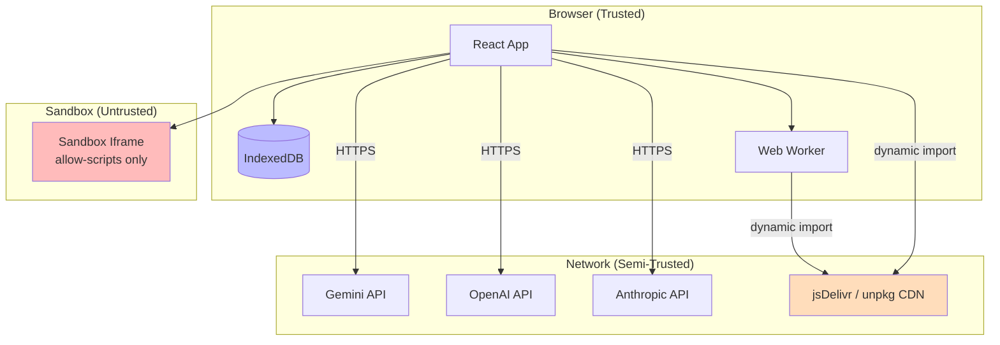

# Threat Model

## Assets

| Asset | Location | Sensitivity | Impact if Compromised |
|-------|----------|-------------|-----------------------|
| AI Provider API keys | IndexedDB `providers` store, `import.meta.env.VITE_*` | **High** | Financial cost (API usage), service disruption |
| User documents & files | IndexedDB `files`, `versions` stores | **High** | Data breach, loss of confidential field data |
| Chat conversations | IndexedDB `sessions`, `episodic` stores | **Medium** | Exposure of research questions and findings |
| A2A agent configurations | IndexedDB `a2aAgents`, `skills` stores | **Low** | Workflow manipulation |
| App state & preferences | IndexedDB `appState`, `settings` | **Low** | Minor inconvenience |
| Google OAuth tokens | In-memory (Google Sign-In SDK) | **High** | Google account access |
| Client-side source code | Browser DevTools (read-only) | **Low** | IP exposure (public repo anyway) |

---

## Threats & Mitigations

### T-001: API Key Theft

**Risk:** Attacker extracts API keys from IndexedDB or network logs.

**Mitigations:**
- API keys stored in IndexedDB `providers` store — encrypted at rest by the browser
- Keys are **never logged** to console, Sentry, or any telemetry
- Keys are sent only as HTTP headers or query params to the configured provider's API endpoint
- Environment variables (`VITE_*`) are compile-time only — not included in source maps
- Keys can be entered/rotated at runtime via Settings panel

**Residual risk:** An attacker with physical access to the user's machine can open DevTools and read IndexedDB contents. No different from any client-side app.

### T-002: Cross-Site Scripting (XSS)

**Risk:** Malicious script execution via user-provided content (documents, chat messages, markdown).

**Mitigations:**
- **No `dangerouslySetInnerHTML`** is used anywhere in the codebase
- React 19's built-in JSX escaping handles all text content
- KaTeX and Mermaid are rendered in isolated containers (CDN libs handle their own sanitization)
- The code sandbox uses a dedicated iframe with `sandbox="allow-scripts"` and no `allow-same-origin`

**Residual risk:** A vulnerability in React, KaTeX, or Mermaid rendering could enable XSS. Keeping CDN versions pinned mitigates supply-chain risk.

### T-003: Malicious Code Execution

**Risk:** A user writes or pastes malicious JavaScript into the code sandbox that attacks the application.

**Mitigations:**
- Sandbox iframe uses `sandbox="allow-scripts"` — **no `allow-same-origin`**, **no `allow-forms`**, **no `allow-popups`**, **no `allow-modals`**
- 5-second execution timeout (configurable)
- Mock `console` — no side effects from log output
- No access to `window.parent`, `localStorage`, or `IndexedDB` (isolated origin)
- After execution completes, the iframe remains in DOM but with no active references

**Residual risk:** The sandboxed code can still make `fetch()` requests to external services, though same-origin policy prevents access to the app's origin.

### T-004: Network Eavesdropping

**Risk:** Intercepting API calls to AI providers over insecure networks.

**Mitigations:**
- **All API calls use HTTPS** — every provider endpoint is hardcoded with `https://`
- No HTTP fallback paths exist in the codebase
- API keys are transmitted as Bearer tokens or query params (both over HTTPS)
- Google OAuth uses the standard OAuth 2.0 flow over HTTPS

**Residual risk:** TLS termination at the provider's server means the provider can see the request content.

### T-005: Cross-Tab Access

**Risk:** Another browser tab or extension reading IndexedDB data.

**Mitigations:**
- IndexedDB is same-origin only — only pages from the same origin can access it
- `BroadcastChannel` (used for cross-tab memory sync) is same-origin only
- No data is shared across origins

**Residual risk:** A malicious browser extension with broad permissions can read IndexedDB. Mitigation is user responsibility (extension management).

### T-006: CDN Compromise

**Risk:** A compromised CDN (jsDelivr, unpkg) serves malicious versions of Transformers.js, Orama, KaTeX, Mermaid, or Leaflet.

**Mitigations:**
- CDN URLs are **version-pinned** (e.g., `@3.4.0`, `@11.16.0`, `@0.18.1`) — not `@latest`
- Transformers.js and Orama are loaded via dynamic `import()` in workers/services — not inline `<script>` tags
- CDN scripts in `index.html` use specific version paths

**Residual risk:** No Subresource Integrity (SRI) hashes are currently used. If a pinned version is compromised at the CDN level, the app would load the malicious code. Future work: add SRI `integrity` attributes.

---

## Trust Boundary Diagram

## See Also

- [Data Privacy & Trust](./020-data-privacy.md)
- [API Key Management](./030-api-key-management.md)
- [Sandbox API Reference](../api/004-sandbox-api.md)
