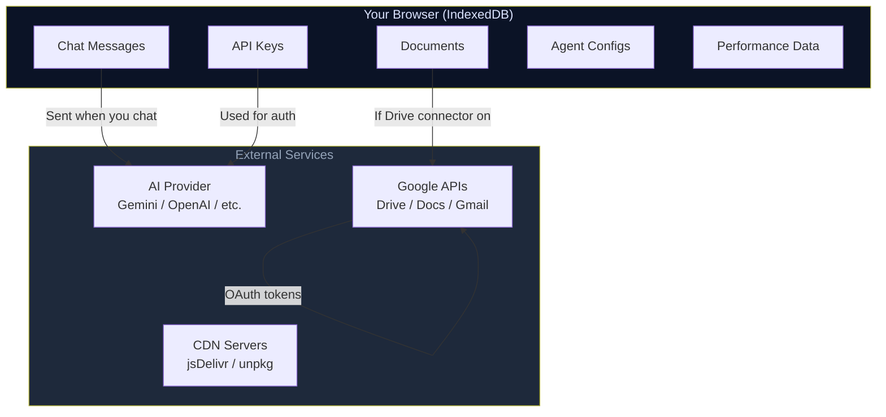

# Data Privacy & Trust

## Data Flow Overview

**Green = stays in browser. Blue = leaves only when you act.**

## Data Residency

**All data is stored in the user's browser, in IndexedDB.** There is no backend server, no cloud sync (unless the user configures a connector), and no data leaves the browser except:

1. **AI provider API calls** — chat messages and context documents are sent to the configured AI provider (Gemini, OpenAI, Anthropic, etc.) over HTTPS
2. **Google OAuth** — if the user signs in with Google, OAuth tokens are exchanged with Google's servers per the standard OAuth 2.0 flow
3. **Connector sync** — if the user configures an external connector (e.g., Google Drive), data may be synced per that connector's configuration

| Data Type | Location | Leaves Browser? |
|-----------|----------|----------------|
| Chat messages | IndexedDB `sessions`, `episodic` | Only to AI providers (if user sends them) |
| Documents & files | IndexedDB `files`, `versions` | No (unless Google Drive connector is enabled) |
| API keys | IndexedDB `providers` | Only to the configured AI provider endpoint |
| A2A agent configs | IndexedDB `a2aAgents`, `skills` | No |
| Templates & tags | IndexedDB `templates`, `tags` | No |
| Metrics | IndexedDB `metrics` | No |
| App state | IndexedDB `appState` | No |

## No Telemetry

- **Zero analytics**: No Google Analytics, no Plausible, no Fathom, no telemetry SDK
- **Zero error reporting**: No Sentry, no Rollbar, no crash reporting service
- **Zero usage tracking**: No feature flags, no A/B testing frameworks
- **No cookies**: The app sets no cookies (except Google OAuth cookies if the user signs in)

## No Third-Party Data Sharing

- No data is sold, shared, or transmitted to any third party
- The only external API calls are to:
  - AI providers configured by the user (Gemini, OpenAI, Anthropic, etc.)
  - Google APIs (if user enables Google Sign-In or Google Drive)
  - CDN servers (for loading libraries at app startup)
- The user controls which AI providers to use and what data to send them

## User Controls

### Data Deletion

Users can delete their data through:

| Action | Method |
|--------|--------|
| Clear all data | Settings → "Clear All Data" (calls `dbClear` on all stores) |
| Delete individual documents | Knowledge Base → file context menu → Delete |
| Clear chat history | Chat sidebar → Delete session |
| Reset application | Settings → "Factory Reset" (clears all IndexedDB stores + reloads) |
| Browser-level clear | `Clear site data` in browser DevTools |

### Data Export

Users can export all data via Settings → "Export Data" which calls `exportAllData()` and downloads a JSON file containing all non-memory stores. This file can be imported on another device or kept as a backup.

## Offline Mode

The app is fully functional offline for:
- Viewing and editing the knowledge base (IndexedDB data)
- Chat interface (offline messages are queued)
- Document editing and templates

Features that require connectivity:
- AI provider queries (Gemini, OpenAI, etc.)
- Semantic search with Orama (initial load needs CDN)
- Embedding computation (Transformers.js loads from CDN)
- Mermaid and KaTeX rendering (first load from CDN)
- Google OAuth and Google Drive sync

For **complete isolation**, users can:
1. Revoke all API keys in Settings
2. Disable Google OAuth
3. Use offline mode for document management and template workflows
4. Never connect to any external service

## See Also

- [Threat Model](./001-threat-model.md)
- [API Key Management](./003-api-key-management.md)
- [ADR-006: PWA & Offline Architecture](../architecture/006-pwa-offline.md)

---

_Open Knowledge Studio v2.0 — Zero-dependency, browser-native, 12-agent A2A platform for offline-first research, writing, and data analysis. Built by [Mohammad Ariful Islam](https://github.com/zsdotcom) ([codeandbrain](https://github.com/codeandbrain)) at the [ZarishSphere Foundation](https://zarishsphere.com). Licensed under MIT. Source code: [github.com/zsdotcom/zs-oks](https://github.com/zsdotcom/zs-oks)._
